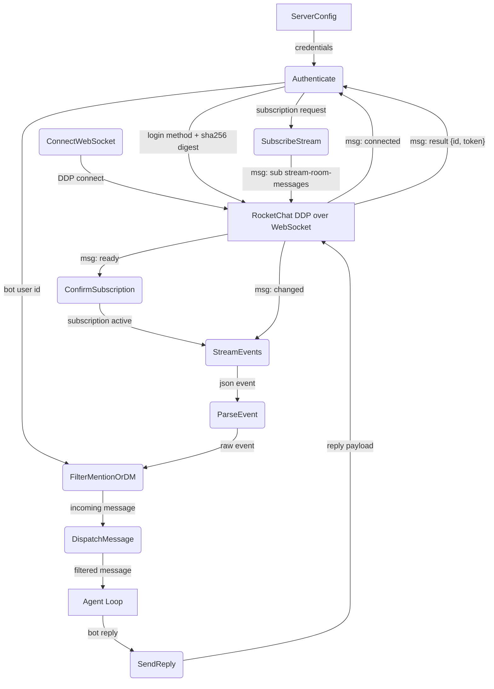
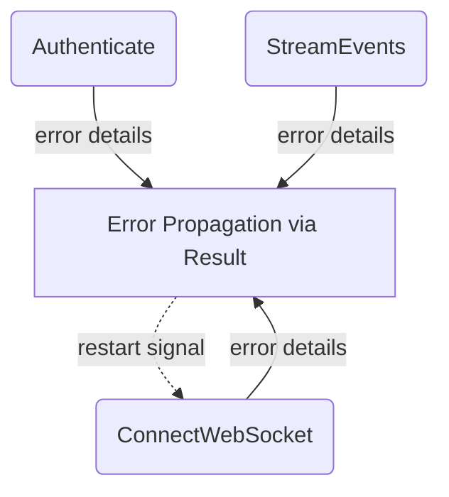
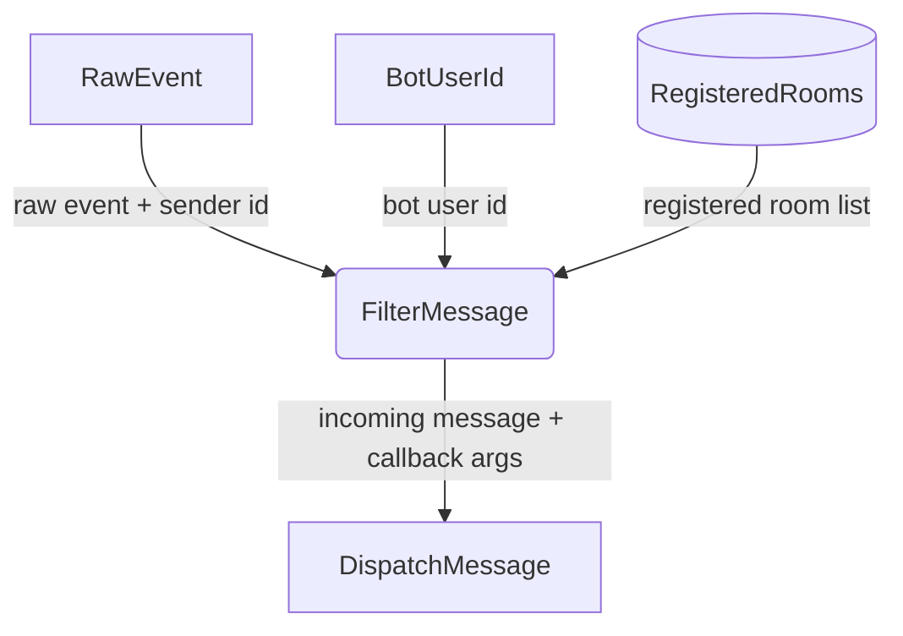
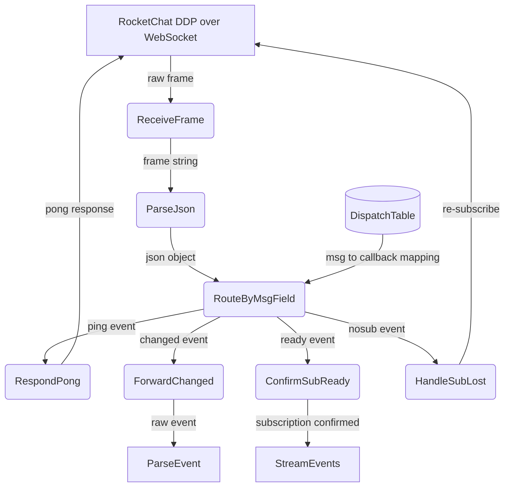
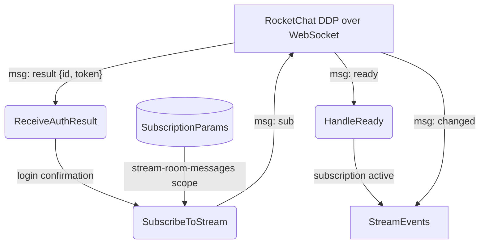
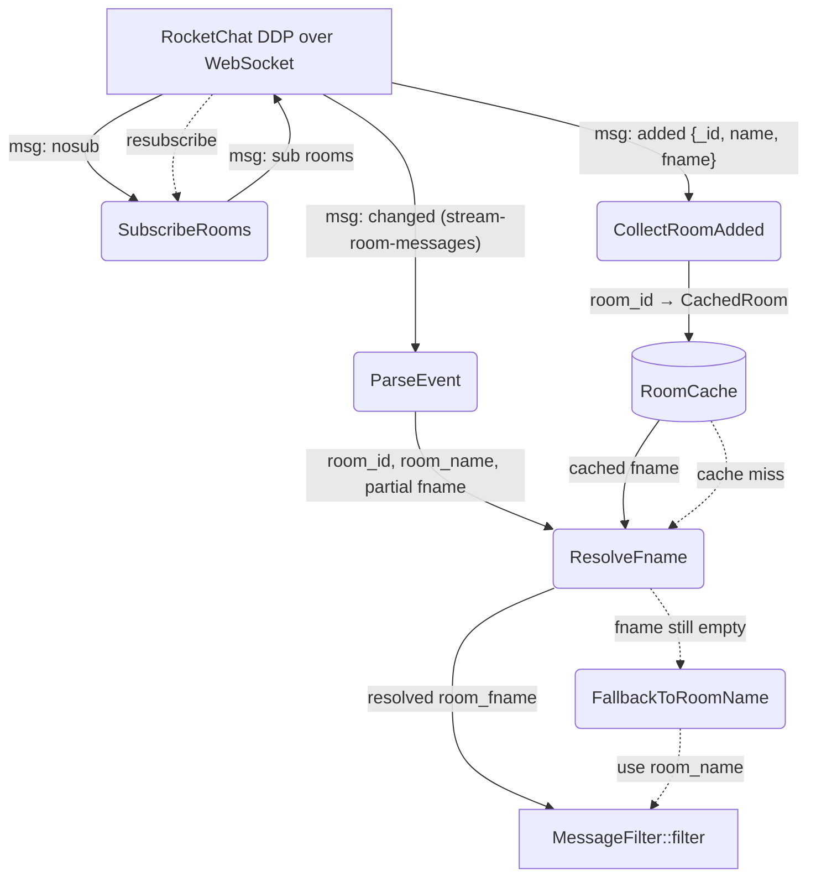
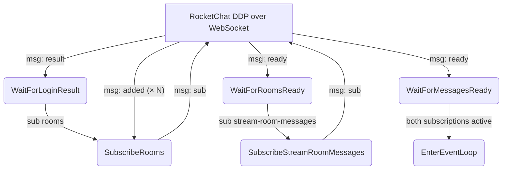

# RocketChat Connection

## 1. Purpose

Rust crate (`crate-rocketchat`) that manages the full lifecycle of a
RocketChat connection over **DDP (Distributed Data Protocol)** via WebSocket:
authentication, subscription to message stream, event dispatch, message
parsing/filtering, and reply delivery. DMs, messages starting with `@botname`,
and room-specific registered callbacks are forwarded to the agent.

> **Deprecation note**: Rocket.Chat's official documentation marks the raw
> DDP/bots approach as **deprecated** (2025). The recommended replacement is
> [`@rocket.chat/ddp-client`](https://www.npmjs.com/package/@rocket.chat/ddp-client)
> or the [Apps-Engine](https://developer.rocket.chat/docs/rocketchat-apps-engine).

- Upstream: [Configuration Management](config.md) provides configuration
  (typed `RocketChatConfig` deserialized from TOML via `serde`)
- Downstream: [Agent Harness](../agent-harness.md) receives filtered `IncomingMessage`
  structs via async callback; sends replies through `MessageSender::reply()`

## 2. Diagram

### 2a. Happy Flow (Main Success Path)



### 2b. Error Handling & Fallbacks

The Rust implementation uses a typed `RocketChatError` enum (`thiserror`) that
classifies WebSocket, protocol, auth, TLS, JSON, and config errors. `Result<T>`
patterns propagate errors from `connect_async`, `read.next()`, and JSON parsing.
The `"nosub"` DDP event triggers automatic re-subscription. No external restart
wrapper is needed — errors bubble up through the `Result` chain to the caller.



### 2c. Message Filter Deep Dive

The `MessageFilter::filter()` method (`crate-rocketchat/src/types.rs:64`)
implements a four-stage decision chain. Messages from the bot itself are
silently dropped. The bot responds to: (1) `@botname` at the start of a
channel message, (2) a specific registered room, or (3) a direct message
with no room name.



The filter process internally:
1. Skips events where `sender_id == bot_user_id` (self-messages)
2. Checks `is_dm` flag from the parsed event
3. Matches messages starting with `@botname` in channels
4. Falls back to checking a registered-room list

All other cases are silently dropped.

### 2d. Ping/Pong Keepalive Deep Dive

The RocketChat server periodically sends `{"msg": "ping"}` to keep the
WebSocket alive. The bot responds immediately with `{"msg": "pong"}`. This
diagram decomposes the `StreamEvents` (STREAM) process from Level 1, showing
the internal dispatch that routes frames by `msg` field.



**Dispatch table** — the `msg` field routes to inline handling in the event loop:

| `msg` value    | Handler                         | Action                              |
| -------------- | ------------------------------- | ----------------------------------- |
| `"ping"`       | `ddp::pong_message()`           | Send `{"msg": "pong"}`              |
| `"connected"`  | `connect_and_run` setup         | Send login method (see 2f)          |
| `"result"`     | `ddp::extract_login_result()`   | Extract userId, confirm login       |
| `"changed"`    | `MessageFilter::filter()`       | Parse + filter + dispatch to agent  |
| `"ready"`      | `expect_msg("ready")`           | Confirm subscription active         |
| `"nosub"`      | re-subscribe inline             | Re-subscribe on subscription loss   |

All six message types are handled. The event loop waits for `"ready"` after
subscription and re-subscribes on `"nosub"`.

Note: the bot does **not** proactively send pings or monitor ping intervals —
it only responds to server-initiated pings. A missing server ping will not be
detected; a WebSocket read returning `None` or `Err` terminates the loop.

### 2e. Subscription Deep Dive

After authentication succeeds (`ddp::extract_login_result()` parses the
`result` with `id` and `token`), `RocketChatClient::connect_and_run()` sends
the subscription via `ddp::subscribe_message()`. Once the server responds with
`"ready"`, the event loop begins delivering `"changed"` events for all messages
visible to the bot user.



**Subscription payload** sent to the WebSocket:

```json
{
    "msg": "sub",
    "id": "ABCROCK",
    "name": "stream-room-messages",
    "params": ["__my_messages__", false]
}
```

The `params` array controls which messages are received: `"__my_messages__"`
scopes to the authenticated user, and `false` (the DDP backward-compatibility
flag) means only `"changed"` events are delivered. Setting it to `true` would
also emit `"added"` events for each existing message, which is unnecessary
for a bot that only needs new incoming messages.

### 2f. Authentication Deep Dive

The login flow uses DDP method calls over the WebSocket (`ddp::login_message()`
in `crate-rocketchat/src/ddp.rs:21`). The Rocket.Chat `login` method requires
the password to be pre-hashed with **SHA-256**, sent as a lowercase hex digest
alongside the algorithm name. The Rust implementation uses `sha2::Digest` to
hash the password before constructing the payload.

**Implementation** (`ddp::login_message()`):

```json
{
    "msg": "method",
    "method": "login",
    "id": "42",
    "params": [
        {
            "user": { "username": "rockbot" },
            "password": {
                "digest": "2cf24dba5fb0a30e26e83b2ac5b9e29e1b161e5c1fa7425e73043362938b9824",
                "algorithm": "sha-256"
            }
        }
    ]
}
```

**Server response** on success:

```json
{
    "msg": "result",
    "id": "42",
    "result": {
        "id": "user-id",
        "token": "auth-token",
        "tokenExpires": { "$date": 1480377601 }
    }
}
```

The `tokenExpires` field is **not consumed** by the current implementation.

### 2g. Room Name Cache Deep Dive

`args[1].fname` is **conditionally present** in `stream-room-messages` `"changed"`
events — it may be `""` or absent entirely. To fill the gap, a second DDP
subscription (`"rooms"`) fetches every room's metadata at startup and builds an
in-memory cache. When a message event arrives with a missing/empty `fname`, the
cache is consulted by `room_id`.



**ResolveFname precedence** (per message):

1. If `args[1].fname` is present and non-empty → use it (per-event wins)
2. Else, look up `room_id` (from `args[0].rid`) in `RoomCache` → use cached `fname`
3. Else → `room_fname` stays empty; downstream falls back to `room_name`

The cache is keyed by `room_id` (RocketChat UUID), not by room name slug. This
guarantees a stable lookup independent of renames.

**Error handling & fallbacks**:

- **`"nosub"` for `"rooms"`**: re-subscribe automatically (same pattern as
  existing `stream-room-messages` `"nosub"` handling). Cache survives
  re-subscription — the server re-sends all `"added"` events.
- **Cache miss**: room not in cache (e.g. created after startup, or DM room not
  in `"rooms"` collection). Degrades to pre-cache behavior — `room_fname` stays
  empty; downstream uses `room_name` slug or `sender_name` (DMs).
- **Rooms subscription never completes** (no `"ready"`): `stream-room-messages`
  still works. Cache stays empty; behavior identical to current state.

### 2h. Room Name Cache — Subscription Ordering

The `"rooms"` subscription is sent **before** `stream-room-messages` and its
`"ready"` is awaited. This guarantees the cache is fully populated before any
message `"changed"` events arrive, eliminating a race where a message arrives
before its room's `fname` is cached.



## 3. Data Structures

The Rust crate defines formal typed structs with `serde` (Serialize/Deserialize)
in `crate-rocketchat/src/types.rs`. Tables below map each field to its struct
definition and how it is populated.

#### `IncomingMessage`

| Field         | Type              | Source / Notes                                      |
| ------------- | ----------------- | --------------------------------------------------- |
| `msg_id`      | `Option<String>`  | `raw["id"]` — DDP message ID                        |
| `room_id`     | `String`          | `args[0]["rid"]` — RocketChat room ID               |
| `room_name`   | `String`          | `args[1]["roomName"]` — URL slug (ASCII, e.g. `sen1-lin2-sheng1-tai4`). `""` or `"DIRECT_MESSAGES"` for DMs |
| `room_fname`  | `String`          | Per-event `args[1]["fname"]`, or resolved from `RoomCache` by `room_id` when absent. Empty for rooms without a custom fname |

Room name precedence:
- **Matching/registration**: use `room_name` (slug) — always ASCII, deterministic
- **Display/log messages**: prefer `room_fname` when non-empty, fall back to `room_name`
- **WebDAV directory naming**: prefer `room_fname` when non-empty, fall back to `room_name` (slug) for safe filesystem paths

The agent harness computes `webdav_dir` using the friendly name when available:
- **Channel** (e.g. `#森林生態` with slug `sen1-lin2-sheng1-tai4`): DDP supplies `roomName: "sen1-lin2-sheng1-tai4"` + `fname: "森林生態"` → `webdav_dir: "r-森林生態"`
- **Channel without fname** (e.g. `#general`): DDP supplies `roomName: "general"` + `fname: ""` → `webdav_dir: "r-general"`
- **Direct message** (e.g. from `saru`): DDP `roomName` empty, `fname` empty → falls back to `sender_name: "saru"` → `webdav_dir: "d-saru"`

The flat `r-`/`d-` prefixes prevent collisions. When `fname` is available
(via per-event `args[1]` or `RoomCache` lookup), the display name is used;
otherwise the URL slug is the fallback.

> **Important distinction**: `room_id` (the RocketChat UUID from DDP `args[0].rid`)
> and `webdav_dir` (the `r-`/`d-`-prefixed path key) are **separate values**.
> `room_id` is used as a stable in-memory lookup key. `webdav_dir` is used for
> WebDAV path construction. Tool calls receive both via `inject_room_context`.

#### `BotReply`

| Field       | Type              | Constructor                          |
| ----------- | ----------------- | ------------------------------------ |
| `room_id`   | `String`          | `MessageSender::room_id()`           |
| `text`      | `String`          | `MessageSender::reply(text)`         |
| `thread_id` | `Option<String>`  | Reserved for threaded replies (`tmid`) |

`MessageSender` also provides `reply_code(text)` (code-block format) and
`typing(state, username)` (typing indicator).

#### `DdpEvent`

| Field  | Type                  | Source                            |
| ------ | --------------------- | --------------------------------- |
| `msg`  | `String`              | Top-level `"msg"` field from JSON |
| `raw`  | `serde_json::Value`   | Full parsed JSON object           |

#### `MessageFilter`

| Field         | Type      | Purpose                            |
| ------------- | --------- | ---------------------------------- |
| `bot_user_id` | `&str`    | User ID to filter out self-messages|

Method `filter(&self, raw: &Value) -> Option<IncomingMessage>` parses and
filters a raw DDP event, returning `None` for self-messages and `Some` for
valid incoming messages. Callers then apply `is_dm_or_mention()` to decide
dispatch.

#### `CachedRoom`

Stored in `RoomCache`, keyed by RocketChat room UUID (`_id`). Populated from
the DDP `"rooms"` subscription `"added"` events.

| Field      | Type     | Source                  | Notes                                      |
| ---------- | -------- | ----------------------- | ------------------------------------------ |
| `room_id`  | `String` | `added.fields._id`      | RocketChat UUID, stable lookup key         |
| `name`     | `String` | `added.fields.name`     | URL slug (ASCII), may be empty for DMs     |
| `fname`    | `String` | `added.fields.fname`    | Friendly display name (Unicode), may be empty |
| `t`        | `String` | `added.fields.t`        | Room type: `"c"` (channel), `"d"` (DM), `"p"` (private group) |

#### `RoomCache`

In-memory `HashMap<String, CachedRoom>` keyed by `room_id`. Populated at
startup from the `"rooms"` subscription. Read on every incoming message to
resolve `fname` when the per-event `args[1].fname` is absent or empty.

No persistent storage — rebuilt from scratch on every bot restart via the
`"rooms"` subscription.
