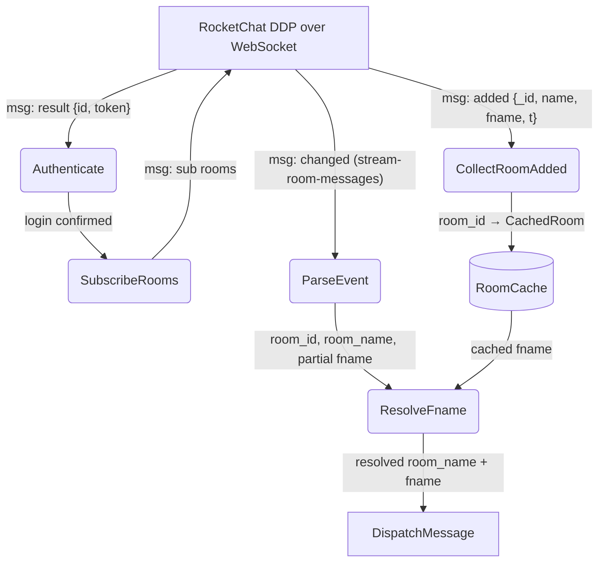
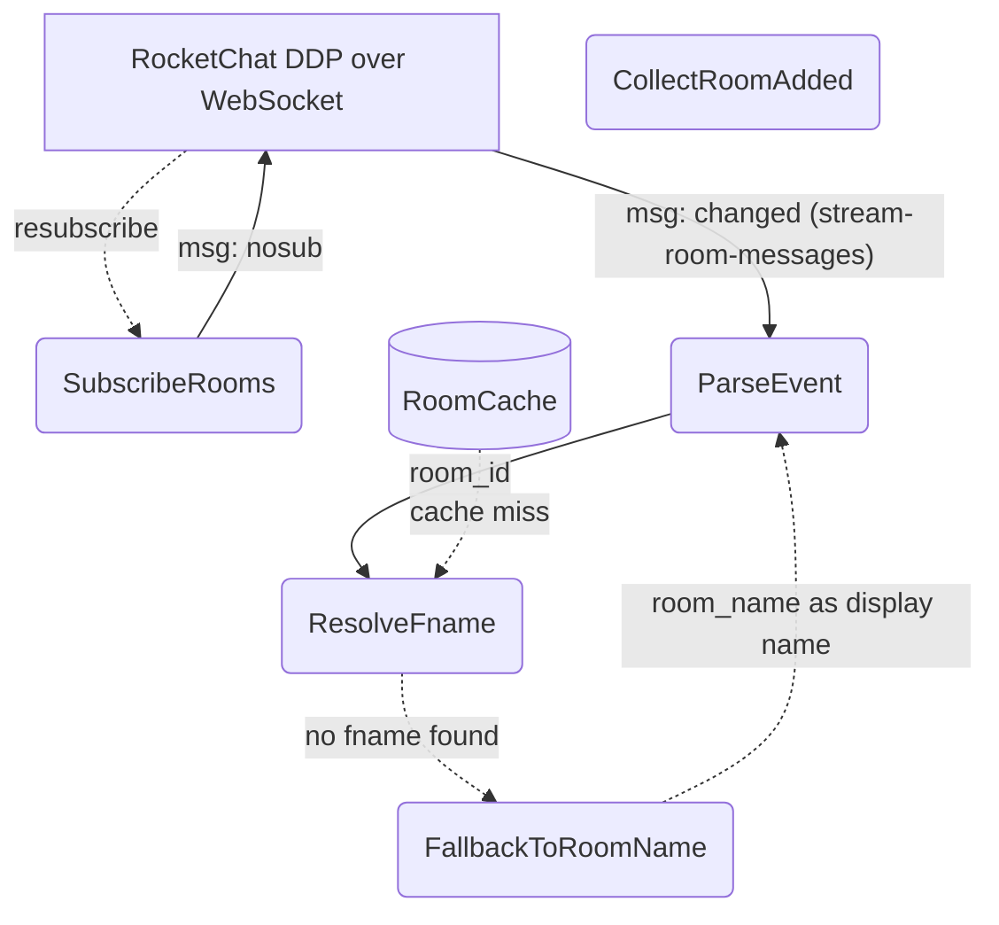
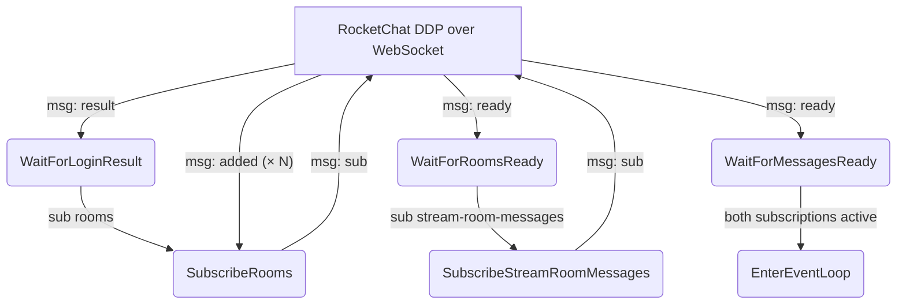

# Room Name Cache

## 1. Purpose

Subscribe to the Rocket.Chat DDP `"rooms"` collection at startup to build an
in-memory cache of room display names (`fname`), then use the cache as a
fallback when `fname` is missing or empty in `stream-room-messages` `"changed"`
events. Eliminates reliance on `args[1].fname` being present in every message
event.

- Upstream: [RocketChat Connection](rocketchat.md) provides the authenticated
  WebSocket, DDP `"sub"`/`"added"` patterns, and `MessageFilter::filter()` parse
  pipeline
- Downstream: [Agent Harness](../agent-harness.md) receives `IncomingMessage`
  with `room_fname` resolved from cache when the per-event `fname` is absent

## 2. Diagram

### 2a. Happy Flow — Build Cache & Resolve fname

**Process detail — ResolveFname** applies this precedence for each message:

1. If `args[1].fname` is present and non-empty → use it (per-event wins)
2. Else, look up `room_id` in `RoomCache` → use cached `fname` if found
3. Else → `room_fname` stays empty, downstream falls back to `room_name`

The cache is keyed by `room_id` (RocketChat UUID from `args[0].rid`), not by
room name slug. This guarantees a stable lookup independent of renames.

### 2b. Error Handling & Fallbacks

- **`"nosub"` for `"rooms"`**: re-subscribe automatically (same pattern as
  existing `stream-room-messages` `"nosub"` handling). Cache survives
  re-subscription — the server re-sends all `"added"` events, refreshing the
  cache.
- **Cache miss**: room not in cache (e.g. created after startup, or DM room not
  in `"rooms"` collection). `room_fname` stays empty; downstream uses
  `room_name` (URL slug) or `sender_name` (for DMs) as before.
- **Rooms subscription never completes** (no `"ready"`): `stream-room-messages`
  still works. Cache stays empty; behavior degrades to current state where
  `fname` depends solely on per-event `args[1].fname`.

### 2c. Subscription Ordering Deep Dive

The `"rooms"` subscription is sent immediately after login confirmation and
**before** `stream-room-messages`. This ordering is intentional:

The `"ready"` for `"rooms"` is awaited before subscribing to
`stream-room-messages`. This guarantees the cache is fully populated before any
message `"changed"` events arrive, eliminating a race where a message arrives
before its room's `fname` is cached.

## 3. Data Structures

### `CachedRoom`

Stored in `RoomCache`, keyed by RocketChat room UUID (`_id`).

| Field      | Type     | Source                  | Notes                                      |
| ---------- | -------- | ----------------------- | ------------------------------------------ |
| `room_id`  | `String` | `added.fields._id`      | RocketChat UUID, stable lookup key         |
| `name`     | `String` | `added.fields.name`     | URL slug (ASCII), may be empty for DMs     |
| `fname`    | `String` | `added.fields.fname`    | Friendly display name (Unicode), may be empty |
| `t`        | `String` | `added.fields.t`        | Room type: `"c"` (channel), `"d"` (DM), `"p"` (private group) |

### `RoomCache`

In-memory `HashMap<String, CachedRoom>` keyed by `room_id`. Populated at startup
from `"rooms"` subscription `"added"` events. Read on every incoming message to
resolve `fname`.

No persistent storage — rebuilt from scratch on every bot restart via the
`"rooms"` subscription.
