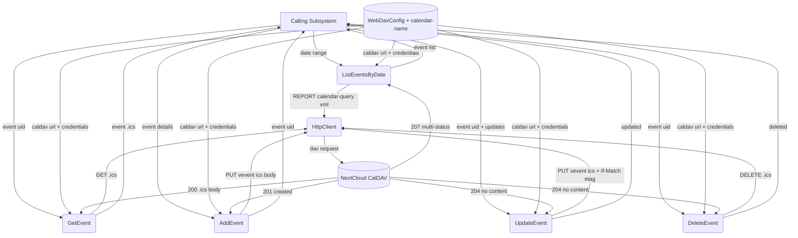
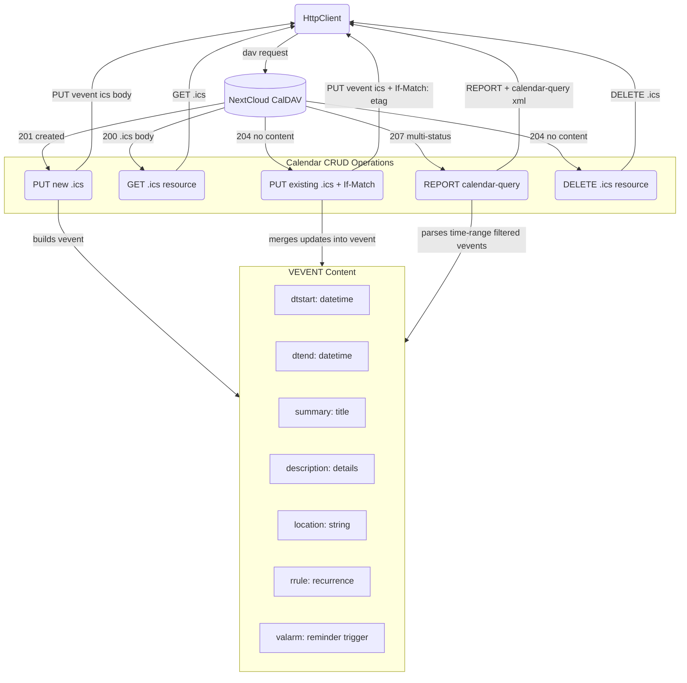
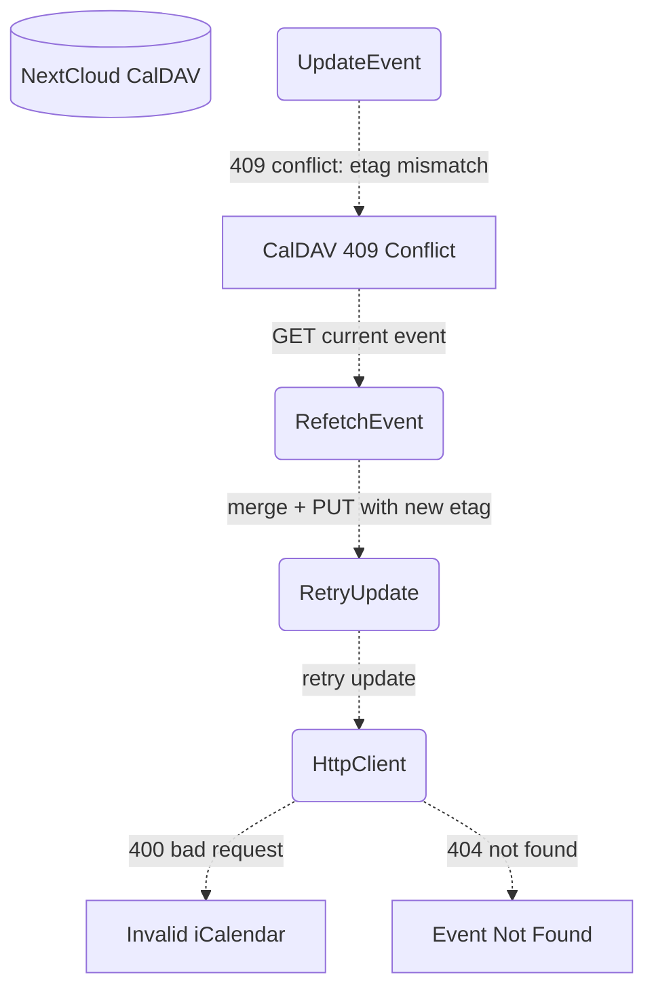

# WebDAV Calendar

## 1. Purpose

CalDAV event access wrapping NextCloud's calendar service. Supports listing
events by date range, create/read/update/delete individual events with
iCalendar (RFC 5545) `VEVENT` payloads, and `VALARM` reminders.

- Upstream: [Configuration Management](config.md) provides `WebDavConfig`
  plus calendar name
- Downstream: [Agent Harness](../agent-harness.md) exposes calendar event
  access to the AI agent via the calendar tool

## 2. Diagram

### 2a. Happy Flow (Main Success Path)



### 2b. Calendar Operations Deep Dive

Per [NextCloud Calendar user guide](https://docs.nextcloud.com/server/latest/user_manual/en/groupware/calendar.html) and [RFC 4791](https://datatracker.ietf.org/doc/html/rfc4791). Events are iCalendar (RFC 5545) `VEVENT` objects. The CalDAV base URL is `/remote.php/dav/calendars/{username}/{calendar-name}/`. Each event is a resource named `{uid}.ics` within that collection.



### 2c. Error Handling & Fallbacks



## 3. Data Structures

#### `CaldavEvent`

CalDAV event resource represented as a parsed iCalendar `VEVENT` (RFC 5545).
Stored as `{uid}.ics` within the calendar collection.

| Field           | Type             | Notes                                   |
| --------------- | ---------------- | --------------------------------------- |
| `uid`           | `String`         | Globally unique event identifier        |
| `href`          | `String`         | Full CalDAV href to `{uid}.ics`         |
| `etag`          | `String`         | Opaque tag for conditional updates      |
| `summary`       | `String`         | Event title/name                        |
| `description`   | `Option<String>` | Event details/notes                     |
| `location`      | `Option<String>` | Event venue/place                       |
| `dtstart`       | `String`         | Start datetime (ISO 8601 with timezone) |
| `dtend`         | `String`         | End datetime (ISO 8601 with timezone)   |
| `rrule`         | `Option<String>` | Recurrence rule (RFC 5545 format)       |
| `reminders`     | `Vec<Reminder>`  | List of `VALARM` reminders              |
| `created`       | `String`         | Creation timestamp                      |
| `last_modified` | `String`         | Last-modified timestamp                 |

#### `Reminder` (`VALARM`)

| Field    | Type     | Notes                                         |
| -------- | -------- | --------------------------------------------- |
| `action` | `String` | `DISPLAY` or `EMAIL`                          |
| `trigger`| `String` | Duration before event (`-PT15M`) or absolute   |

#### `WebDavPath` (calendar methods)

| Method                      | Returns  | Notes                             |
| --------------------------- | -------- | --------------------------------- |
| `calendar_path(calendar)`   | `String` | `/calendars/{calendar}/`          |
| `event_path(calendar, uid)` | `String` | `/calendars/{calendar}/{uid}.ics` |

## 4. NextCloud API Reference

Per [NextCloud Calendar user guide](https://docs.nextcloud.com/server/latest/user_manual/en/groupware/calendar.html), [RFC 4791](https://datatracker.ietf.org/doc/html/rfc4791) (CalDAV), and [RFC 5545](https://datatracker.ietf.org/doc/html/rfc5545) (iCalendar). NextCloud serves CalDAV at `/remote.php/dav/calendars/{user}/{calendar-name}/`.

| DFD Operation       | HTTP Method | Endpoint / Headers                        | Notes                                           |
| ------------------- | ----------- | ----------------------------------------- | ----------------------------------------------- |
| ListEventsByDate    | `REPORT`    | `{base}/calendars/{user}/{cal}/`          | XML body with `calendar-query`, time-range filter |
| GetEvent            | `GET`       | `{base}/calendars/{user}/{cal}/{uid}.ics` | Returns full `VEVENT` iCalendar data            |
| AddEvent            | `PUT`       | `{base}/calendars/{user}/{cal}/{uid}.ics` | Body = `VEVENT` iCalendar (RFC 5545)            |
| UpdateEvent         | `PUT`       | `{base}/calendars/{user}/{cal}/{uid}.ics` | `If-Match: {etag}` header; 409 on conflict      |
| DeleteEvent         | `DELETE`    | `{base}/calendars/{user}/{cal}/{uid}.ics` | 204 on success, 404 if not found                |

#### `calendar-query` REPORT body (listing events for a date)

```xml
<?xml version="1.0" encoding="UTF-8"?>
<C:calendar-query xmlns:D="DAV:" xmlns:C="urn:ietf:params:xml:ns:caldav">
  <D:prop>
    <D:getetag/>
    <C:calendar-data/>
  </D:prop>
  <C:filter>
    <C:comp-filter name="VCALENDAR">
      <C:comp-filter name="VEVENT">
        <C:time-range start="20260601T000000Z" end="20260602T000000Z"/>
      </C:comp-filter>
    </C:comp-filter>
  </C:filter>
</C:calendar-query>
```

#### `VEVENT` iCalendar payload (create/update event with reminder)

```
BEGIN:VCALENDAR
VERSION:2.0
PRODID:-//RockBot//NextCloud Calendar//EN
BEGIN:VEVENT
UID:abc123-uuid@rockbot
DTSTART:20260615T140000Z
DTEND:20260615T150000Z
SUMMARY:Team standup
DESCRIPTION:Daily sync meeting
LOCATION:Room 4B
BEGIN:VALARM
ACTION:DISPLAY
TRIGGER:-PT15M
DESCRIPTION:Meeting in 15 minutes
END:VALARM
END:VEVENT
END:VCALENDAR
```
