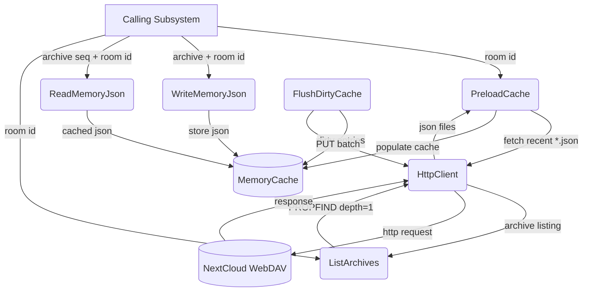
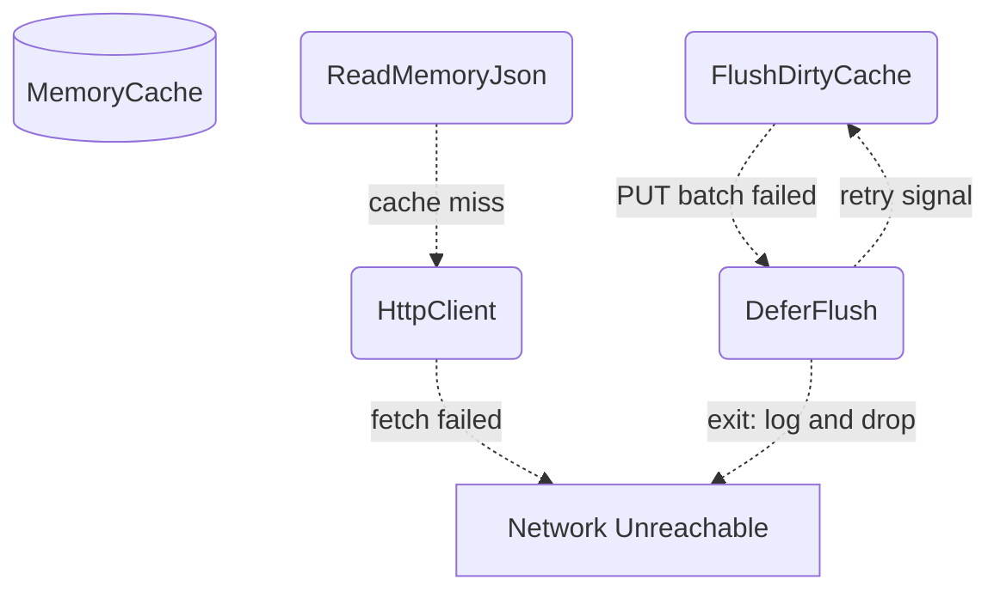
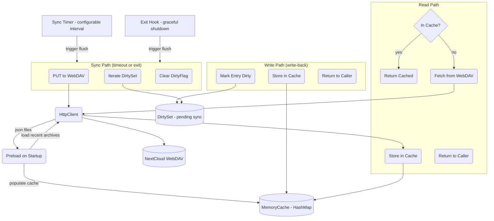

# WebDAV Memory

## 1. Purpose

JSON conversation memory archives persisted on WebDAV with a local write-back
cache. Writes go to cache immediately and return to the caller without waiting
for the WebDAV round-trip. Dirty entries are flushed on a configurable sync
interval or graceful shutdown. Reads check the cache first; on miss, the file
is fetched from WebDAV and cached.

Archives are stored at `{root}/{room_id}/memory/{seq:06}_memory.json`. On
startup, recent archives are preloaded into the cache from WebDAV.

- Upstream: [Memory Management](memory.md) triggers archive writes when the
  conversation character-count threshold is exceeded, and loads recent
  archives on room init
- Upstream: [Configuration Management](config.md) provides `WebDavConfig`
- Downstream: [WebDAV Directory](webdav-directory.md) provides the underlying
  PUT/GET/PROPFIND operations

## 2. Diagram

### 2a. Happy Flow (Main Success Path)

### 2b. Error Handling & Fallbacks

### 2c. Memory Cache Deep Dive

Write-back cache for JSON memory archives. Writes return immediately after
storing in local cache; a background timer or graceful-shutdown hook flushes
dirty entries to WebDAV. Reads hit the cache first and fetch from WebDAV
only on miss (populating the cache for subsequent reads). On startup, recent
archives are preloaded into the cache from WebDAV.

## 3. Data Structures

#### `MemoryJson`

Code-level name for `MemoryArchive` — see [Memory Management](memory.md#memoryarchive)
for the full field definitions. Each file is persisted at
`{root}/{room_id}/memory/{seq:06}_memory.json`.

#### `MemoryCache`

Per-room write-back cache for `MemoryJson` archive files. Writes go to
cache immediately; dirty entries are flushed to WebDAV on a configurable
sync interval or on graceful shutdown.

| Field           | Type                       | Notes                                       |
| --------------- | -------------------------- | ------------------------------------------- |
| `entries`       | `HashMap<String, CachedEntry>`| Path → cached JSON + dirty flag          |
| `sync_interval` | `Duration`                 | How often to flush dirty entries (default 30s)|
| `sync_handle`   | `Option<JoinHandle<()>>`   | Background sync task handle                 |

#### `CachedEntry`

| Field       | Type         | Notes                                    |
| ----------- | ------------ | ---------------------------------------- |
| `data`      | `MemoryJson` | Parsed archive content                   |
| `dirty`     | `bool`       | True if cache is ahead of WebDAV         |
| `cached_at` | `Instant`    | When the entry was last loaded/updated   |

#### `WebDavPath` (memory methods)

| Method                   | Returns  | Notes                                       |
| ------------------------ | -------- | ------------------------------------------- |
| `memory_dir(key)`        | `String` | `/{root}/{key}/memory/`                     |
| `archive_path(key, seq)` | `String` | `/{root}/{key}/memory/{seq:06}_memory.json` |

## 4. NextCloud API Reference

Memory operations route through the local `MemoryCache` layer before touching
WebDAV. Writes are immediate to cache; sync to WebDAV happens on timer or exit.

| DFD Operation       | HTTP Method | NextCloud Endpoint                                  | Notes                              |
| ------------------- | ----------- | --------------------------------------------------- | ---------------------------------- |
| WriteMemoryJson     | `PUT`       | `{base}/files/{user}/{root}/{room}/memory/{seq:06}_memory.json` | Serialized `MemoryJson` — via cache write-back |
| ReadMemoryJson      | `GET`       | `{base}/files/{user}/{root}/{room}/memory/{seq:06}_memory.json` | Returns `MemoryJson` — cache-hit or fetch |
| ListMemoryArchives  | `PROPFIND`  | `{base}/files/{user}/{root}/{room}/memory/`          | `Depth: 1` — filter `*.json`      |
| FlushDirtyCache     | —           | — (local operation, triggers `PUT` batch)            | Called by sync timer or exit hook  |
| PreloadCache        | —           | — (local, fetches recent `*.json`)                   | Called on room init after restart  |
