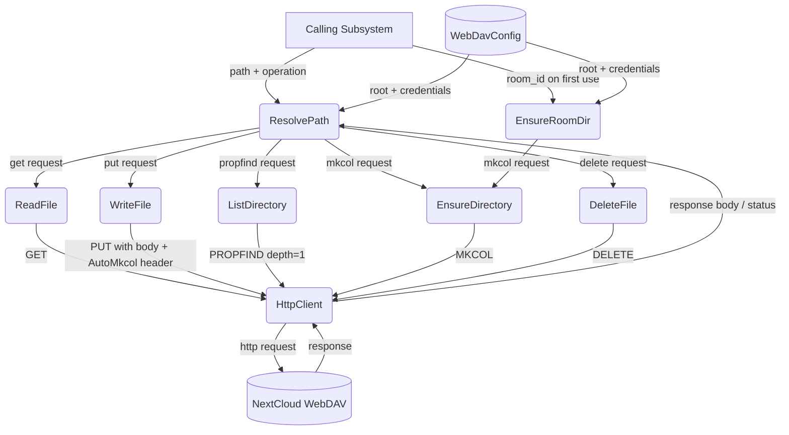
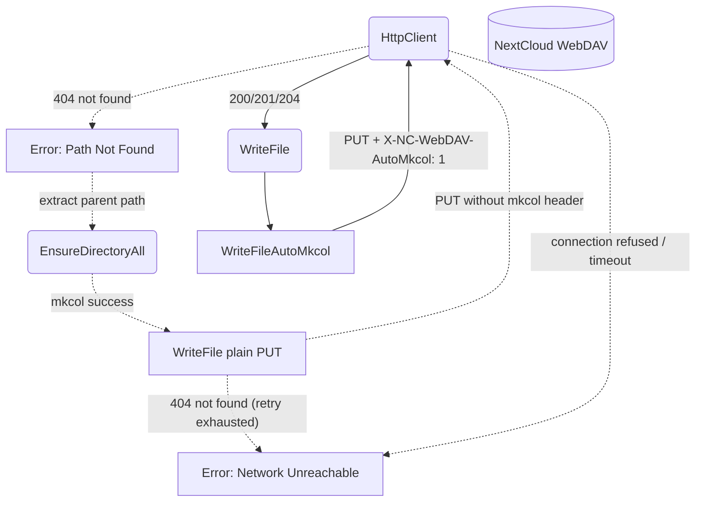
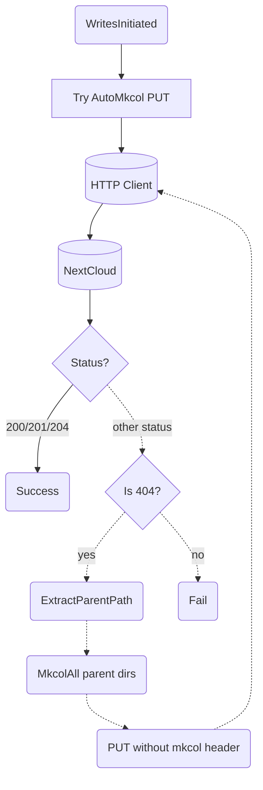
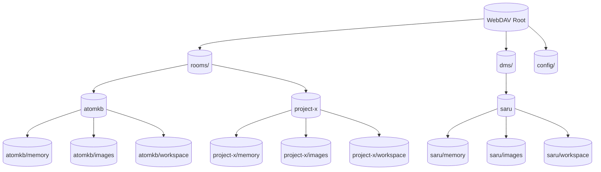

# WebDAV Storage

## 1. Purpose

Thin abstraction over HTTP-based WebDAV (NextCloud) providing typed
read/write/list/mkdir/delete operations. All bot state — configuration backups, memory
archives, and image assets — is stored remotely; the bot never writes to local
disk. Each room gets its own directory subtree, created proactively on first
use.

**Room name isolation:** Directories use human-readable room names with
namespace prefixes — `rooms/{name}/` for channels (e.g. `rooms/atomkb/`) and
`dms/{name}/` for direct messages (e.g. `dms/saru/`). The prefixes prevent
collisions between a channel and a DM user with the same slug. The harness
computes the `webdav_dir` from `room_name` + `is_dm` and injects it into tool
arguments; the raw `room_id` UUID is never used for WebDAV path construction.

The WebDAV client is used both internally (by `harness.rs` for room message
archiving) and as an AI-callable tool (`WebDavTool` in `tools/webdav.rs`) that
exposes read, write, list, mkdir, delete, and exists operations scoped to room
directories.

The client targets NextCloud's WebDAV API at the path:
`{base_url}/remote.php/dav/files/{username}`. Authentication uses HTTP Basic Auth
with an app password (generated via NextCloud's personal security settings).

- Upstream: [Configuration Management](config.md) provides `WebDavConfig`
- Upstream: [Memory Management](memory.md) stores and retrieves `.md` archives
- Upstream: [Agent Harness](../agent-harness.md) (vision tool) reads images from WebDAV
- Upstream: [Agent Harness](../agent-harness.md) (webdav tool) exposes storage to the AI agent

## 2. Diagram

### 2a. Happy Flow (Main Success Path)

### 2b. Error Handling & Fallbacks

### 2c. Write-With-Fallback Deep Dive

### 2d. Directory Structure Deep Dive

All room data is namespaced under `rooms/` (channels) or `dms/` (direct messages).
The harness injects `webdav_dir` (e.g. `"rooms/atomkb"`) into tool arguments so
every read, write, and archive call targets the correct room subtree.

## 3. Data Structures

#### `WebDavClient`

| Field       | Type              | Notes                                  |
| ----------- | ----------------- | -------------------------------------- |
| `base_url`  | `String`          | WebDAV endpoint including root          |
| `client`    | `reqwest::Client` | Shared HTTP client with connection pool|
| `auth_header`| `String`          | `Basic` base64-encoded credentials     |

#### `WebDavEntry`

| Field       | Type     | Notes                                      |
| ----------- | -------- | ------------------------------------------ |
| `name`      | `String` | File or directory name                     |
| `href`      | `String` | Full WebDAV href                           |
| `is_dir`    | `bool`   | True if collection (directory)             |
| `size`      | `u64`    | File size in bytes (0 for dirs)            |
| `modified`  | `String` | Last-modified timestamp                    |

#### `WebDavPath`

All methods accept a `dir_key` — either a plain room name (for backwards
compatibility) or a namespaced `webdav_dir` such as `rooms/atomkb` or
`dms/saru`. The harness computes and injects `webdav_dir`; the raw
RocketChat room UUID is never used as a path segment.

| Method                  | Returns    | Notes                                    |
| ----------------------- | ---------- | ---------------------------------------- |
| `room_dir(key)`         | `String`   | `/{root}/{key}/`                         |
| `memory_dir(key)`       | `String`   | `/{root}/{key}/memory/`                  |
| `image_dir(key)`        | `String`   | `/{root}/{key}/images/`                  |
| `workspace_dir(key)`    | `String`   | `/{root}/{key}/workspace/`               |
| `image_path(key, name)` | `String`   | `/{root}/{key}/images/{name}`            |
| `archive_path(key, seq)`| `String`   | `/{root}/{key}/memory/{seq:06}_summary.md` |
| `room_path(key, file)`  | `String`   | `/{root}/{key}/{file_path}`              |
| `parent_path(path)`     | `String`   | Strips last path segment                 |

## 4. NextCloud API Reference

| DFD Operation           | HTTP Method | NextCloud Endpoint                        | Notes                                |
| ----------------------- | ----------- | ----------------------------------------- | ------------------------------------ |
| ReadFile                | `GET`       | `{base}/files/{user}/{path}`              | Returns raw file bytes               |
| WriteFile               | `PUT`       | `{base}/files/{user}/{path}`              | Overwrites existing files            |
| WriteFileAutoMkcol      | `PUT`       | `{base}/files/{user}/{path}`              | Set `X-NC-WebDAV-AutoMkcol: 1` header |
| WriteFileWithFallback   | `PUT`       | `{base}/files/{user}/{path}`              | Tries AutoMkcol; 404 → mkcol parents → retry PUT |
| ListDirectory           | `PROPFIND`  | `{base}/files/{user}/{path}`              | `Depth: 1` for children              |
| EnsureDirectory         | `MKCOL`     | `{base}/files/{user}/{path}`              | Returns 405 if exists                |
| EnsureDirectoryAll      | `MKCOL`     | `{base}/files/{user}/{path}`              | Iterative MKCOL per segment          |
| EnsureRoomDirectory     | `MKCOL`     | `{base}/files/{user}/{root}/{room}/`      | Creates room dir on first use        |
| Delete                  | `DELETE`    | `{base}/files/{user}/{path}`              | Recursive for folders                |
| Exists                  | `PROPFIND`  | `{base}/files/{user}/{path}`              | `Depth: 0` — 207 = exists, 404 = no  |

The `X-NC-WebDAV-AutoMkcol` header (available since NextCloud 32) instructs the
server to automatically create any missing parent directories when uploading a
file. When this header is not supported (NextCloud < 32, or non-NextCloud
servers), the `WriteFileWithFallback` operation catches the 404 response,
explicitly creates parent directories via iterative `MKCOL`, then retries the
`PUT` without the header.
