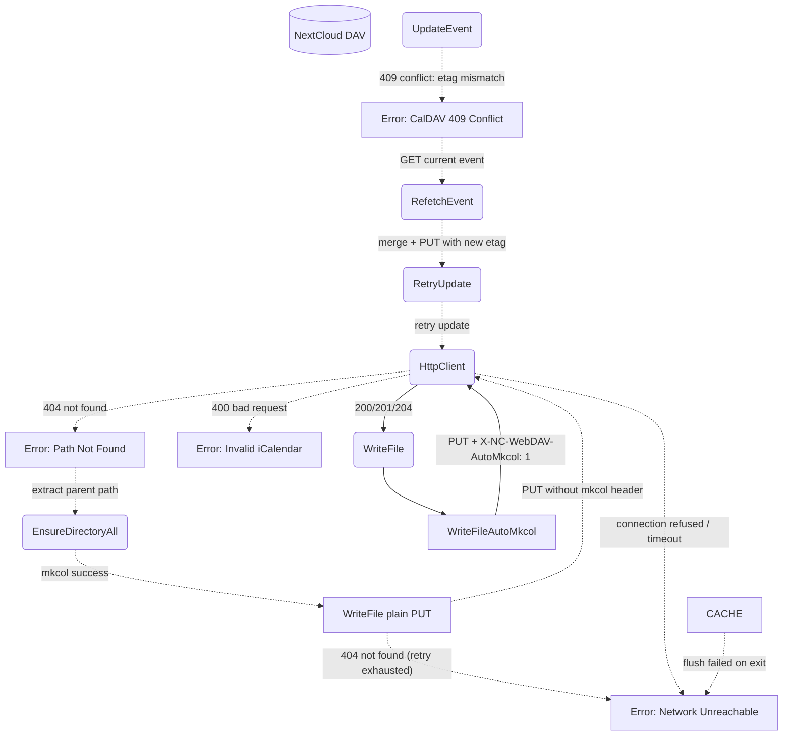
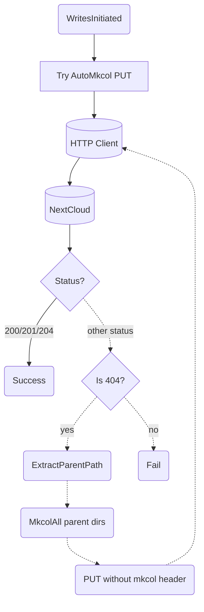
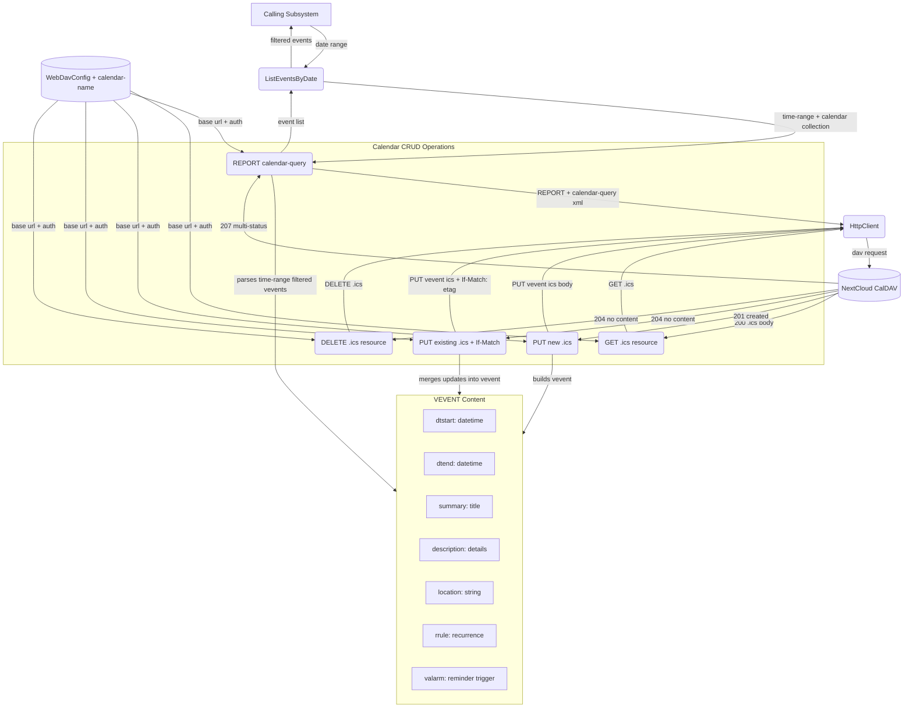
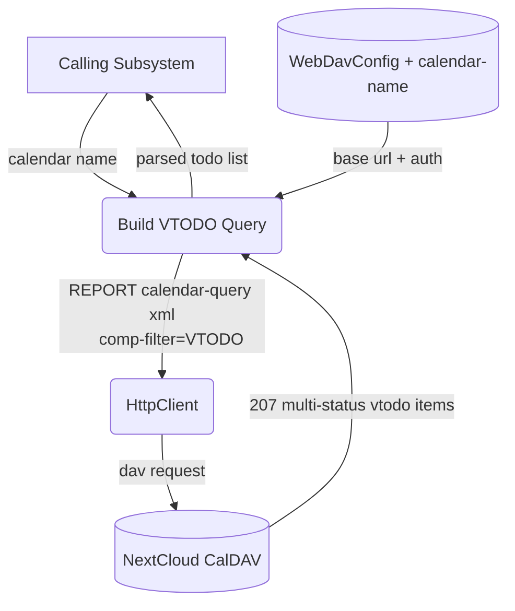
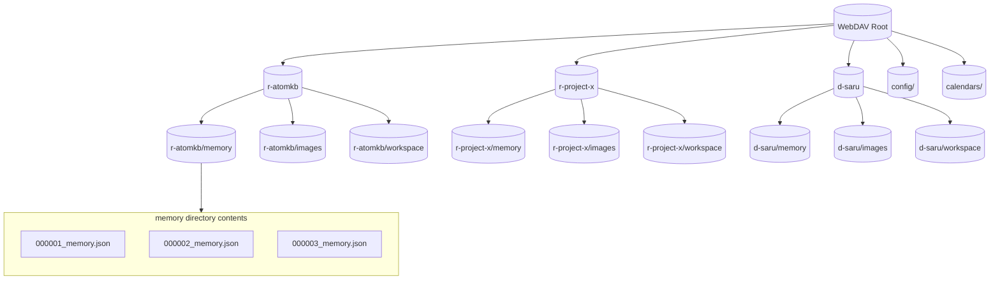
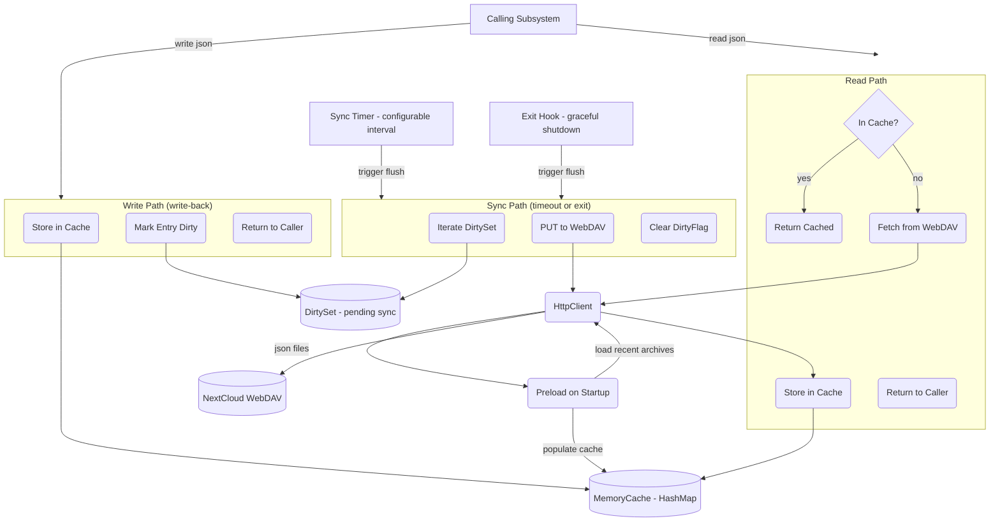

# WebDAV Storage

## 1. Purpose

Thin abstraction over HTTP-based WebDAV (NextCloud) providing typed file
read/write/list/mkdir/delete, calendar (CalDAV) event/todo access, and JSON
memory persistence. All bot state — configuration backups, JSON memory archives,
image assets, calendar events, and todo items — is stored remotely; the bot
never persists state to local disk. Each room gets its own directory subtree,
created proactively on first use.

**System Memory Cache:** JSON memory archives use a local in-memory cache
(`MemoryCache`) for read/write performance. Writes go to the cache immediately
(returning without waiting for the WebDAV round-trip), then sync to WebDAV on
a configurable timeout or on graceful shutdown. Reads check the cache first;
on miss, the file is fetched from WebDAV and cached. This avoids blocking the
agent loop on every memory I/O while keeping durability via the sync path.

**Calendar (CalDAV):** The client wraps NextCloud's CalDAV implementation
(RFC 4791) at `/remote.php/dav/calendars/{username}/{calendar-name}/`. CalDAV
uses the `REPORT` method with `calendar-query` XML bodies to list events within
a date range, `PUT` with iCalendar (RFC 5545) `VEVENT` payloads for create/update,
and `DELETE` to remove events. Event reminders use the `VALARM` iCalendar
component. **Todo list access is read-only** — `REPORT calendar-query` filtering
`VTODO` components, no create/update/delete on tasks.

**Memory as JSON:** Conversation memory is serialized to structured JSON files
at `{root}/{room_id}/memory/{seq:06}_memory.json` instead of markdown `.md`
archives. In-memory `ConversationHistory` buffers recent messages; when the
character-count threshold triggers, the oldest messages are summarized and the
full memory (summary + metadata + recent messages) is flushed to a JSON archive.
On startup, recent JSON archives are loaded back from WebDAV to seed context.

**Room name isolation:** Directories use a flat structure with type prefixes —
`r-{name}/` for channels (e.g. `r-原子知识库/` or `r-atomkb/`) and
`d-{name}/` for direct messages (e.g. `d-saru/`). The prefixes prevent
collisions between a channel and a DM user with the same slug. The harness
computes the `webdav_dir` from the room's display name (DDP `name` field,
falling back to `roomName`) + `is_dm` and injects it into tool arguments;
the raw `room_id` UUID is never used for WebDAV path construction.

The WebDAV client is used both internally (by `harness.rs` for room message
archiving) and as an AI-callable tool (`WebDavTool` in `tools/webdav.rs`) that
exposes read, write, list, mkdir, delete, and exists operations scoped to room
directories.

The client targets NextCloud's WebDAV API at:
- Files: `{base_url}/remote.php/dav/files/{username}` ([NextCloud WebDAV docs](https://docs.nextcloud.com/server/latest/developer_manual/client_apis/WebDAV/basic.html))
- Calendar: `{base_url}/remote.php/dav/calendars/{username}/{calendar-name}/` (CalDAV RFC 4791, iCalendar RFC 5545)
- Authentication: HTTP Basic Auth with an app password (generated via NextCloud's personal security settings)

- Upstream: [Configuration Management](config.md) provides `WebDavConfig`
- Upstream: [Memory Management](memory.md) stores and retrieves `.json` archives
- Upstream: [Agent Harness](../agent-harness.md) (vision tool) reads images from WebDAV
- Upstream: [Agent Harness](../agent-harness.md) (webdav tool) exposes storage to the AI agent
- Upstream: [Agent Harness](../agent-harness.md) (calendar tool) exposes calendar event/todo access to the AI agent

## 2. Diagram

### 2a. Happy Flow (Main Success Path) — Files, Calendar, Memory

```mermaid
flowchart TD
    CALLER[Calling Subsystem]
    CFG[(WebDavConfig)]
    RESOLVE(ResolvePath)
    READ(ReadFile)
    WRITE(WriteFile)
    LIST(ListDirectory)
    MKDIR(EnsureDirectory)
    DELETE(DeleteFile / DeleteEvent)
    ENSURE_ROOM(EnsureRoomDir)
    HTTP(HttpClient)
    NC[(NextCloud DAV)]
    CACHE[(MemoryCache)]
    CAL_LIST(ListEventsByDate)
    CAL_ADD(AddEvent)
    CAL_UPD(UpdateEvent)
    CAL_GET(GetEvent)
    TODO_LIST(ListTodos)
    MEM_WRITE(WriteMemoryJson)
    MEM_READ(ReadMemoryJson)
    MEM_LIST(ListMemoryArchives)

    CALLER -->|"path + operation"| RESOLVE
    CALLER -->|"room_id on first use"| ENSURE_ROOM
    CALLER -->|"date range + calendar"| CAL_LIST
    CALLER -->|"event details + calendar"| CAL_ADD
    CALLER -->|"event uid + updates + calendar"| CAL_UPD
    CALLER -->|"event uid + calendar"| CAL_GET
    CALLER -->|"calendar name"| TODO_LIST
    CALLER -->|"room_id + memory json"| MEM_WRITE
    CALLER -->|"room_id + archive seq"| MEM_READ
    CALLER -->|"room_id"| MEM_LIST
    CFG -->|"root + credentials"| RESOLVE
    CFG -->|"root + credentials"| ENSURE_ROOM
    CFG -->|"caldav url + credentials"| CAL_LIST
    CFG -->|"caldav url + credentials"| CAL_ADD
    CFG -->|"caldav url + credentials"| CAL_UPD
    CFG -->|"caldav url + credentials"| CAL_GET
    CFG -->|"caldav url + credentials"| TODO_LIST
    CFG -->|"root + credentials"| MEM_WRITE
    CFG -->|"root + credentials"| MEM_READ
    CFG -->|"root + credentials"| MEM_LIST
    RESOLVE -->|"get request"| READ
    RESOLVE -->|"put request"| WRITE
    RESOLVE -->|"propfind request"| LIST
    RESOLVE -->|"mkcol request"| MKDIR
    RESOLVE -->|"delete request"| DELETE
    ENSURE_ROOM -->|"mkcol request"| MKDIR
    CAL_LIST -->|"REPORT calendar-query"| HTTP
    CAL_ADD -->|"PUT vevent ics"| HTTP
    CAL_UPD -->|"PUT vevent ics + If-Match etag"| HTTP
    CAL_GET -->|"GET event ics"| HTTP
    TODO_LIST -->|"REPORT calendar-query vtodo"| HTTP
    MEM_WRITE -->|"store json in cache"| CACHE
    MEM_READ -->|"check cache"| CACHE
    CACHE -->|"cache hit: return json"| MEM_READ
    CACHE -.->|"cache miss: fetch + cache"| HTTP
    CACHE -->|"dirty entry: PUT json body"| HTTP
    MEM_LIST -->|"PROPFIND depth=1"| HTTP
    READ -->|"GET"| HTTP
    WRITE -->|"PUT with body + AutoMkcol header"| HTTP
    LIST -->|"PROPFIND depth=1"| HTTP
    MKDIR -->|"MKCOL"| HTTP
    DELETE -->|"DELETE"| HTTP
    HTTP -->|"http request"| NC
    NC -->|"response"| HTTP
    HTTP -->|"response body / status"| RESOLVE
    HTTP -->|"multi-status / event ics"| CAL_LIST
    HTTP -->|"201 created"| CAL_ADD
    HTTP -->|"204 updated"| CAL_UPD
    HTTP -->|"event ics"| CAL_GET
    HTTP -->|"multi-status vtodo"| TODO_LIST
    HTTP -.->|"json body"| CACHE
    CACHE -->|"response body / status"| MEM_WRITE
    CACHE -.->|"fetched memory json"| MEM_READ
    HTTP -->|"archive listing"| MEM_LIST
```



### 2b. Error Handling & Fallbacks



### 2c. Write-With-Fallback Deep Dive



### 2d. Calendar Operations Deep Dive

CalDAV calendar access per [NextCloud Calendar user guide](https://docs.nextcloud.com/server/latest/user_manual/en/groupware/calendar.html) and [RFC 4791](https://datatracker.ietf.org/doc/html/rfc4791). Events are iCalendar (RFC 5545) `VEVENT` objects. The CalDAV base URL is `/remote.php/dav/calendars/{username}/{calendar-name}/`. Each event is a resource named `{uid}.ics` within that collection.



### 2e. Todo List Deep Dive

Read-only access to NextCloud calendar `VTODO` items via CalDAV `REPORT
calendar-query` (RFC 4791 section 7.8), filtering by component type `VTODO`.
No create, update, or delete operations are exposed — the bot only reads
existing task items.



### 2f. JSON Memory Storage

Conversation memory is stored as structured JSON files on WebDAV instead of
in-memory-only buffers. Each room's memory lives in
`{root}/{room_id}/memory/{seq:06}_memory.json`. When the in-memory character
threshold triggers summarization, the oldest messages are compressed by the
AI provider, and the full memory state is serialized to a JSON archive file.
On startup, recent `.json` archives are loaded from WebDAV to seed context.



### 2g. Memory Cache Deep Dive

Write-back cache for JSON memory archives. Writes return immediately after
storing in local cache; a background timer or graceful-shutdown hook flushes
dirty entries to WebDAV. Reads hit the cache first and fetch from WebDAV
only on miss (populating the cache for subsequent reads). On startup, recent
archives are preloaded into the cache from WebDAV.



## 3. Data Structures

#### `WebDavClient`

| Field       | Type              | Notes                                  |
| ----------- | ----------------- | -------------------------------------- |
| `base_url`  | `String`          | WebDAV endpoint including root          |
| `client`    | `reqwest::Client` | Shared HTTP client with connection pool|
| `auth_header`| `String`          | `Basic` base64-encoded credentials     |

#### `WebDavEntry`

| Field       | Type     | Notes                                      |
| ----------- | -------- | ------------------------------------------ |
| `name`      | `String` | File or directory name                     |
| `href`      | `String` | Full WebDAV href                           |
| `is_dir`    | `bool`   | True if collection (directory)             |
| `size`      | `u64`    | File size in bytes (0 for dirs)            |
| `modified`  | `String` | Last-modified timestamp                    |

#### `CaldavEvent`

CalDAV event resource represented as a parsed iCalendar `VEVENT` (RFC 5545).
Stored as `{uid}.ics` within the calendar collection.

| Field          | Type          | Notes                                      |
| -------------- | ------------- | ------------------------------------------ |
| `uid`          | `String`      | Globally unique event identifier           |
| `href`         | `String`      | Full CalDAV href to `{uid}.ics`            |
| `etag`         | `String`      | Opaque tag for conditional updates         |
| `summary`      | `String`      | Event title/name                           |
| `description`  | `Option<String>`| Event details/notes                      |
| `location`     | `Option<String>`| Event venue/place                        |
| `dtstart`      | `String`      | Start datetime (ISO 8601 with timezone)    |
| `dtend`        | `String`      | End datetime (ISO 8601 with timezone)      |
| `rrule`        | `Option<String>`| Recurrence rule (RFC 5545 format)        |
| `reminders`    | `Vec<Reminder>`| List of `VALARM` reminders                |
| `created`      | `String`      | Creation timestamp                         |
| `last_modified`| `String`      | Last-modified timestamp                    |

#### `Reminder` (`VALARM`)

| Field       | Type     | Notes                                         |
| ----------- | -------- | --------------------------------------------- |
| `action`    | `String` | `DISPLAY` or `EMAIL`                          |
| `trigger`   | `String` | Duration before event (`-PT15M`) or absolute   |

#### `CaldavTodo`

Read-only CalDAV `VTODO` item. Only list/read access; no create/update/delete.
Retrieved via `REPORT calendar-query` with `<comp-filter name="VTODO"/>`.

| Field         | Type          | Notes                                   |
| ------------- | ------------- | --------------------------------------- |
| `uid`         | `String`      | Globally unique todo identifier         |
| `href`        | `String`      | Full CalDAV href to `{uid}.ics`         |
| `summary`     | `String`      | Todo title/name                         |
| `description` | `Option<String>`| Todo details/notes                    |
| `priority`    | `Option<u8>`  | 1 (highest) – 9 (lowest), 0 = undefined |
| `status`      | `String`      | `NEEDS-ACTION`, `COMPLETED`, `CANCELLED`|
| `due`         | `Option<String>`| Due date (ISO 8601)                   |
| `completed`   | `Option<String>`| Completion date (ISO 8601)            |
| `created`     | `String`      | Creation timestamp                      |

#### `MemoryJson`

Conversation memory serialized to JSON and persisted at
`{root}/{room_id}/memory/{seq:06}_memory.json`. Each file contains a full
archive snapshot — AI-generated summary plus the messages summarized.

| Field        | Type             | Notes                                       |
| ------------ | ---------------- | ------------------------------------------- |
| `seq`        | `u64`            | Archive sequence number                     |
| `room_id`    | `String`         | Owning room identifier                      |
| `summary`    | `String`         | AI-generated conversation summary           |
| `date_range` | `String`         | `"2026-06-01 to 2026-06-08"`               |
| `msg_count`  | `usize`          | Number of messages summarized in this file  |
| `messages`   | `Vec<MessageRef>`| Summarized message references               |
| `created_at` | `String`         | ISO 8601 archive creation timestamp         |

#### `MessageRef`

| Field       | Type     | Notes                                |
| ----------- | -------- | ------------------------------------ |
| `id`        | `String` | RocketChat message UUID              |
| `author`    | `String` | Display name of the message author   |
| `content`   | `String` | Message text content                 |
| `timestamp` | `String` | ISO 8601 message timestamp           |

#### `MemoryCache`

Per-room write-back cache for `MemoryJson` archive files. Writes go to
cache immediately; dirty entries are flushed to WebDAV on a configurable
sync interval or on graceful shutdown.

| Field            | Type                       | Notes                                       |
| ---------------- | -------------------------- | ------------------------------------------- |
| `entries`        | `HashMap<String, CachedEntry>`| Path → cached JSON + dirty flag          |
| `sync_interval`  | `Duration`                 | How often to flush dirty entries (default 30s)|
| `sync_handle`    | `Option<JoinHandle<()>>`   | Background sync task handle                 |

#### `CachedEntry`

| Field      | Type          | Notes                                    |
| ---------- | ------------- | ---------------------------------------- |
| `data`     | `MemoryJson`  | Parsed archive content                   |
| `dirty`    | `bool`        | True if cache is ahead of WebDAV         |
| `cached_at`| `Instant`     | When the entry was last loaded/updated   |

#### `WebDavPath`

All methods accept a `dir_key` — a flat type-prefixed `webdav_dir` such as
`r-atomkb` or `d-saru`. The harness computes and injects `webdav_dir` from
the room's display name; the raw RocketChat room UUID is never used as a
path segment.

| Method                     | Returns    | Notes                                          |
| -------------------------- | ---------- | ---------------------------------------------- |
| `room_dir(key)`            | `String`   | `/{root}/{key}/`                               |
| `memory_dir(key)`          | `String`   | `/{root}/{key}/memory/`                        |
| `image_dir(key)`           | `String`   | `/{root}/{key}/images/`                        |
| `workspace_dir(key)`       | `String`   | `/{root}/{key}/workspace/`                     |
| `image_path(key, name)`    | `String`   | `/{root}/{key}/images/{name}`                  |
| `archive_path(key, seq)`   | `String`   | `/{root}/{key}/memory/{seq:06}_memory.json`    |
| `room_path(key, file)`     | `String`   | `/{root}/{key}/{file_path}`                    |
| `calendar_path(calendar)`  | `String`   | `/calendars/{calendar}/`                       |
| `event_path(calendar, uid)`| `String`   | `/calendars/{calendar}/{uid}.ics`              |
| `parent_path(path)`        | `String`   | Strips last path segment                       |

## 4. NextCloud API Reference

### WebDAV File Operations

Per [NextCloud WebDAV basic operations](https://docs.nextcloud.com/server/latest/developer_manual/client_apis/WebDAV/basic.html).

| DFD Operation           | HTTP Method | NextCloud Endpoint                        | Notes                                |
| ----------------------- | ----------- | ----------------------------------------- | ------------------------------------ |
| ReadFile                | `GET`       | `{base}/files/{user}/{path}`              | Returns raw file bytes               |
| WriteFile               | `PUT`       | `{base}/files/{user}/{path}`              | Overwrites existing files            |
| WriteFileAutoMkcol      | `PUT`       | `{base}/files/{user}/{path}`              | Set `X-NC-WebDAV-AutoMkcol: 1` header |
| WriteFileWithFallback   | `PUT`       | `{base}/files/{user}/{path}`              | Tries AutoMkcol; 404 → mkcol parents → retry PUT |
| ListDirectory           | `PROPFIND`  | `{base}/files/{user}/{path}`              | `Depth: 1` for children              |
| EnsureDirectory         | `MKCOL`     | `{base}/files/{user}/{path}`              | Returns 405 if exists                |
| EnsureDirectoryAll      | `MKCOL`     | `{base}/files/{user}/{path}`              | Iterative MKCOL per segment          |
| EnsureRoomDirectory     | `MKCOL`     | `{base}/files/{user}/{root}/{room}/`      | Creates room dir on first use        |
| Delete                  | `DELETE`    | `{base}/files/{user}/{path}`              | Recursive for folders                |
| Exists                  | `PROPFIND`  | `{base}/files/{user}/{path}`              | `Depth: 0` — 207 = exists, 404 = no  |

### CalDAV Calendar Operations

Per [NextCloud Calendar user guide](https://docs.nextcloud.com/server/latest/user_manual/en/groupware/calendar.html), [RFC 4791](https://datatracker.ietf.org/doc/html/rfc4791) (CalDAV), and [RFC 5545](https://datatracker.ietf.org/doc/html/rfc5545) (iCalendar).
NextCloud serves CalDAV at `/remote.php/dav/calendars/{user}/{calendar-name}/`.
Events are stored as `{uid}.ics` resources within the calendar collection.
iCalendar payloads use content type `text/calendar; charset=utf-8`.

| DFD Operation           | HTTP Method | Endpoint / Headers                           | Notes                                           |
| ----------------------- | ----------- | -------------------------------------------- | ----------------------------------------------- |
| ListEventsByDate        | `REPORT`    | `{base}/calendars/{user}/{cal}/`             | XML body with `calendar-query`, time-range filter |
| GetEvent                | `GET`       | `{base}/calendars/{user}/{cal}/{uid}.ics`    | Returns full `VEVENT` iCalendar data            |
| AddEvent                | `PUT`       | `{base}/calendars/{user}/{cal}/{uid}.ics`    | Body = `VEVENT` iCalendar (RFC 5545)            |
| UpdateEvent             | `PUT`       | `{base}/calendars/{user}/{cal}/{uid}.ics`    | `If-Match: {etag}` header; 409 on conflict      |
| DeleteEvent             | `DELETE`    | `{base}/calendars/{user}/{cal}/{uid}.ics`    | 204 on success, 404 if not found                |

#### `calendar-query` REPORT body (listing events for a date)

```xml
<?xml version="1.0" encoding="UTF-8"?>
<C:calendar-query xmlns:D="DAV:" xmlns:C="urn:ietf:params:xml:ns:caldav">
  <D:prop>
    <D:getetag/>
    <C:calendar-data/>
  </D:prop>
  <C:filter>
    <C:comp-filter name="VCALENDAR">
      <C:comp-filter name="VEVENT">
        <C:time-range start="20260601T000000Z" end="20260602T000000Z"/>
      </C:comp-filter>
    </C:comp-filter>
  </C:filter>
</C:calendar-query>
```

#### `VEVENT` iCalendar payload (create/update event with reminder)

```
BEGIN:VCALENDAR
VERSION:2.0
PRODID:-//RockBot//NextCloud Calendar//EN
BEGIN:VEVENT
UID:abc123-uuid@rockbot
DTSTART:20260615T140000Z
DTEND:20260615T150000Z
SUMMARY:Team standup
DESCRIPTION:Daily sync meeting
LOCATION:Room 4B
BEGIN:VALARM
ACTION:DISPLAY
TRIGGER:-PT15M
DESCRIPTION:Meeting in 15 minutes
END:VALARM
END:VEVENT
END:VCALENDAR
```

### CalDAV Todo List Operations (read-only)

| DFD Operation           | HTTP Method | Endpoint                                      | Notes                                           |
| ----------------------- | ----------- | --------------------------------------------- | ----------------------------------------------- |
| ListTodos               | `REPORT`    | `{base}/calendars/{user}/{cal}/`              | XML body filtering `VTODO` components only      |

#### Todo `calendar-query` REPORT body

```xml
<?xml version="1.0" encoding="UTF-8"?>
<C:calendar-query xmlns:D="DAV:" xmlns:C="urn:ietf:params:xml:ns:caldav">
  <D:prop>
    <D:getetag/>
    <C:calendar-data/>
  </D:prop>
  <C:filter>
    <C:comp-filter name="VCALENDAR">
      <C:comp-filter name="VTODO">
        <C:comp-filter name="STATUS">
          <C:text-match negate-condition="yes">CANCELLED</C:text-match>
        </C:comp-filter>
      </C:comp-filter>
    </C:comp-filter>
  </C:filter>
</C:calendar-query>
```

### JSON Memory Operations

Memory operations route through the local `MemoryCache` layer before touching
WebDAV. Writes are immediate to cache; sync to WebDAV happens on timer or exit.

| DFD Operation           | HTTP Method | NextCloud Endpoint                        | Notes                                |
| ----------------------- | ----------- | ----------------------------------------- | ------------------------------------ |
| WriteMemoryJson         | `PUT`       | `{base}/files/{user}/{root}/{room}/memory/{seq:06}_memory.json` | Serialized `MemoryJson` — via cache write-back |
| ReadMemoryJson          | `GET`       | `{base}/files/{user}/{root}/{room}/memory/{seq:06}_memory.json` | Returns `MemoryJson` — cache-hit or fetch |
| ListMemoryArchives      | `PROPFIND`  | `{base}/files/{user}/{root}/{room}/memory/` | `Depth: 1` — filter `*.json`        |
| FlushDirtyCache         | —           | — (local operation, triggers `PUT` batch) | Called by sync timer or exit hook     |
| PreloadCache            | —           | — (local, fetches recent `*.json`)        | Called on room init after restart     |

The `X-NC-WebDAV-AutoMkcol` header (available since NextCloud 32) instructs the
server to automatically create any missing parent directories when uploading a
file. When this header is not supported (NextCloud < 32, or non-NextCloud
servers), the `WriteFileWithFallback` operation catches the 404 response,
explicitly creates parent directories via iterative `MKCOL`, then retries the
`PUT` without the header.
