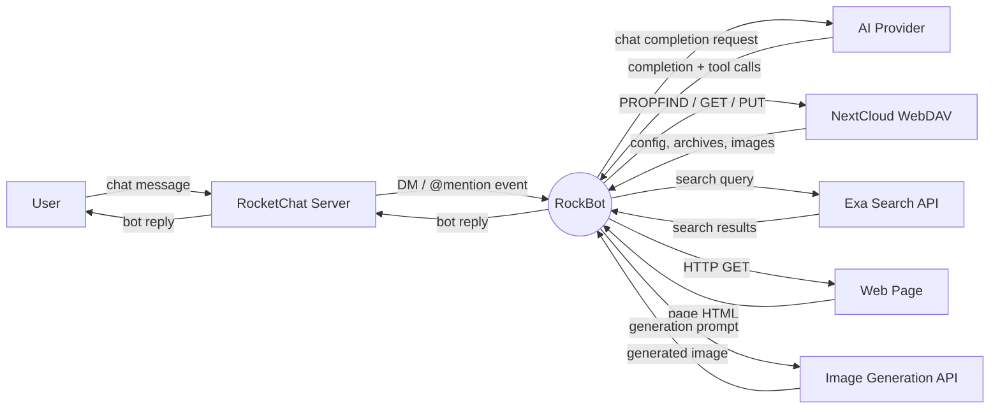

# RockBot — Context Diagram (Level 0)

## 1. Purpose

Single-process view of RockBot: a Rust-based AI agent that connects to a
self-hosted RocketChat server, answers DMs and @mentions via configurable AI
providers, executes agentic tools (web search, URL fetch, vision, image
generation), and persists all state to a NextCloud WebDAV server — never
touching local disk.

## 2. Diagram

