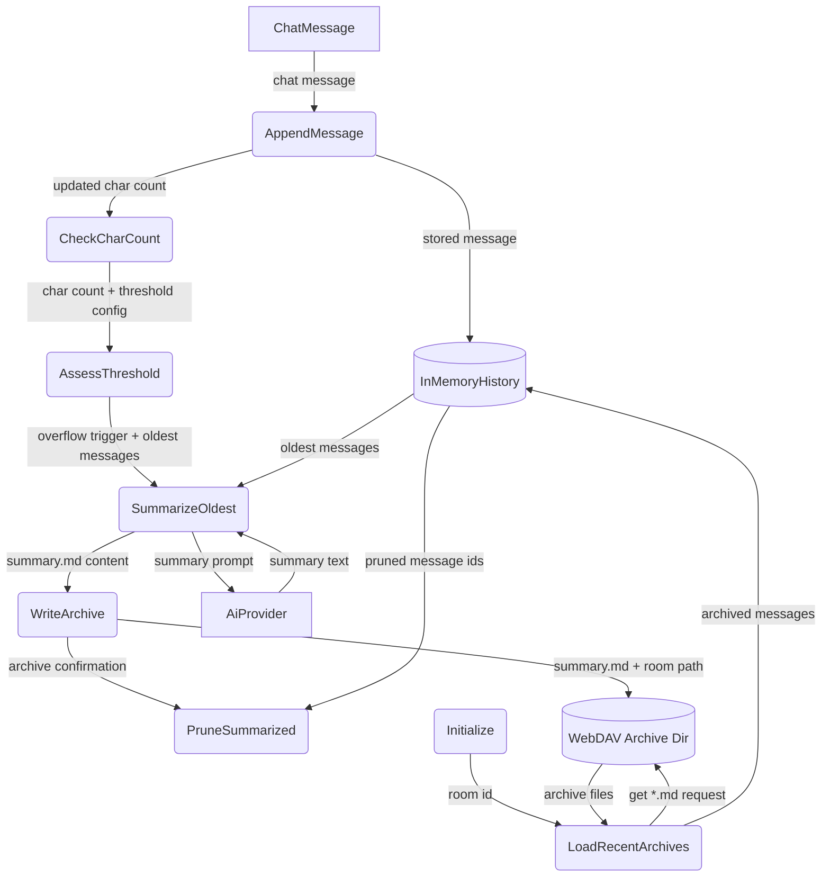
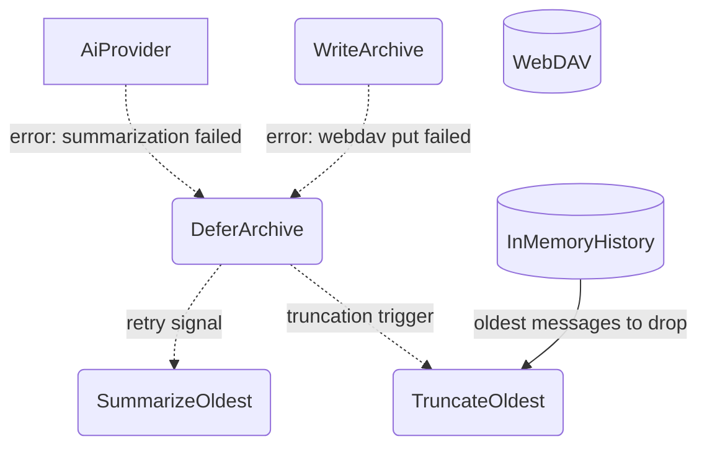
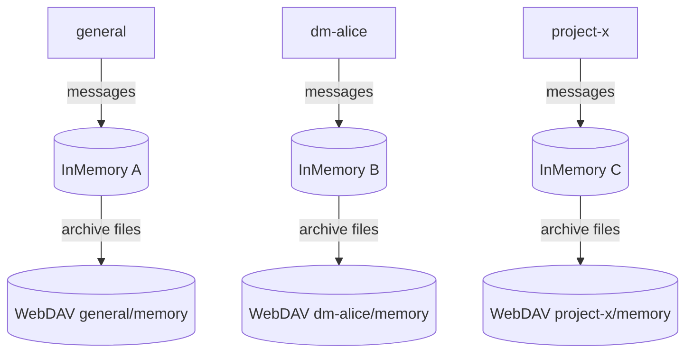

# Memory Management

## 1. Purpose

Per-room in-memory conversation store with character-count threshold monitoring.
When the local history exceeds the configured maximum, the oldest messages are
summarized via the AI provider into a compressed `.md` file and archived to the
room's WebDAV directory. On startup, recent archives are loaded back to seed
context.

- Upstream: [Configuration Management](config.md) provides `MemoryConfig`
- Upstream: [Agent Loop](agent-harness.md) loads archives on startup and
  triggers per-room history operations after each message
- Downstream: [WebDAV Storage](webdav.md) persists `.md` archive files
- Downstream: [AI Provider](ai-provider.md) is called to generate summaries

## 2. Diagram

### 2a. Happy Flow (Main Success Path)



### 2b. Error Handling & Fallbacks



### 2c. Memory Partitioning Deep Dive

Each room (channel or DM) gets an isolated memory partition with its own
in-memory history and WebDAV archive directory.



## 3. Data Structures

#### `ConversationHistory`

| Field          | Type                  | Notes                               |
| -------------- | --------------------- | ----------------------------------- |
| `room_id`      | `String`              | Owning room identifier              |
| `messages`     | `Vec<ChatMessage>`    | In-memory message buffer            |
| `char_count`   | `usize`               | Running character count             |
| `archive_seq`  | `u64`                 | Next archive sequence number        |

#### `ArchiveEntry`

| Field        | Type     | Notes                                       |
| ------------ | -------- | ------------------------------------------- |
| `seq`        | `u64`    | Sequence number (zero-padded for ordering)  |
| `summary`    | `String` | Markdown-formatted conversation summary     |
| `date_range` | `String` | `"2026-06-01 to 2026-06-08"`               |
| `msg_count`  | `usize`  | Number of messages summarized               |

#### Archive File Naming

```
{root}/{room_id}/memory/{seq:06}_summary.md
```

Example: `rockbot/general/memory/000001_summary.md`
