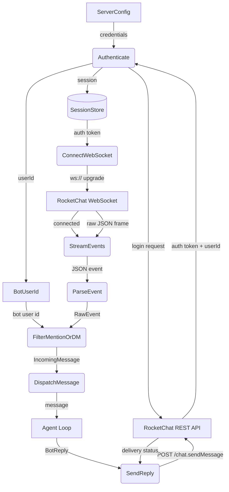
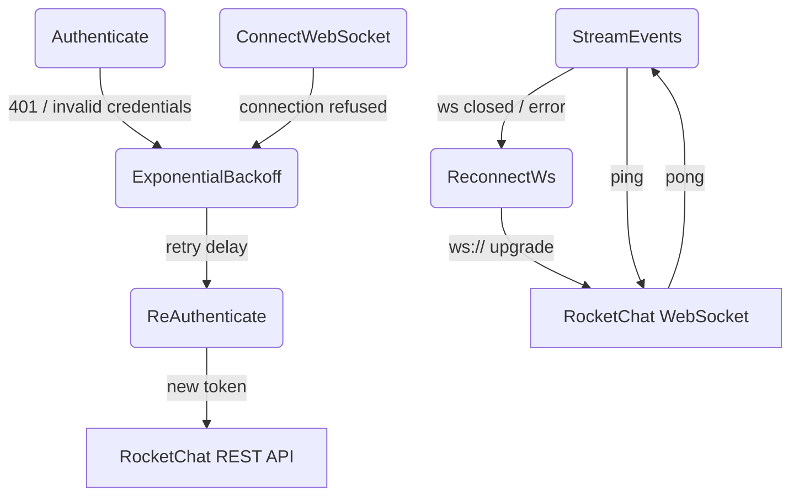
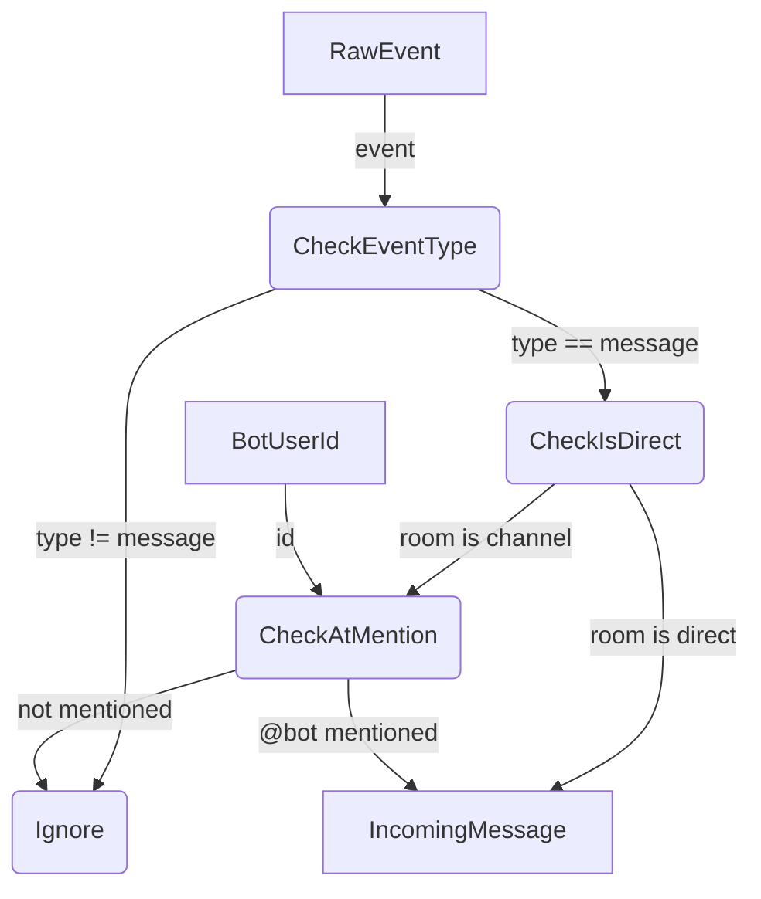

# RocketChat Connection

## 1. Purpose

Standalone reusable crate (`rocketchat`) that manages the full lifecycle of a
RocketChat connection: REST authentication, WebSocket event streaming, message
parsing/filtering, and reply delivery. Only DMs and @mentions are forwarded to
the agent.

- Upstream: [Configuration Management](config.md) provides `ServerConfig`
- Downstream: [Agent Loop](agent-harness.md) receives filtered
  `IncomingMessage` events; consumes `BotReply` for delivery to RocketChat

## 2. Diagram

### 2a. Happy Flow (Main Success Path)

### 2b. Error Handling & Fallbacks

### 2c. Message Filter Deep Dive

## 3. Data Structures

#### `IncomingMessage`

| Field       | Type     | Notes                                       |
| ----------- | -------- | ------------------------------------------- |
| `msg_id`    | `String` | RocketChat message ID                       |
| `room_id`   | `String` | Room/Channel ID                             |
| `sender_id` | `String` | User who sent the message                   |
| `text`      | `String` | Message text (mentions stripped)            |
| `is_dm`     | `bool`   | True if direct message                      |
| `timestamp` | `i64`    | Unix timestamp                              |

#### `BotReply`

| Field       | Type     | Notes                                  |
| ----------- | -------- | -------------------------------------- |
| `room_id`   | `String` | Target room                            |
| `text`      | `String` | Reply content (Markdown supported)     |
| `thread_id` | `Option<String>` | Reply in thread if set         |

#### `SessionStore`

| Field        | Type     | Notes                               |
| ------------ | -------- | ----------------------------------- |
| `auth_token` | `String` | X-Auth-Token from login             |
| `user_id`    | `String` | Bot user ID                         |
| `ws_url`     | `String` | Resolved WebSocket URL              |

#### `RawEvent`

| Field    | Type     | Notes                                       |
| -------- | -------- | ------------------------------------------- |
| `msg`    | `String` | WS frame type (`"changed"`, `"ping"`, etc.) |
| `fields` | `Value`  | Event payload from RocketChat stream        |
