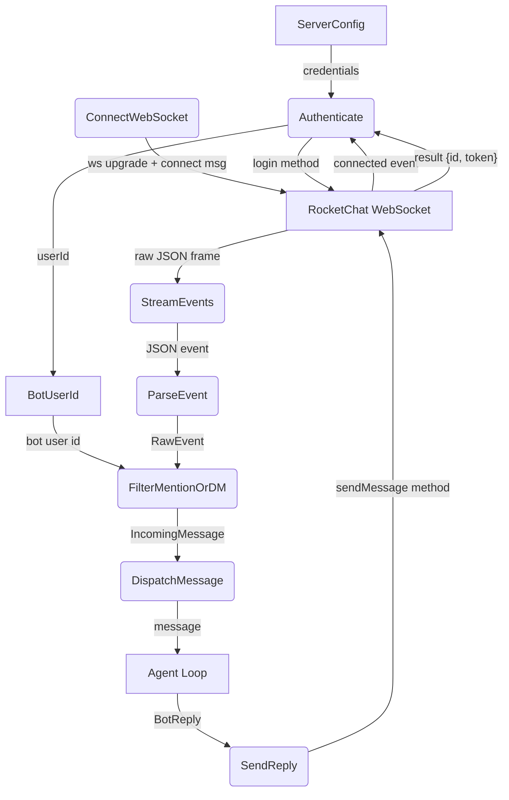
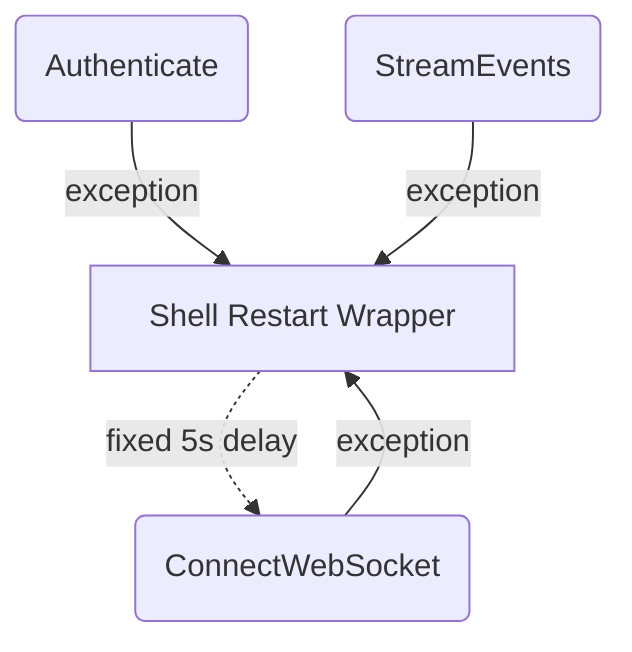
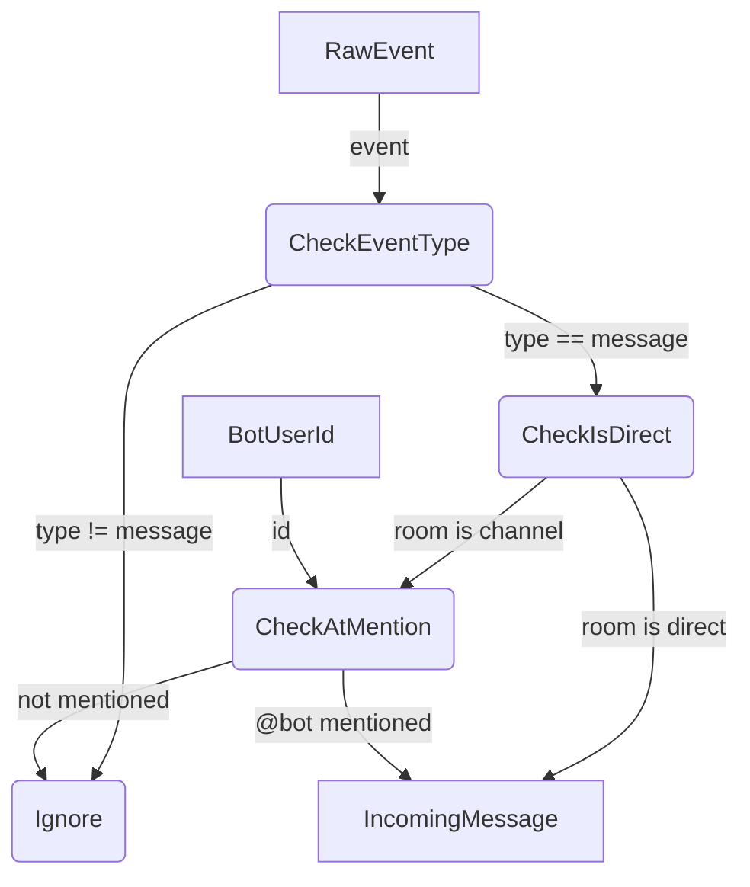
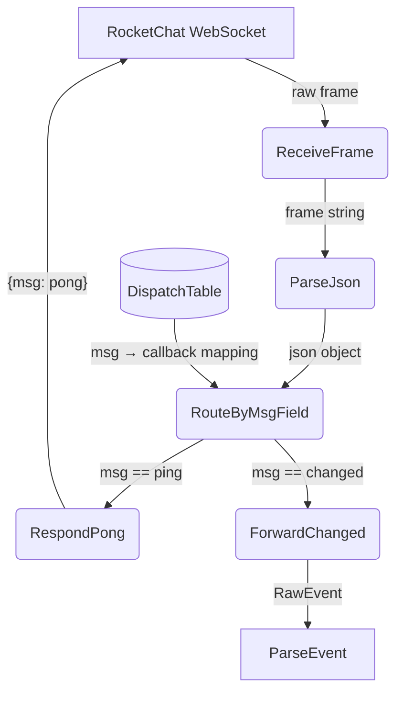

# RocketChat Connection

## 1. Purpose

Python module (`RocketChatBot`) that manages the full lifecycle of a
RocketChat connection: WebSocket authentication, event streaming, message
parsing/filtering, and reply delivery. Only DMs and @mentions are forwarded to
the agent.

- Upstream: [Configuration Management](config.md) provides `ServerConfig`
- Downstream: [Agent Loop](agent-harness.md) receives filtered
  `IncomingMessage` events; consumes `BotReply` for delivery to RocketChat

## 2. Diagram

### 2a. Happy Flow (Main Success Path)

### 2b. Error Handling & Fallbacks

The Python implementation has minimal internal error recovery — any WebSocket
exception propagates uncaught and terminates the process. External restart is
provided by the shell wrapper (`manual_start.sh`) with a fixed 5s delay and
retry counter.

### 2c. Message Filter Deep Dive

### 2d. Ping/Pong Keepalive Deep Dive

The RocketChat server periodically sends `{"msg": "ping"}` to keep the
WebSocket alive. The bot responds immediately with `{"msg": "pong"}`. This
diagram decomposes the `StreamEvents` (STREAM) process from Level 1, showing
the internal dispatch that routes frames by `msg` field.

**Dispatch table** — the `cbdist` dict maps each `msg` value to a callback:

| `msg` value    | Callback         | Action                            |
| -------------- | ---------------- | --------------------------------- |
| `"ping"`       | `_cb_ping`       | Send `{"msg": "pong"}`            |
| `"connected"`  | `_cb_connected`  | Send login method                 |
| `"result"`     | `_rt_dispatch`   | Extract userId, subscribe to room |
| `"changed"`    | `_cb_changed`    | Forward to ParseEvent             |

Note: the bot does **not** proactively send pings or monitor ping intervals —
it only responds to server-initiated pings. A missing server ping will not be
detected; a WebSocket error will propagate uncaught (see 2b).

## 3. Data Structures

#### `IncomingMessage`

| Field       | Type     | Notes                                       |
| ----------- | -------- | ------------------------------------------- |
| `msg_id`    | `String` | RocketChat message ID                       |
| `room_id`   | `String` | Room/Channel ID                             |
| `sender_id` | `String` | User who sent the message                   |
| `text`      | `String` | Message text (mentions stripped)            |
| `is_dm`     | `bool`   | True if direct message                      |
| `timestamp` | `i64`    | Unix timestamp                              |

#### `BotReply`

| Field       | Type     | Notes                                  |
| ----------- | -------- | -------------------------------------- |
| `room_id`   | `String` | Target room                            |
| `text`      | `String` | Reply content (Markdown supported)     |
| `thread_id` | `Option<String>` | Reply in thread if set         |

#### `DispatchTable`

| Field    | Type         | Notes                             |
| -------- | ------------ | --------------------------------- |
| `msg`    | `String`     | WS frame type (key)               |
| `cb`     | `Callable`   | Async callback (value)            |

#### `RawEvent`

| Field    | Type     | Notes                                       |
| -------- | -------- | ------------------------------------------- |
| `msg`    | `String` | WS frame type (`"changed"`, `"ping"`, etc.) |
| `fields` | `Value`  | Event payload from RocketChat stream        |
