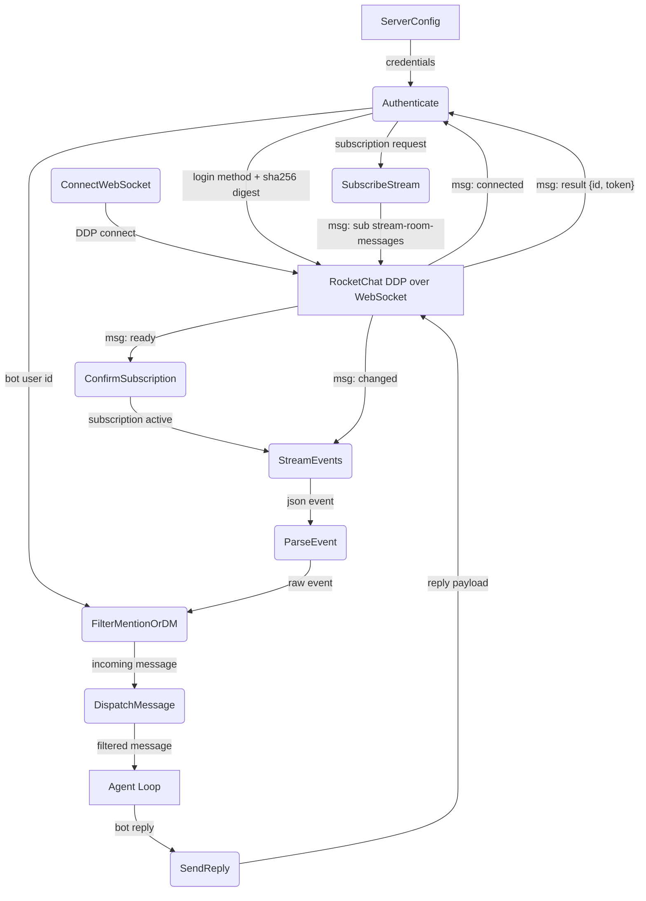
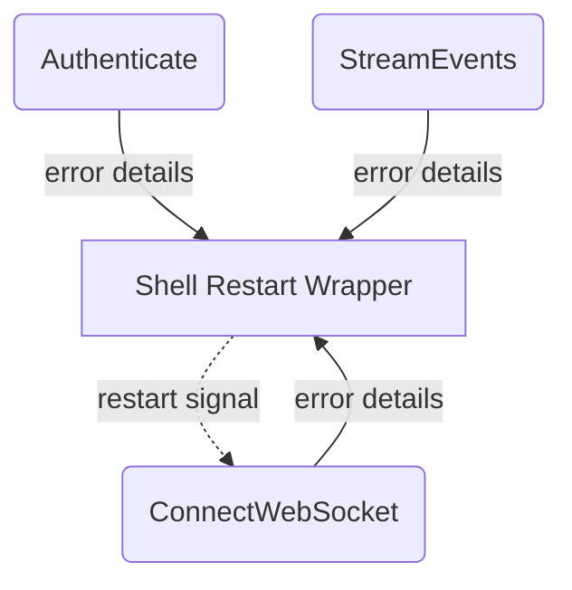
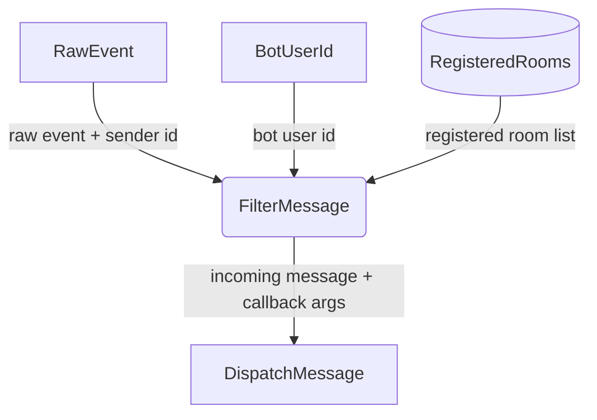
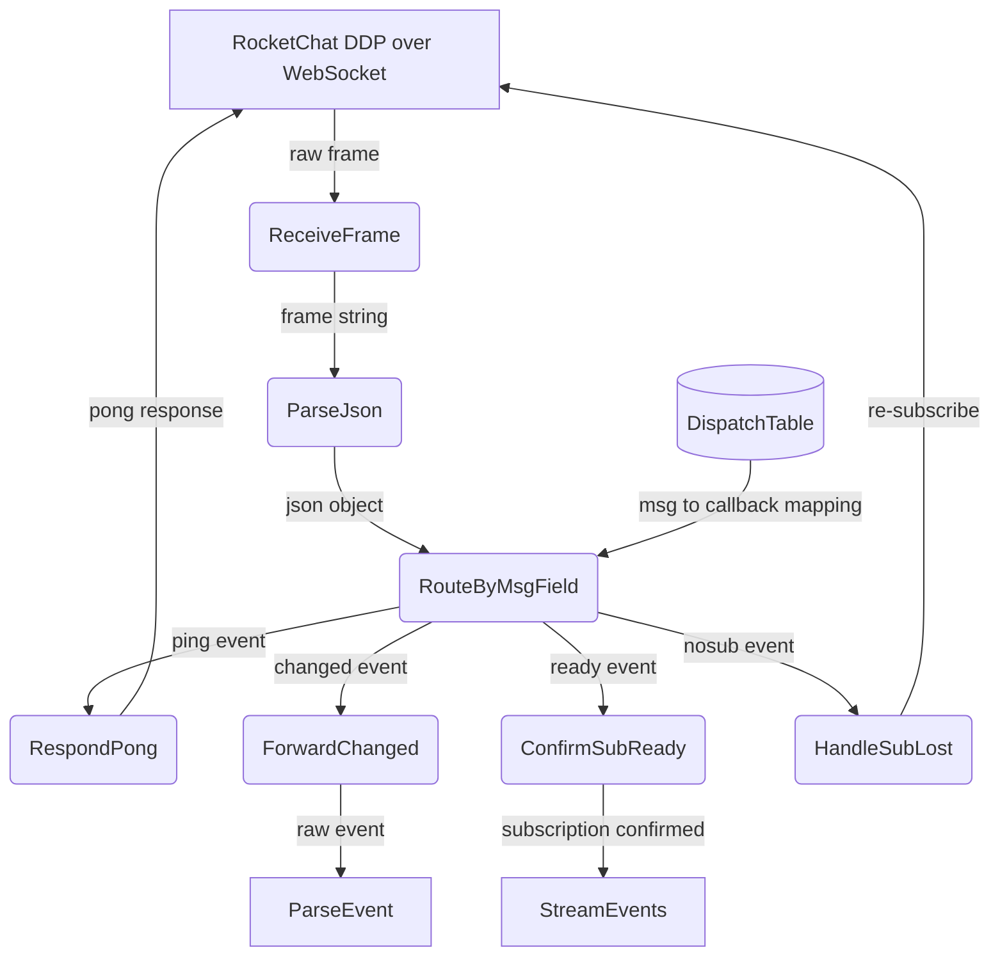
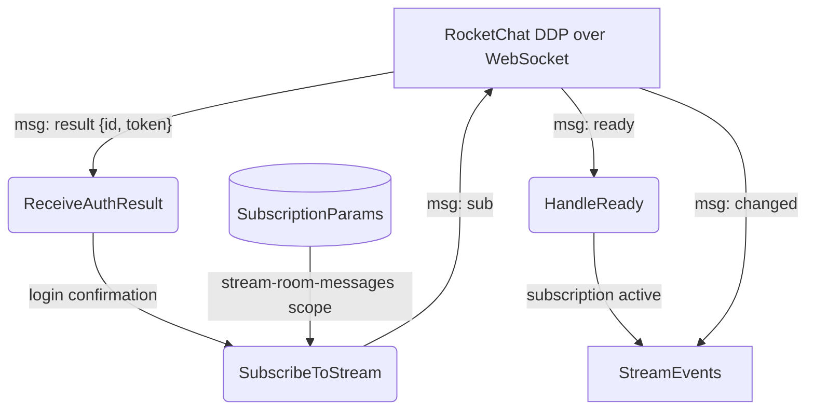

# RocketChat Connection

## 1. Purpose

Python module (`RocketChatBot`) that manages the full lifecycle of a
RocketChat connection over **DDP (Distributed Data Protocol)** via WebSocket:
authentication, subscription to message stream, event dispatch, message
parsing/filtering, and reply delivery. DMs, messages starting with `@botname`,
and room-specific registered callbacks are forwarded to the agent.

> **Deprecation note**: Rocket.Chat's official documentation marks the raw
> DDP/bots approach as **deprecated** (2025). The recommended replacement is
> [`@rocket.chat/ddp-client`](https://www.npmjs.com/package/@rocket.chat/ddp-client)
> or the [Apps-Engine](https://developer.rocket.chat/docs/rocketchat-apps-engine).

- Upstream: [Configuration Management](config.md) provides configuration
  (loaded as `SimpleNamespace` from `config.json` in the Python implementation)
- Downstream: [Agent Loop](agent-harness.md) receives filtered messages via
  callback `(sender_name, room_name, room_id, text)`; sends replies through
  the `bot` helper class wrapping `sendMsg()`

## 2. Diagram

### 2a. Happy Flow (Main Success Path)



### 2b. Error Handling & Fallbacks

The Python implementation has minimal internal error recovery — any WebSocket
exception propagates uncaught and terminates the process. External restart is
provided by the shell wrapper (`manual_start.sh`) with a retry counter.



### 2c. Message Filter Deep Dive

The `_cb_changed` callback (`bot/RocketChatBot.py:116`) implements a four-stage
decision chain. Messages from the bot itself are silently dropped. The bot
responds to three cases: (1) `@botname` at the start of a channel message,
(2) a specific registered room, or (3) a direct message with no room name.



The filter process internally:
1. Skips events from the bot's own user ID
2. Matches messages starting with `@botname` in channels
3. Falls back to checking a registered-room list
4. Accepts DMs with no room name (`rom == ""` or `rom == "DIRECT_MESSAGES"`)

All other cases are silently dropped.

### 2d. Ping/Pong Keepalive Deep Dive

The RocketChat server periodically sends `{"msg": "ping"}` to keep the
WebSocket alive. The bot responds immediately with `{"msg": "pong"}`. This
diagram decomposes the `StreamEvents` (STREAM) process from Level 1, showing
the internal dispatch that routes frames by `msg` field.



**Dispatch table** — the `cbdist` dict maps each `msg` value to a callback:

| `msg` value    | Callback           | Action                              |
| -------------- | ------------------ | ----------------------------------- |
| `"ping"`       | `_cb_ping`         | Send `{"msg": "pong"}`              |
| `"connected"`  | `_cb_connected`    | Send login method                   |
| `"result"`     | `_rt_dispatch`     | Extract userId, subscribe to room   |
| `"changed"`    | `_cb_changed`      | Forward to ParseEvent               |
| `"ready"`      | **missing**         | Gateway to StreamEvents (see fix)   |
| `"nosub"`      | **missing**         | Re-subscribe on disconnect (see fix)|

> **Known gaps**: `"ready"` and `"nosub"` are standard DDP lifecycle messages
> sent after subscription/unsubscription. Neither is handled by the current
> implementation. The bot never confirms its subscription actually succeeded,
> and cannot detect subscription loss.

Note: the bot does **not** proactively send pings or monitor ping intervals —
it only responds to server-initiated pings. A missing server ping will not be
detected; a WebSocket error will propagate uncaught (see 2b).

### 2e. Subscription Deep Dive

After authentication succeeds (`_rt_dispatch` receives `result` with `id` and
`token`), `_gologin()` subscribes to the `stream-room-messages` endpoint with
the `__my_messages__` scope. Once subscribed, the server begins delivering
`"changed"` events for all messages visible to the bot user.



**Subscription payload** sent to the WebSocket:

```json
{
    "msg": "sub",
    "id": "ABCROCK",
    "name": "stream-room-messages",
    "params": ["__my_messages__", false]
}
```

The `params` array controls which messages are received: `"__my_messages__"`
scopes to the authenticated user, and `false` (the DDP backward-compatibility
flag) means only `"changed"` events are delivered. Setting it to `true` would
also emit `"added"` events for each existing message, which is unnecessary
for a bot that only needs new incoming messages.

### 2f. Authentication Deep Dive

The login flow uses DDP method calls over the WebSocket. The Rocket.Chat
`login` method requires the password to be pre-hashed with **SHA-256**, sent
as a lowercase hex digest alongside the algorithm name.

**Current implementation** (`bot/RocketChatBot.py:79-87`):

```json
{
    "msg": "method",
    "method": "login",
    "id": "42",
    "params": [
        {
            "user": { "username": "rockbot" },
            "password": "plaintext-password"
        }
    ]
}
```

> **BUG**: The password is sent as a plain string. The Rocket.Chat login API
> expects the password field to be an object with `"digest"` and `"algorithm"`
> keys. The server may accept plaintext passwords if configured
> non-standardly, but the documented protocol requires:

**Correct payload** (per [Rocket.Chat Realtime API docs](https://web.archive.org/web/20220728050012/https://developer.rocket.chat/reference/api/realtime-api/method-calls/login)):

```json
{
    "msg": "method",
    "method": "login",
    "id": "42",
    "params": [
        {
            "user": { "username": "rockbot" },
            "password": {
                "digest": "2cf24dba5fb0a30e26e83b2ac5b9e29e1b161e5c1fa7425e73043362938b9824",
                "algorithm": "sha-256"
            }
        }
    ]
}
```

The `_cb_connected` callback should hash the password with
`hashlib.sha256(password.encode()).hexdigest()` before constructing the
payload.

**Server response** on success:

```json
{
    "msg": "result",
    "id": "42",
    "result": {
        "id": "user-id",
        "token": "auth-token",
        "tokenExpires": { "$date": 1480377601 }
    }
}
```

The `tokenExpires` field is **not consumed** by the current implementation.

## 3. Data Structures

The Python implementation does not define formal typed structures (dataclasses,
TypedDicts, etc.). Data flows through positional callback arguments and ad-hoc
dicts. The tables below describe both the conceptual types and how each field
maps to the current code.

#### `IncomingMessage`

| Field        | Type     | Python mapping                                       |
| ------------ | -------- | ---------------------------------------------------- |
| `msg_id`     | `String` | **Not parsed** — not available in callback           |
| `room_id`    | `String` | `rid` arg passed to callback                         |
| `room_name`  | `String` | `rom` arg passed to callback; `"DIRECT_MESSAGES"` for DMs, channel name otherwise |
| `sender_name`| `String` | `usr` arg passed to callback (username, not user ID) |
| `text`       | `String` | `txt` arg; mentions stripped via `.replace()` for @channel messages, **not stripped for DMs** |
| `is_dm`      | `bool`   | **Not a boolean** — inferred from `rom == "DIRECT_MESSAGES"` or `rom == ""` |
| `timestamp`  | `i64`    | **Not parsed** — not available in callback           |

#### `BotReply`

| Field       | Type     | Python mapping                              |
| ----------- | -------- | ------------------------------------------- |
| `room_id`   | `String` | `bot.rid` on the `bot` helper class         |
| `text`      | `String` | `msg` arg to `bot.reply(msg)`               |
| `thread_id` | `Option<String>` | **Not implemented** — the DDP `sendMessage` method supports `tmid` (thread message ID), but `sendMsg()` doesn't expose it |

The `bot` helper class (`bot/bot.py`) also provides `replyQ(msg)` (code-block
formatted reply) and `typing(state)` (typing indicator) which are not part of
the `BotReply` concept.

#### `DispatchTable`

| Field    | Type         | Python mapping                             |
| -------- | ------------ | ------------------------------------------ |
| `msg`    | `String`     | Key in `cbdist` dict (e.g. `"ping"`)       |
| `cb`     | `Callable`   | Value in `cbdist` dict (e.g. `_cb_ping`)   |

#### `RawEvent`

| Field    | Type     | Python mapping                              |
| -------- | -------- | ------------------------------------------- |
| `msg`    | `String` | `jds["msg"]` after JSON parse in `_dispatch_ds` |
| `fields` | `Value`  | The full parsed JSON object (`jds`) with `fields.args` for message payload |
