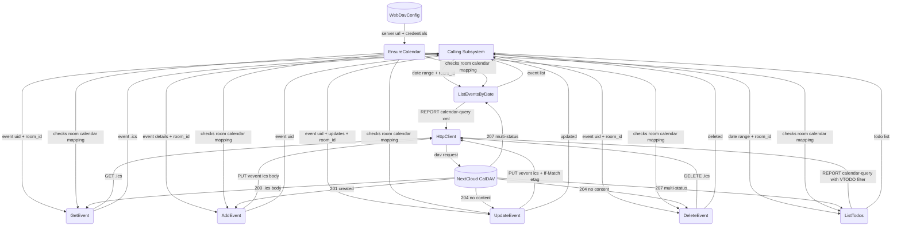
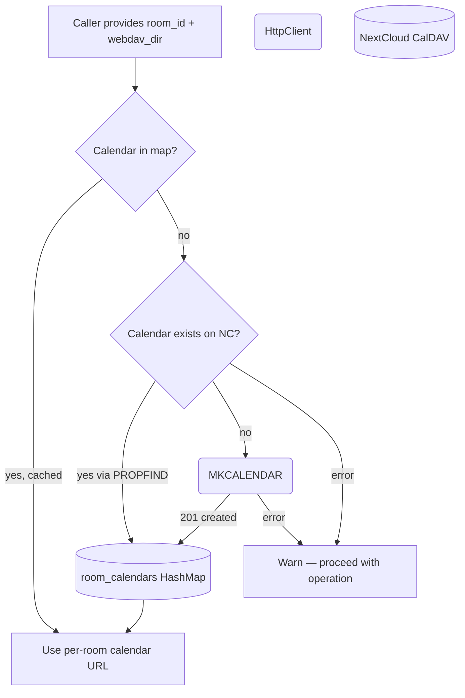
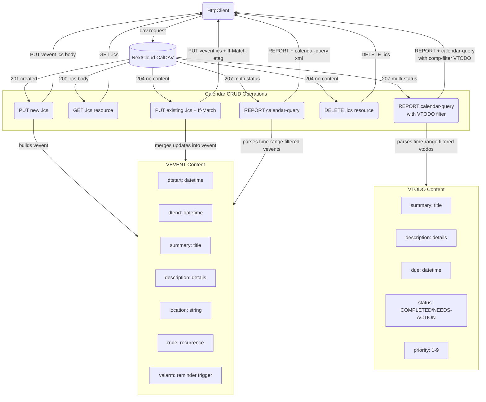
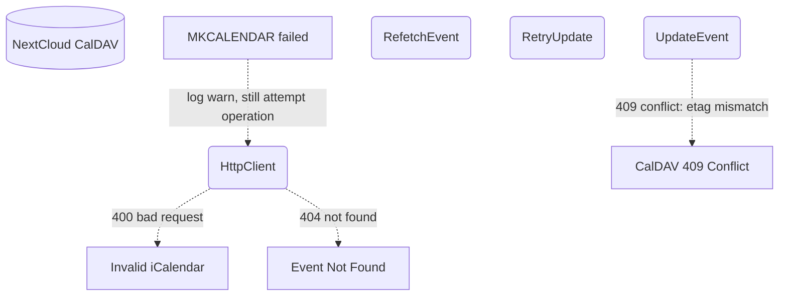

# WebDAV Calendar

## 1. Purpose

CalDAV event access wrapping NextCloud's calendar service. Supports listing
events by date range, create/read/update/delete individual events with
iCalendar (RFC 5545) `VEVENT` payloads, and `VALARM` reminders.

**Scope**: Calendar events are **per-room** — each RocketChat room gets its own
NextCloud calendar, auto-created on first use via CalDAV `MKCALENDAR`. The
calendar name is `{webdav_dir}` (matching the WebDAV directory name,
e.g. `r-General`, `d-bob`), stored under the configured user's CalDAV
calendar home (`/remote.php/dav/calendars/{username}/`). Events from
different rooms are fully isolated.

> **Note:** `list_todos` currently does **not** accept a date range — it
> fetches todos without time-range filtering. The DFD diagrams show date
> range for todos as aspirational/planned behavior.

- Upstream: [Configuration Management](../base/config.md) provides `WebDavConfig`
  (server URL, credentials)
- Downstream: [Agent Harness](../agent-harness.md) injects `room_id` + `webdav_dir`
  into calendar tool arguments. `room_id` is used as the cache key in
  `room_calendars`, while `webdav_dir` names the per-room calendar
  (auto-created on first use)

## 2. Diagram

### 2a. Happy Flow (Main Success Path)



### 2b. Calendar Auto-Creation Flow



### 2c. Calendar Operations Deep Dive

Per [NextCloud Calendar user guide](https://docs.nextcloud.com/server/latest/user_manual/en/groupware/calendar.html) and [RFC 4791](https://datatracker.ietf.org/doc/html/rfc4791). Events are iCalendar (RFC 5545) `VEVENT` objects. The CalDAV base URL is `/remote.php/dav/calendars/{username}/{webdav_dir}/` (e.g. `/remote.php/dav/calendars/bot/r-General/`). Each event is a resource named `{uid}.ics` within that collection.



### 2d. Error Handling & Fallbacks



Note: The 409 Conflict retry loop (refetch → merge → retry with new etag) is not yet implemented. Calendar update returns an error on etag mismatch. MKCALENDAR failure (permissions, unsupported) is non-fatal — the operation still proceeds against the target URL.

## 3. Data Structures

#### `CaldavEvent`

CalDAV event resource represented as a parsed iCalendar `VEVENT` (RFC 5545).
Stored as `{uid}.ics` within the calendar collection.

| Field           | Type             | Notes                                   |
| --------------- | ---------------- | --------------------------------------- |
| `uid`           | `String`         | Globally unique event identifier        |
| `href`          | `String`         | Full CalDAV href to `{uid}.ics`         |
| `etag`          | `String`         | Opaque tag for conditional updates      |
| `summary`       | `String`         | Event title/name                        |
| `description`   | `Option<String>` | Event details/notes                     |
| `location`      | `Option<String>` | Event venue/place                       |
| `dtstart`       | `String`         | Start datetime (ISO 8601 with timezone) |
| `dtend`         | `String`         | End datetime (ISO 8601 with timezone)   |
| `rrule`         | `Option<String>` | Recurrence rule (RFC 5545 format)       |
| `reminders`     | `Vec<Reminder>`  | List of `VALARM` reminders              |
| `created`       | `String`         | Creation timestamp                      |
| `last_modified` | `String`         | Last-modified timestamp                 |

#### `Reminder` (`VALARM`)

| Field    | Type     | Notes                                         |
| -------- | -------- | --------------------------------------------- |
| `action` | `String` | `DISPLAY` or `EMAIL`                          |
| `trigger`| `String` | Duration before event (`-PT15M`) or absolute   |

#### Room Calendar Mapping

| Field           | Type                                | Notes                                                 |
| --------------- | ----------------------------------- | ----------------------------------------------------- |
| room_calendars  | `HashMap<String, String>`           | `room_id → webdav_dir` mapping (in-memory, `Mutex`). `room_id` is the raw RocketChat room ID (cache key); `webdav_dir` is the human-readable directory/calendar name (e.g. `r-General`, `d-bob`) |

#### `WebDavPath` (calendar methods)

Calendar paths are built via `CalendarTool::build_caldav_url(webdav_dir)` — the
CalDAV endpoint is a separate URL (`/remote.php/dav/calendars/{user}/{webdav_dir}/`)
independent of the WebDAV file storage root. `WebDavPath` does **not** provide
calendar-specific methods. The URL is constructed directly in `CalendarTool`.

| Method                              | Returns  | Notes                             |
| ----------------------------------- | -------- | --------------------------------- |
| `build_caldav_url(calendar_name)`   | `String` | Constructs the CalDAV URL for a given calendar name — implemented in `CalendarTool`, not `WebDavPath` |

## 4. NextCloud API Reference

Per [NextCloud Calendar user guide](https://docs.nextcloud.com/server/latest/user_manual/en/groupware/calendar.html), [RFC 4791](https://datatracker.ietf.org/doc/html/rfc4791) (CalDAV), and [RFC 5545](https://datatracker.ietf.org/doc/html/rfc5545) (iCalendar). NextCloud serves CalDAV at `/remote.php/dav/calendars/{user}/{calendar-name}/`.

### New: Create Calendar

| DFD Operation   | HTTP Method  | Endpoint / Headers                                     | Notes                                                    |
| --------------- | ------------ | ------------------------------------------------------ | -------------------------------------------------------- |
| EnsureCalendar  | `MKCALENDAR` | `{origin}/remote.php/dav/calendars/{user}/{cal-name}/` | Creates a new calendar collection if it doesn't exist    |
| CalendarExists  | `PROPFIND`   | `{origin}/remote.php/dav/calendars/{user}/{cal-name}/` | Depth: 0, check for 207 response                         |

### Event Operations

| DFD Operation       | HTTP Method | Endpoint / Headers                        | Notes                                           |
| ------------------- | ----------- | ----------------------------------------- | ----------------------------------------------- |
| ListEventsByDate    | `REPORT`    | `{base}/calendars/{user}/{cal}/`          | XML body with `calendar-query`, time-range filter |
| GetEvent            | `GET`       | `{base}/calendars/{user}/{cal}/{uid}.ics` | Returns full `VEVENT` iCalendar data            |
| AddEvent            | `PUT`       | `{base}/calendars/{user}/{cal}/{uid}.ics` | Body = `VEVENT` iCalendar (RFC 5545)            |
| UpdateEvent         | `PUT`       | `{base}/calendars/{user}/{cal}/{uid}.ics` | `If-Match: {etag}` header; 409 on conflict      |
| DeleteEvent         | `DELETE`    | `{base}/calendars/{user}/{cal}/{uid}.ics` | 204 on success, 404 if not found                |
| ListTodos           | `REPORT`    | `{base}/calendars/{user}/{cal}/`          | XML body with `calendar-query`, comp-filter `VTODO`, time-range filter |

#### `MKCALENDAR` request body

```xml
<?xml version="1.0" encoding="UTF-8"?>
<C:mkcalendar xmlns:D="DAV:" xmlns:C="urn:ietf:params:xml:ns:caldav">
  <D:set>
    <D:prop>
      <D:displayname>{Display Name}</D:displayname>
      <C:supported-calendar-component-set>
        <C:comp name="VEVENT"/>
      </C:supported-calendar-component-set>
    </D:prop>
  </D:set>
</C:mkcalendar>
```

#### `calendar-query` REPORT body (listing events for a date)

```xml
<?xml version="1.0" encoding="UTF-8"?>
<C:calendar-query xmlns:D="DAV:" xmlns:C="urn:ietf:params:xml:ns:caldav">
  <D:prop>
    <D:getetag/>
    <C:calendar-data/>
  </D:prop>
  <C:filter>
    <C:comp-filter name="VCALENDAR">
      <C:comp-filter name="VEVENT">
        <C:time-range start="20260601T000000Z" end="20260602T000000Z"/>
      </C:comp-filter>
    </C:comp-filter>
  </C:filter>
</C:calendar-query>
```

#### `VEVENT` iCalendar payload (create/update event with reminder)

```
BEGIN:VCALENDAR
VERSION:2.0
PRODID:-//RockBot//NextCloud Calendar//EN
BEGIN:VEVENT
UID:abc123-uuid@rockbot
DTSTART:20260615T140000Z
DTEND:20260615T150000Z
SUMMARY:Team standup
DESCRIPTION:Daily sync meeting
LOCATION:Room 4B
BEGIN:VALARM
ACTION:DISPLAY
TRIGGER:-PT15M
DESCRIPTION:Meeting in 15 minutes
END:VALARM
END:VEVENT
END:VCALENDAR
```
