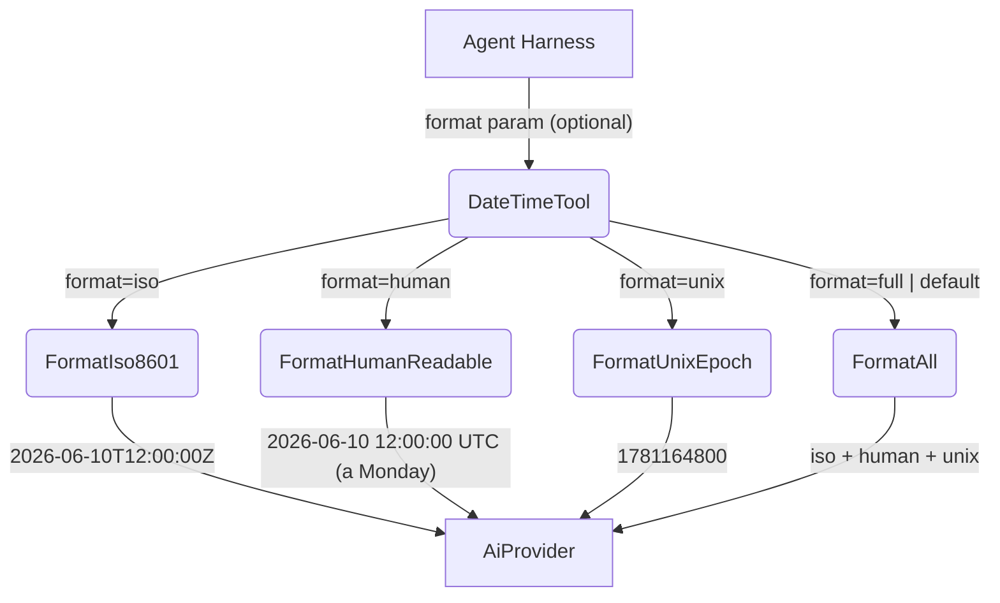
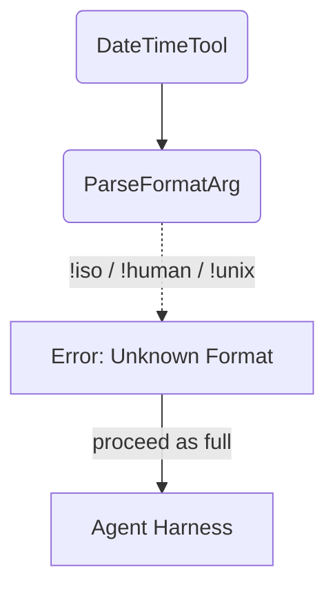

# DateTime

## 1. Purpose

Returns the current UTC date and time in one of four formats — ISO 8601,
human-readable with weekday, Unix epoch seconds, or all three combined. A pure
computation tool with no external dependencies.

- Upstream: [Agent Harness](../agent-harness.md) invokes `DateTimeTool` with an
  optional format selector

## 2. Diagram

### 2a. Happy Flow (Main Success Path)

### 2b. Error Handling

Invalid format strings fall back to `full` output — no hard error.

## 3. Data Structures

#### `DateTimeParams`

| Field    | Type     | Notes                                                  |
| -------- | -------- | ------------------------------------------------------ |
| `format` | `string` | `"iso"`, `"human"`, `"unix"`, or `"full"` (default)   |

#### Date Computation

All formats are derived from `SystemTime::now()` via a civil date algorithm
(Howard Hinnant's `days_from_civil` / `civil_from_days`). No external time
library is used — the implementation is self-contained.

| Format   | Example output                                     |
| -------- | -------------------------------------------------- |
| `iso`    | `2026-06-10T12:00:00Z`                             |
| `human`  | `2026-06-10 12:00:00 UTC (a Monday)`               |
| `unix`   | `1781164800`                                       |
| `full`   | All three above, newline-separated                 |
