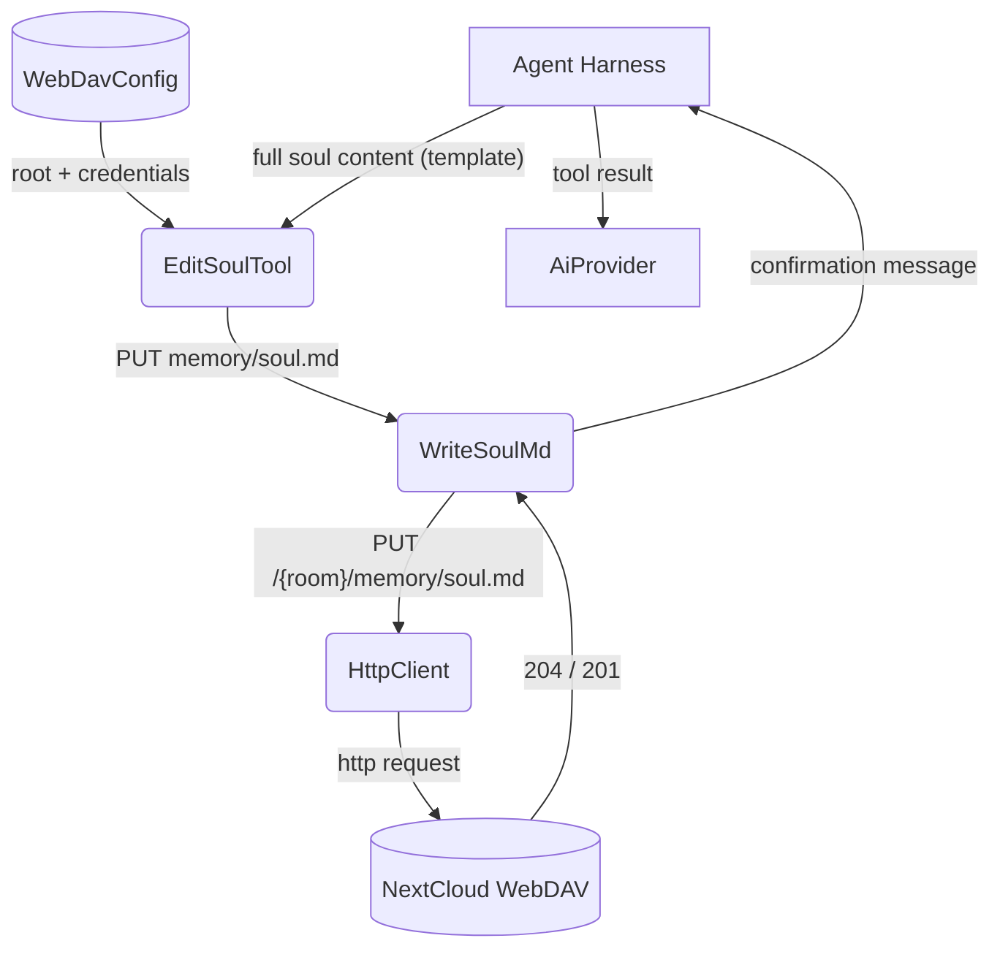
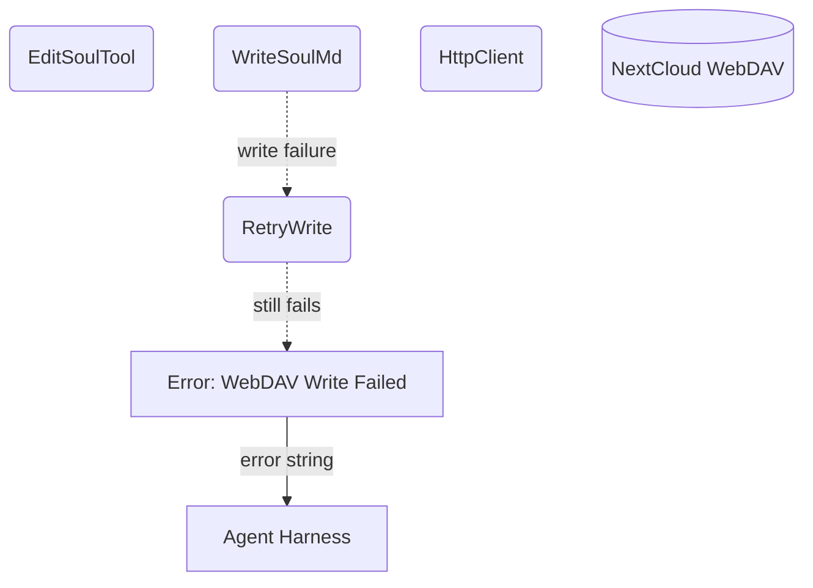

# Edit Soul

## 1. Purpose

Manages the bot's permanent per-room "soul" memory — a single `soul.md` file
stored on WebDAV under `{room}/memory/soul.md`. The tool performs a **full
replace** of the entire file content using the standard soul template.

The LLM MUST use this exact template when calling edit_soul:

```markdown
# Soul Memory

## Identity
YourName ✨

## Preferences
(optional)

## Facts
(optional)
```

The display name (extracted by regex `## Identity[ \t]*\n?[ \t]*(.+)`) must
appear immediately after `## Identity`. Keep it under 32 characters.

- Upstream: [Configuration Management](../base/config.md) provides WebDAV
  credentials for file access
- Upstream: [Agent Harness](../agent-harness.md) invokes `EditSoulTool` with
  the full soul content
- Downstream: [WebDAV Tool](webdav.md) performs the PUT operation
- Downstream: [Memory Management](../base/memory.md) — soul.md lives alongside
  other per-room memory archives under `{room}/memory/`

## 2. Diagram

### 2a. Happy Flow (Main Success Path)



### 2b. Error Handling & Fallbacks



## 3. Data Structures

#### `EditSoulParams`

| Field        | Type     | Notes                                              |
| ------------ | -------- | -------------------------------------------------- |
| `content`    | `string` | Full soul.md content using the standard template   |
| `webdav_dir` | `string` | Room WebDAV directory key (injected automatically) |

#### Soul File Format

Stored at `/{root}/{webdav_dir}/memory/soul.md`:

```markdown
# Soul Memory

## Identity
YourName ✨

## Preferences
(optional preferences content)

## Facts
(optional facts content)
```

#### Soul Operations

| Operation | Inputs   | Behavior                                 |
| --------- | -------- | ---------------------------------------- |
| `replace` | content  | Overwrites the entire soul.md file       |
