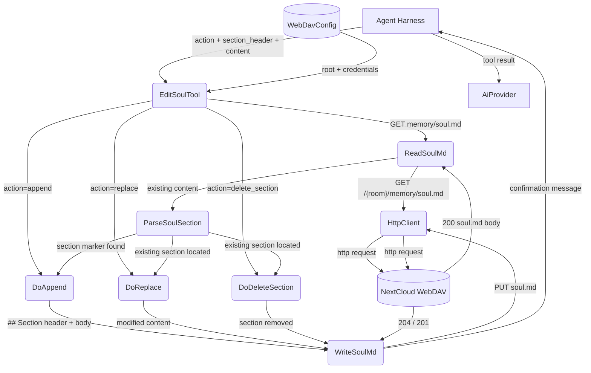
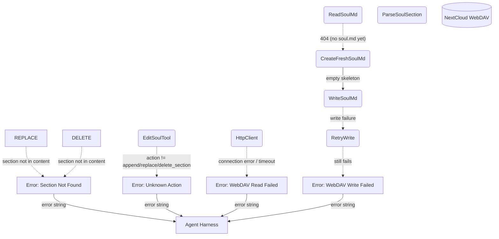
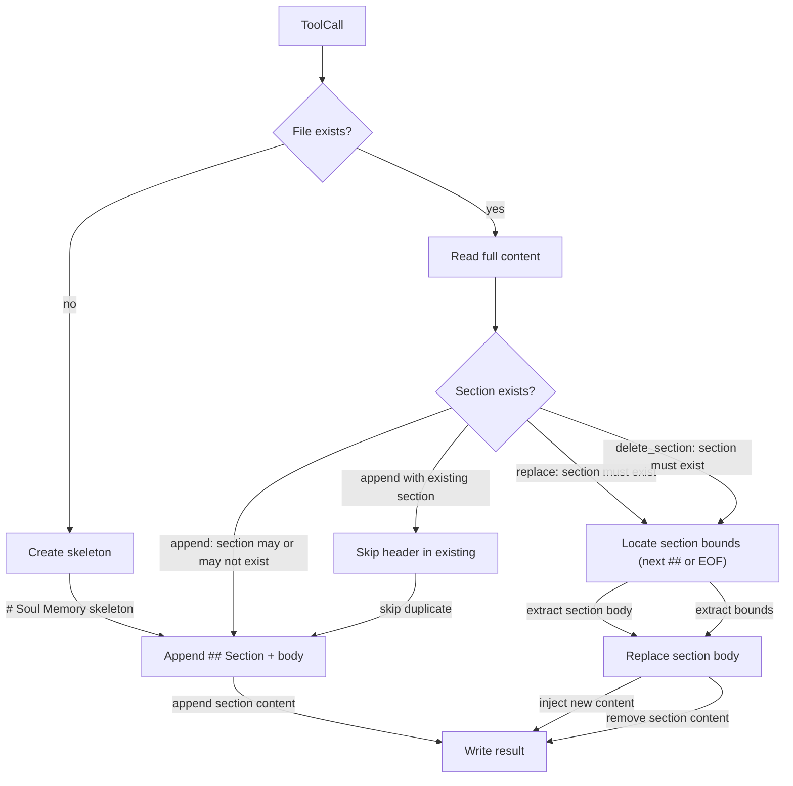

# Edit Soul

## 1. Purpose

Manages the bot's permanent per-room "soul" memory — a single `soul.md` file
stored on WebDAV under `{room}/memory/soul.md`. Supports three operations:
`append` (add a new `## Section`), `replace` (update an existing section's
content), and `delete_section` (remove a section entirely).

- Upstream: [Configuration Management](../base/config.md) provides WebDAV
  credentials for file access
- Upstream: [Agent Harness](../agent-harness.md) invokes `EditSoulTool` with
  action, section_header, and optional content
- Downstream: [WebDAV Tool](webdav.md) performs GET/PUT operations against
  the soul.md file
- Downstream: [Memory Management](../base/memory.md) — soul.md lives alongside
  other per-room memory archives under `{room}/memory/`

## 2. Diagram

### 2a. Happy Flow (Main Success Path)



### 2b. Error Handling & Fallbacks



### 2c. Append vs Replace Deep Dive



## 3. Data Structures

#### `EditSoulParams`

| Field            | Type     | Notes                                                    |
| ---------------- | -------- | -------------------------------------------------------- |
| `action`         | `string` | `"append"`, `"replace"`, or `"delete_section"`           |
| `section_header` | `string` | Target `## Section` name (without `## ` prefix)          |
| `content`        | `string` | New body text (required for append/replace)              |
| `webdav_dir`     | `string` | Room WebDAV directory key (injected automatically)       |

#### Soul File Format

Stored at `/{root}/{webdav_dir}/memory/soul.md`:

```markdown
# Soul Memory

## Preferences
Prefer concise responses with code examples.

## Identity
You are a helpful bot assistant.
```

#### Soul Operations

| Operation        | Inputs                    | Behavior                                                    |
| ---------------- | ------------------------- | ----------------------------------------------------------- |
| `append`         | section_header, content   | Adds a new `## {header}` section at the end of the file     |
| `replace`        | section_header, content   | Finds existing `## {header}` and replaces its body          |
| `delete_section` | section_header            | Finds existing `## {header}` and removes it entirely        |
