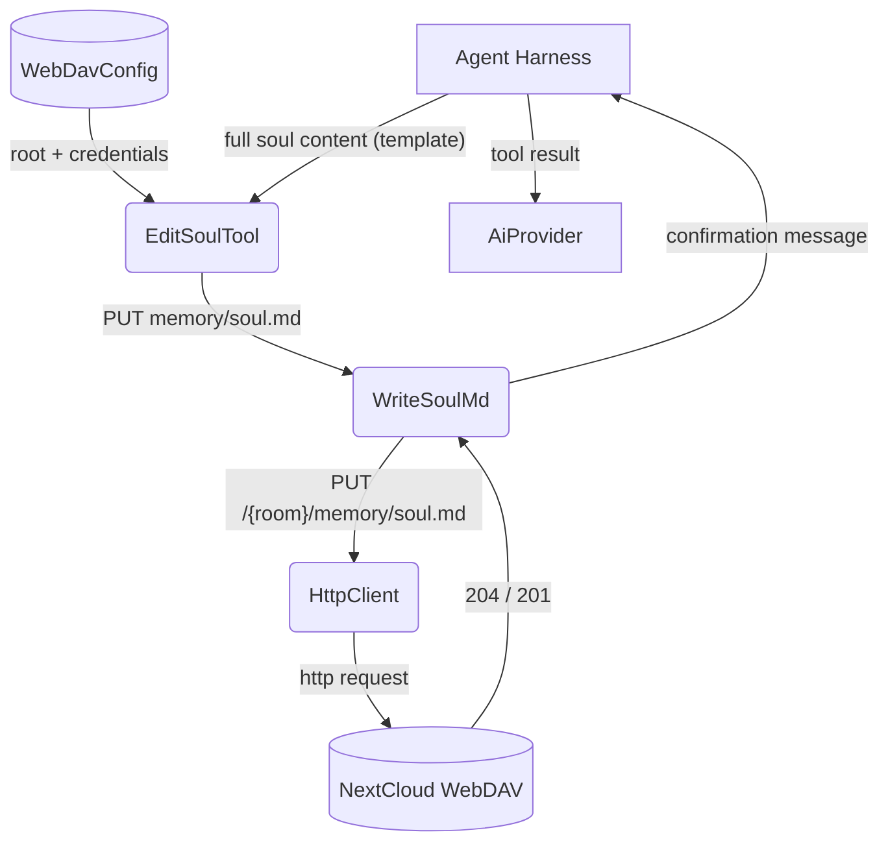
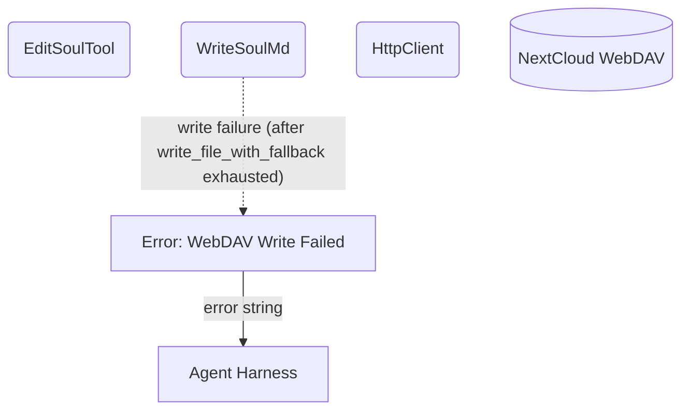

# Edit Soul

## 1. Purpose

Manages the bot's permanent per-room "soul" memory — a single `soul.md` file
stored on WebDAV under `{room}/memory/soul.md`. The tool performs a **full
replace** of the entire file content using the standard soul template.

The LLM MUST use this exact template when calling edit_soul:

```markdown
# Soul Memory

- My name is YourName ✨
- (optional preference)
- (optional fact)
- (optional preference)
- (optional fact)
```

The soul is a **flat enumeration list** — each line is a `-` bullet item. The
**first item always** starts with `My name is ...`. The display name is
extracted by regex `My name is (.+)` from that first item. Keep it under 32
characters. Additional items follow the same flat list format with no
sub-headings.

- Upstream: [Configuration Management](../base/config.md) provides WebDAV
  credentials for file access
- Upstream: [Agent Harness](../agent-harness.md) invokes `EditSoulTool` with
  the full soul content
- Downstream: [WebDAV Tool](webdav.md) performs the PUT operation
- Downstream: [Memory Management](../base/memory.md) — soul.md lives alongside
  other per-room memory archives under `{room}/memory/`

## 2. Diagram

### 2a. Happy Flow (Main Success Path)



### 2b. Error Handling & Fallbacks

On write failure, the tool relies on the underlying `write_file_with_fallback`
(AutoMkcol → mkcol parents → retry PUT). The tool does not implement its own
retry loop — errors bubble up directly via `?`.



## 3. Data Structures

#### `EditSoulParams`

> **Note:** No dedicated Rust struct — parsed ad-hoc from `serde_json::Value`.

| Field        | Type     | Notes                                              |
| ------------ | -------- | -------------------------------------------------- |
| `content`    | `string` | Full soul.md content using the standard template   |
| `webdav_dir` | `string` | Room WebDAV directory key (injected automatically). Falls back to `room_id` if absent. |

#### Soul File Format

Stored at `/{root}/{webdav_dir}/memory/soul.md`. The soul is a flat enumeration
list. The first item always starts with `My name is ...` — the display name is
extracted from that item by regex `My name is (.+)`.

```markdown
# Soul Memory

- My name is YourName ✨
- (optional preference)
- (optional fact)
- (optional preference)
- (optional fact)
```

#### Soul Operations

| Operation | Inputs   | Behavior                                 |
| --------- | -------- | ---------------------------------------- |
| `replace` | content  | Overwrites the entire soul.md file       |
