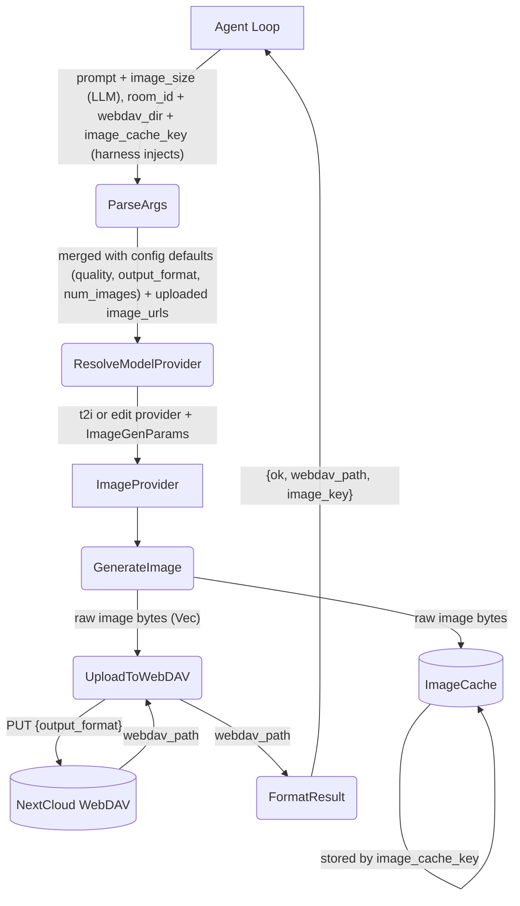
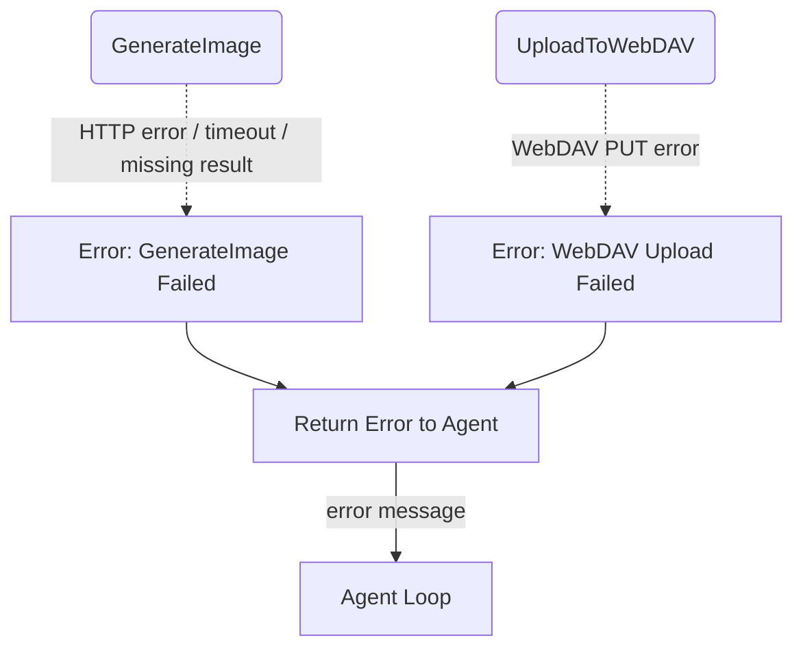
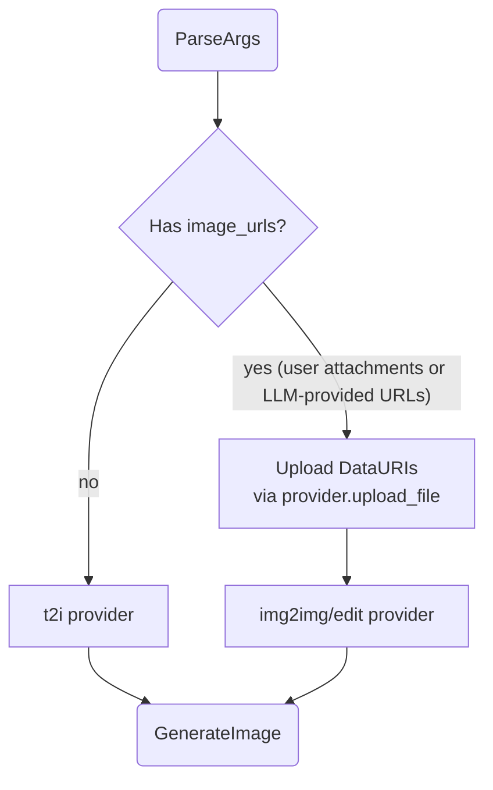
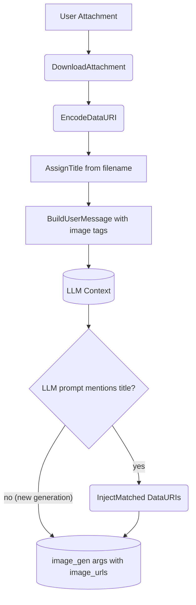

# Image Generation Tool

## 1. Purpose

Generates images via an `ImageProvider` (fal.ai queue API or OpenRouter
synchronous endpoint), stores them on WebDAV for persistence, and caches the
raw image bytes in the shared `ImageCache`. The agent loop calls `image_gen`
with a prompt and optional parameters; the tool delegates to the provider,
writes to WebDAV, stores to the cache, and returns a minimal result
(`{ok, webdav_path, image_key}`) so the LLM context stays lightweight.

- Upstream: [Agent Harness](../agent-harness.md) injects `room_id`, `webdav_dir`,
  and `image_cache_key` (call_id) into tool args before invoking `execute_by_name()`
- Upstream: [Image Injection Pipeline](../agent-harness.md#2i-generated-image-upload--injection-pipeline)
  retrieves the image from ImageCache by key and uploads it as a RocketChat attachment
- Downstream: [Image Provider](../base/ai-provider.md) — `FalAiProvider` (CDN-hosted URLs)
  and `OpenRouterImageProvider` (inline base64) implement `generate_image() -> Vec<u8>`
- Downstream: WebDAV crate persists image assets
- Shared: `ImageCache` (`image_cache.rs`) is the central store keyed by call_id

## 2. Diagram

### 2a. Happy Flow (Main Success Path)



### 2b. Error Handling & Fallbacks



### 2c. Provider Selection & Data URI Handling

The tool selects the provider based on `image_urls` presence and configuration.
Fal requires CDN-hosted URLs (data URIs uploaded first), OpenRouter accepts
inline base64. The harness is unaware of this difference — both implement
`ImageProvider::generate_image() -> Vec<u8>`.



**Provider differences:**

| Aspect | fal.ai | OpenRouter |
|--------|--------|------------|
| `upload_file()` | Initiate + PUT to CDN → file_url | Base64-encode → data URI |
| `generate_image()` | Submit → Poll → Fetch CDN → Download | Single POST → parse base64 response |
| Image delivery | CDN URL → separate HTTP GET | Base64 inline in response JSON |
| Protocol | 3-phase async (submit/poll/fetch) | Single synchronous POST |

The `ImageProvider` trait abstracts both — the tool and harness never branch on provider type.

### 2d. Harness Attachment Injection

User-attached images are downloaded and labeled by the harness before the agent
loop. Images appear in the conversation as markdown tags ``.
The LLM references images by their title in image_gen prompts. The harness
scans prompts for title matches and injects the matched data URIs.



## 3. Data Structures

#### `ImageGenParams`

LLM provides `prompt` and optional `image_size`; all other fields come from config.

| Field           | Source            | Type                                           | Description                                      |
| --------------- | ----------------- | ---------------------------------------------- | ------------------------------------------------ |
| `prompt`        | LLM               | `string`                                       | **Required.** Text description of the image      |
| `image_size`    | LLM               | preset name or `{width: int, height: int}`     | Aspect ratio preset or custom dimensions. Both edges multiples of 16, max edge 3840px, aspect ratio ≤ 3:1. Default: `"landscape_4_3"` |
| `room_id`       | Harness           | `string`                                       | Room UUID for image storage (injected if omitted)|
| `webdav_dir`    | Harness           | `string`                                       | Type-prefixed room path (injected; falls back to room_id) |
| `image_cache_key`| Harness          | `string`                                       | Tool call_id — used as ImageCache lookup key     |
| `image_urls`    | Harness (auto)    | `[]string`                                     | Injected from user attachments or LLM-provided URLs |
| `model_id`      | Config            | `string`                                       | From `default_text_model` / `default_edit_model` |
| `quality`       | Config            | `string`                                       | From `default_quality`                           |
| `output_format` | Config            | `string`                                       | From `default_output_format`                     |
| `num_images`    | Config            | `integer`                                      | From `default_num_images`                        |

#### `ImageGenResult`

The tool returns minimal JSON — no base64. The actual image bytes are in `ImageCache` keyed by `image_key`.

```json
{"ok": true, "webdav_path": "...", "image_key": "call_abc123def4567890"}
```

#### `ImageCache` Entry (GeneratedImage)

Stored in `Arc<Mutex<HashMap<String, GeneratedImage>>>` keyed by call_id.

| Field          | Type           | Description                                   |
| -------------- | -------------- | --------------------------------------------- |
| `webdav_path`  | `string`       | WebDAV path where the image was persisted     |
| `image_bytes`  | `Vec<u8>`      | Raw image bytes (fallback for data URI)       |
| `mime_type`    | `string`       | MIME type, e.g. `image/png`                  |
| `share_url`    | `Option<string>`| NextCloud public share link (7-day expiry)    |

After WebDAV upload, the tool calls `create_nextcloud_share_link()` on the
`WebDavClient` which POSTs to `/ocs/v2.php/apps/files_sharing/api/v1/shares`
with `shareType=3`, `permissions=1`, and `expireDate={today+7d}`. The resulting
short URL is stored in `share_url`. The agent loop (main.rs) prefers this URL
for the reply text — appending `` — which
RocketChat renders as an inline image preview. If share generation fails,
the agent falls back to a `data:` URI as a DDP attachment.
