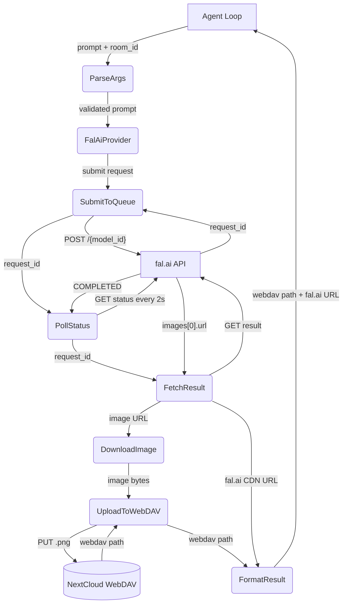
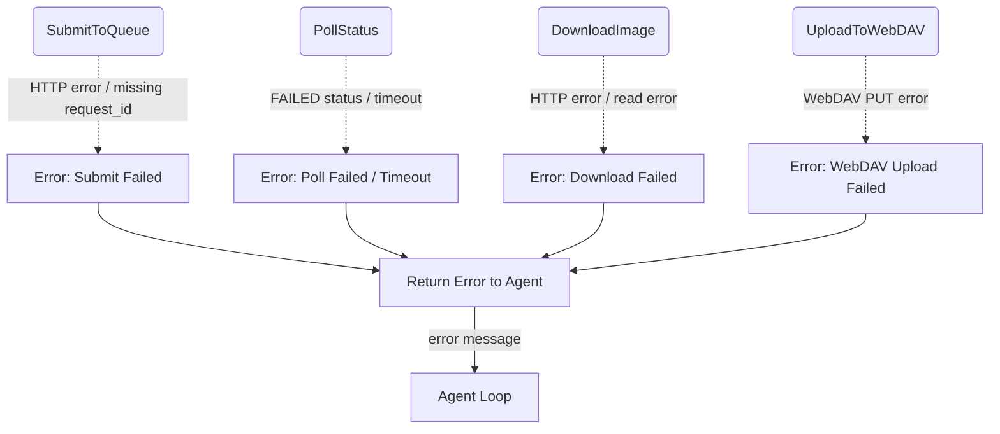

# Image Generation Tool

## 1. Purpose

Generates images via fal.ai's queue API and stores them on WebDAV. The agent loop
calls `image_gen` with a prompt; the tool submits to fal.ai, polls for completion,
downloads the result, uploads to WebDAV, and returns both the WebDAV path and the
original fal.ai CDN URL (the LLM should prefer the fal.ai URL when sharing with
the user).

- Upstream: [Agent Harness](../agent-harness.md) executes the tool during the
  agent loop via `ToolRegistry::execute_by_name()`
- Downstream: [AI Provider](../base/ai-provider.md) — `FalAiProvider` (provider/fal.rs)
  handles the fal.ai queue submit/poll/fetch cycle
- Downstream: WebDAV crate (`WebDavClient`, `WebDavPath`) persists image assets

## 2. Diagram

### 2a. Happy Flow (Main Success Path)



### 2b. Error Handling & Fallbacks



## 3. Data Structures

#### `ImageGenParams`

| Field       | Type     | Description                                      |
| ----------- | -------- | ------------------------------------------------ |
| `prompt`    | `string` | **Required.** Text description of the image      |
| `room_id`   | `string` | Room UUID for image storage (injected by harness if omitted) |
| `webdav_dir`| `string` | Type-prefixed room path (injected by harness; falls back to room_id) |
| `model_id`  | `string` | fal.ai model ID (default: `fal-ai/flux/schnell`) |

#### `ImageGenResult`

The tool returns a formatted string containing both paths:

```
Image generated and stored at {webdav_path}. Original fal.ai URL: {fal_url}
```

| Value        | Source                     | Purpose                                   |
| ------------ | -------------------------- | ----------------------------------------- |
| `webdav_path`| `WebDavPath::image_path()` | Persistent storage path in WebDAV         |
| `fal_url`    | `images[0].url`            | fal.ai CDN URL — prefer for sharing       |

#### fal.ai Queue API

The `FalAiProvider` (provider/fal.rs) implements a three-step queue workflow:

| Step   | Method | Endpoint                        | Response              |
| ------ | ------ | ------------------------------- | --------------------- |
| Submit | POST   | `{base_url}/{model_id}`        | `{"request_id": "..."}` |
| Poll   | GET    | `{base_url}/{model_id}/requests/{request_id}/status` | `{"status": "COMPLETED"}` |
| Fetch  | GET    | `{base_url}/{model_id}/requests/{request_id}`       | `{"images": [{"url": "..."}]}` |

Polling runs every 2 seconds for up to 90 attempts (3 minutes total), then times out.
