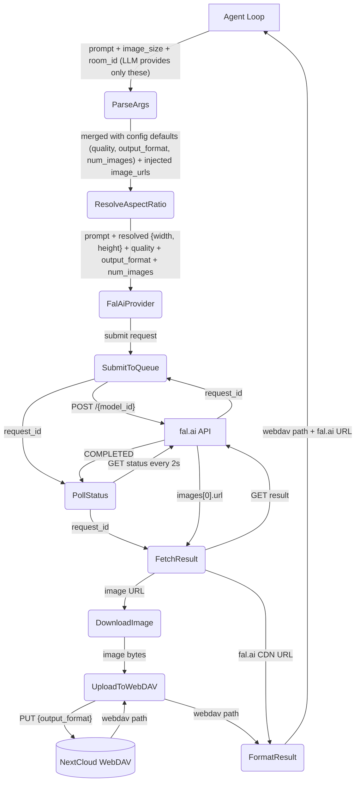
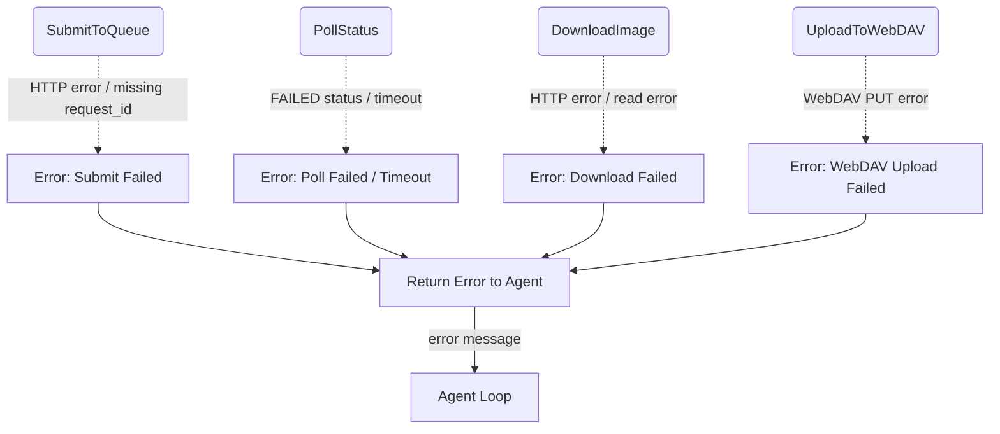

# Image Generation Tool

## 1. Purpose

Generates images via fal.ai's queue API and stores them on WebDAV. The agent loop
calls `image_gen` with a prompt and optional parameters (quality, image_size,
output_format, num_images, model_id); the tool submits to fal.ai, polls for
completion, downloads the result, uploads to WebDAV, and returns both the
WebDAV path and the original fal.ai CDN URL (the LLM should prefer the fal.ai
URL when sharing with the user). For [openai/gpt-image-2](https://fal.ai/models/openai/gpt-image-2)
the recommended defaults are `quality: "medium"`, `output_format: "png"`, and
the highest available resolution for the chosen aspect ratio.

- Upstream: [Agent Harness](../agent-harness.md) executes the tool during the
  agent loop via `ToolRegistry::execute_by_name()`
- Downstream: [AI Provider](../base/ai-provider.md) — `FalAiProvider` (provider/fal.rs)
  handles the fal.ai queue submit/poll/fetch cycle
- Downstream: WebDAV crate (`WebDavClient`, `WebDavPath`) persists image assets
- API reference: [fal.ai GPT Image 2 schema](https://fal.ai/models/openai/gpt-image-2/api)
  — full input/output spec including `image_size`, `quality`, `output_format`

## 2. Diagram

### 2a. Happy Flow (Main Success Path)



### 2b. Error Handling & Fallbacks



## 3. Data Structures

#### `ImageGenParams`

LLM provides only `prompt` and `image_size`; all other fields come from `[image_model]` config.

| Field           | Source            | Type                                           | Description                                      |
| --------------- | ----------------- | ---------------------------------------------- | ------------------------------------------------ |
| `prompt`        | LLM               | `string`                                       | **Required.** Text description of the image      |
| `image_size`    | LLM               | preset name or `{width: int, height: int}`     | Aspect ratio preset or custom dimensions. Both edges must be multiples of 16, max edge 3840px, aspect ratio ≤ 3:1, total pixels 655,360–8,294,400. Default: `"landscape_4_3"` |
| `room_id`       | Harness           | `string`                                       | Room UUID for image storage (injected by harness if omitted) |
| `webdav_dir`    | Harness           | `string`                                       | Type-prefixed room path (injected by harness; falls back to room_id) |
| `image_urls`    | Harness (auto)    | `[]string`                                     | Injected automatically from user attachments or LLM-provided fal.ai URLs |
| `model_id`      | Config            | `string`                                       | Hardcoded from `default_text_model` / `default_edit_model` |
| `quality`       | Config            | `string`                                       | Hardcoded from `default_quality` (e.g. `"medium"`) |
| `output_format` | Config            | `string`                                       | Hardcoded from `default_output_format` (e.g. `"png"`) |
| `num_images`    | Config            | `integer`                                      | Hardcoded from `default_num_images` (e.g. `1`) |

**Resolution presets** (maps aspect ratio → highest available dimensions):

| Preset              | Aspect Ratio | Dimensions  | Pixel Count |
| ------------------- | ------------ | ----------- | ----------- |
| `"square_hd"`       | 1:1          | 2880×2880   | 8,294,400   |
| `"landscape_16_9"`  | 16:9         | 3840×2160   | 8,294,400   |
| `"portrait_16_9"`   | 9:16         | 2160×3840   | 8,294,400   |
| `"landscape_4_3"`   | 4:3          | 3328×2496   | 8,306,688*  |
| `"portrait_4_3"`    | 3:4          | 2496×3328   | 8,306,688*  |
| `"landscape_3_2"`   | 3:2          | 3520×2344†  | 8,250,880   |
| `"portrait_2_3"`    | 2:3          | 2344×3520†  | 8,250,880   |
| `"square"`          | 1:1          | 512×512     | 262,144     |
| `"auto"`            | —            | model picks | —           |

\* Slightly exceeds the 8,294,400 pixel max — implementation must clamp to
   `{[3328, 2496]}` with pixel product validated server-side; client-side
   clamp to 3312×2480 (8,213,760 px) on models that enforce the limit strictly.
† `3520×2344` — 2344 not a multiple of 16; clamp to `3520×2336` (8,222,720 px)
   or `3504×2336` (8,185,344 px). Final mapping validated in implementation.

Custom `{width, height}` is also supported, passed directly to the API.

#### `ImageGenResult`

The tool returns a JSON object:

```json
{"ok": true, "fal_url": "https://v3b.fal.media/...", "webdav_path": "..."}
```

| Value        | Source                     | Purpose                                   |
| ------------ | -------------------------- | ----------------------------------------- |
| `webdav_path`| `WebDavPath::image_path()` | Persistent storage path in WebDAV         |
| `fal_url`    | `images[0].url`            | fal.ai CDN URL — prefer for sharing       |

#### fal.ai Queue API (POST body)

```
{
  "prompt": "...",
  "image_size": { "width": 3840, "height": 2160 },
  "quality": "medium",
  "num_images": 1,
  "output_format": "png"
}
```

The `FalAiProvider` (provider/fal.rs) implements a three-step queue workflow:

| Step   | Method | Endpoint                        | Response              |
| ------ | ------ | ------------------------------- | --------------------- |
| Submit | POST   | `{base_url}/{model_id}`        | `{"request_id": "..."}` |
| Poll   | GET    | `{base_url}/{model_id}/requests/{request_id}/status` | `{"status": "COMPLETED"}` |
| Fetch  | GET    | `{base_url}/{model_id}/requests/{request_id}`       | `{"images": [{"url": "..."}]}` |

Polling runs every 2 seconds for up to 90 attempts (3 minutes total), then times out.
