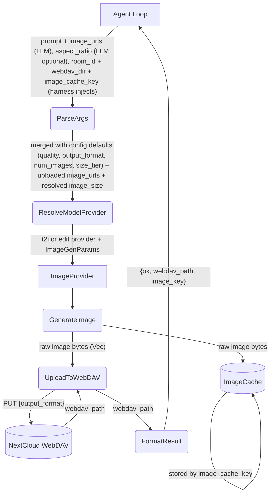
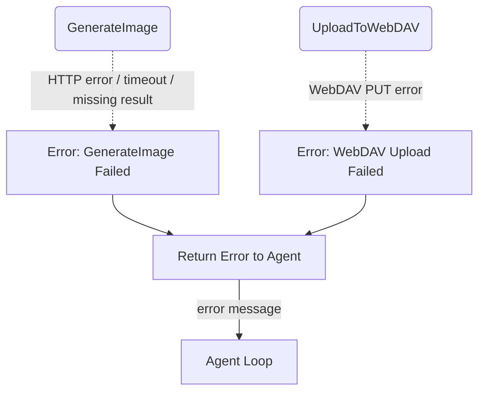
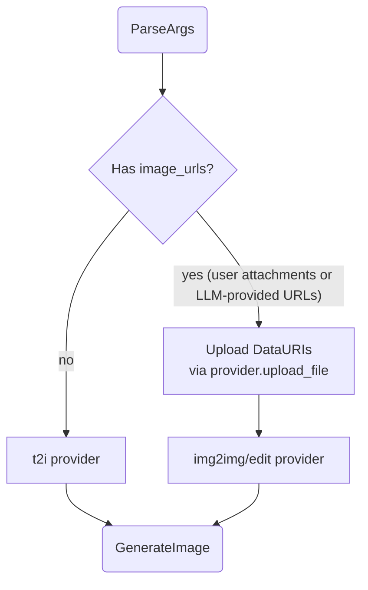
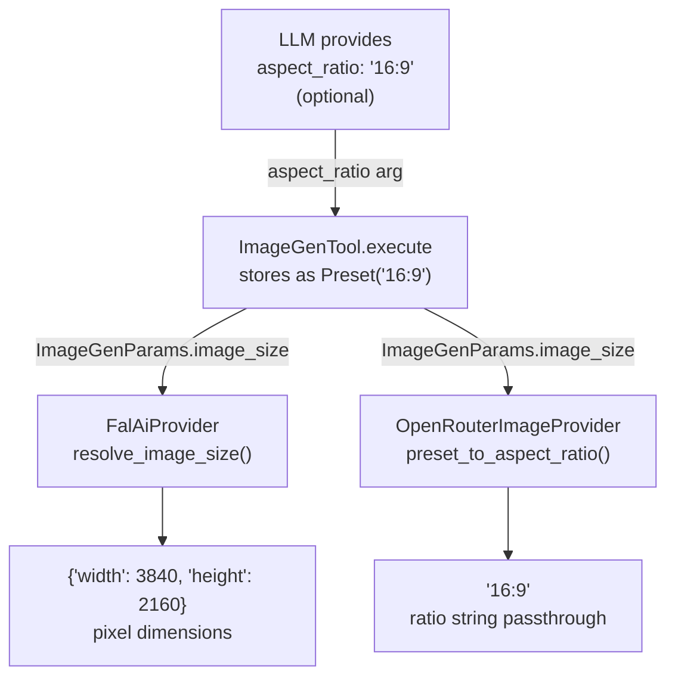
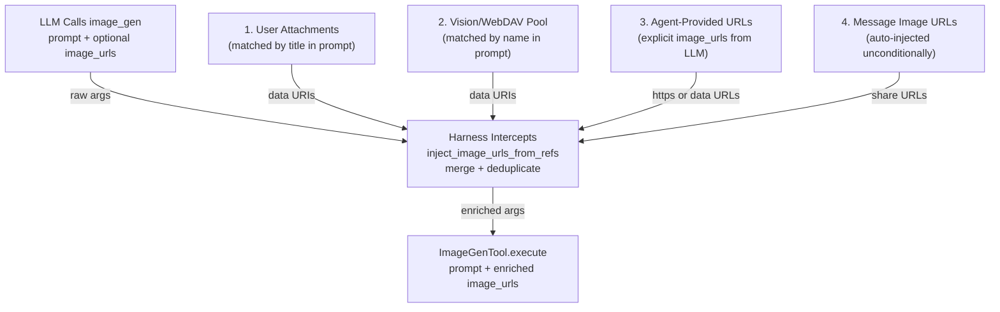

# Image Generation Tool

## 1. Purpose

Generates images via an `ImageProvider` (fal.ai queue API or OpenRouter
synchronous endpoint), stores them on WebDAV for persistence, and caches the
raw image bytes in the shared `ImageCache`. The agent loop calls `image_gen`
with a prompt and optional parameters; the tool delegates to the provider,
writes to WebDAV, stores to the cache, and returns a minimal result
(`{ok, webdav_path, image_key}`) so the LLM context stays lightweight.

- Upstream: [Agent Harness](../agent-harness.md) injects `room_id`, `webdav_dir`,
  and `image_cache_key` (call_id) into tool args before invoking `execute_by_name()`
- Upstream: [Image Injection Pipeline](../agent-harness.md#2i-generated-image-upload--injection-pipeline)
  retrieves the image from ImageCache by key and uploads it as a RocketChat attachment
- Downstream: [Image Provider](../base/ai-provider.md) — `FalAiProvider` (CDN-hosted URLs)
  and `OpenRouterImageProvider` (inline base64) implement `generate_image() -> Vec<u8>`
- Downstream: WebDAV crate persists image assets
- Shared: `ImageCache` (`image_cache.rs`) is the central store keyed by call_id

## 2. Diagram

### 2a. Happy Flow (Main Success Path)



### 2b. Error Handling & Fallbacks



### 2c. Provider Selection & Data URI Handling

The tool selects the provider based on `image_urls` presence and configuration.
Fal requires CDN-hosted URLs (data URIs uploaded first), OpenRouter accepts
inline base64. The harness is unaware of this difference — both implement
`ImageProvider::generate_image() -> Vec<u8>`.



**Provider differences:**

| Aspect | fal.ai | OpenRouter |
|--------|--------|------------|
| `upload_file()` | Initiate + PUT to CDN → file_url | Base64-encode → data URI |
| `generate_image()` | Submit → Poll → Fetch CDN → Download | Single POST → parse base64 response |
| Image delivery | CDN URL → separate HTTP GET | Base64 inline in response JSON |
| Protocol | 3-phase async (submit/poll/fetch) | Single synchronous POST |

The `ImageProvider` trait abstracts both — the tool and harness never branch on provider type.

### 2d. Aspect Ratio Resolution

The LLM supplies `aspect_ratio` as a `W:H` string (e.g. `"16:9"`, `"2:3"`,
`"1:1"`). If the LLM omits it, the tool falls back to `default_image_size` from
config. The tool stores the value as `ImageSizeValue::Preset(ratio_string)` and
each provider resolves it to its required format:



| Ratio string | Fal `resolve_image_size()` output | OpenRouter `preset_to_aspect_ratio()` output |
|---|---|---|
| `"16:9"` | `{"width": 3840, "height": 2160}` | `"16:9"` |
| `"2:3"` | `{"width": 2336, "height": 3504}` | `"2:3"` |
| `"1:1"` | `{"width": 2880, "height": 2880}` | `"1:1"` |
| `"4:3"` | `{"width": 3312, "height": 2480}` | `"4:3"` |
| `"3:4"` | `{"width": 2480, "height": 3312}` | `"3:4"` |
| `"3:2"` | `{"width": 3504, "height": 2336}` | `"3:2"` |
| `"auto"` | `"auto"` (passthrough) | `"auto"` (passthrough) |

Fal requires pixel dimensions in the `image_size` body field; OpenRouter accepts
the ratio string directly in the `image_config.aspect_ratio` field. Unknown
strings (e.g. `"auto"`) pass through unchanged to both providers.

### 2e. Image URL Injection for Editing

When the LLM calls `image_gen` for editing (with `image_urls` in the
arguments), the harness intercepts the call at `inject_image_urls_from_refs()`
(`harness.rs:1475`) and enriches the arguments with image URLs from four
converging sources. The full merge logic is in
[Image Interception](../image-interception.md#2d-image-editing--inject_image_urls_from_refs).



After injection, `data:` URIs are uploaded to the provider's CDN (Fal) via
`upload_data_uri`, which returns an `https://` URL. Existing `https://` URLs
(e.g. NextCloud share links from a previous `image_gen` result) pass through
directly. See
[Provider Selection](#2c-provider-selection--data-uri-handling) for the
subsequent provider dispatch.

## 3. Data Structures

#### `ImageGenParams`

LLM provides `prompt` and optional `aspect_ratio`; all other fields come from config.

| Field           | Source            | Type                                           | Description                                      |
| --------------- | ----------------- | ---------------------------------------------- | ------------------------------------------------ |
| `prompt`        | LLM               | `string`                                       | **Required.** Text description of the image      |
| `aspect_ratio`  | LLM (optional)   | `string`                                      | Aspect ratio as `W:H` (e.g. `"16:9"`, `"2:3"`, `"1:1"`). If omitted, falls back to `default_image_size` from config. |
| `image_size`    | Tool (resolved)  | preset name → pixels                         | Resolved from LLM's `aspect_ratio` (or config default) per-provider. Hidden from LLM. |
| `size_tier`     | Config            | `"4K"`, `"2K"`, `"1K"`                        | Resolution tier for OpenRouter. Set from `default_image_size_tier`. Ignored by fal. |
| `room_id`       | Harness           | `string`                                       | Room UUID for image storage (injected if omitted). **Note:** injected at execute time, not stored in the Rust struct. |
| `webdav_dir`    | Harness           | `string`                                       | Type-prefixed room path (injected; falls back to room_id). **Note:** injected at execute time, not stored in the Rust struct. |
| `image_cache_key`| Harness          | `string`                                       | Tool call_id — used as ImageCache lookup key     |
| `image_urls`    | Harness (auto)    | `[]string`                                     | Injected from 4 converging sources (see §2d): user attachments, vision/WebDAV pool, agent-provided URLs, and message image URLs (auto-injected unconditionally) |
| `model_id`      | Config            | `string`                                       | From `default_text_model` / `default_edit_model` |
| `quality`       | Config            | `string`                                       | From `default_quality`                           |
| `output_format` | Config            | `string`                                       | From `default_output_format`                     |
| `num_images`    | Config            | `integer`                                      | From `default_num_images`                        |

#### `ImageGenResult`

The tool returns minimal JSON — no base64. The actual image bytes are in `ImageCache` keyed by `image_key`.

```json
{"ok": true, "webdav_path": "...", "image_key": "call_abc123def4567890"}
```

#### `ImageCache` Entry (GeneratedImage)

Stored in `Arc<Mutex<HashMap<String, GeneratedImage>>>` keyed by call_id.

| Field          | Type           | Description                                   |
| -------------- | -------------- | --------------------------------------------- |
| `webdav_path`  | `string`       | WebDAV path where the image was persisted     |
| `image_bytes`  | `Vec<u8>`      | Raw image bytes (fallback for data URI)       |
| `mime_type`    | `string`       | MIME type, e.g. `image/png`                  |
| `share_url`    | `Option<string>`| NextCloud public share link (7-day expiry)    |

After WebDAV upload, the tool calls `create_nextcloud_share_link()` on the
`WebDavClient` which POSTs to `/ocs/v2.php/apps/files_sharing/api/v1/shares`
with `shareType=3`, `permissions=1`, and `expireDate={today+7d}`. The resulting
short URL is stored in `share_url`. The agent loop (main.rs) prefers this URL
for the reply text — appending `` — which
RocketChat renders as an inline image preview. If share generation fails,
the agent falls back to a `data:` URI as a DDP attachment.
