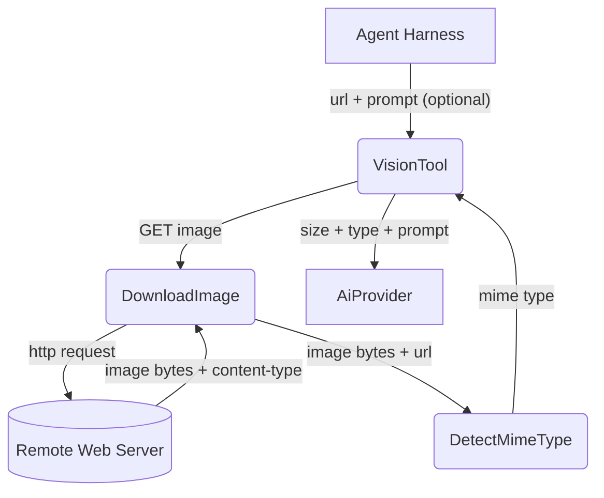
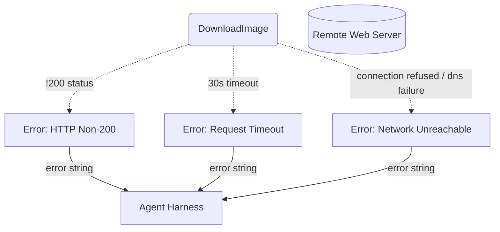

# Vision

## 1. Purpose

Downloads an image from a given URL and reports its metadata (byte size, MIME
type detected from file extension) along with an optional user prompt. This is a
read-only introspective tool — true vision (sending image data to an AI provider)
is planned but not yet implemented.

- Upstream: [Agent Harness](../agent-harness.md) invokes `VisionTool` with a
  URL and optional prompt
- Downstream: [AI Provider](../base/ai-provider.md) consumes the returned metadata
  as context for chat completions

## 2. Diagram

### 2a. Happy Flow (Main Success Path)

### 2b. Error Handling & Fallbacks

## 3. Data Structures

#### `VisionParams`

| Field    | Type     | Notes                                                  |
| -------- | -------- | ------------------------------------------------------ |
| `url`    | `string` | URL of the image to download (required)                |
| `prompt` | `string` | Optional description of what to look for in the image  |

#### `VisionResult`

| Field       | Type     | Notes                                       |
| ----------- | -------- | ------------------------------------------- |
| `bytes`     | `u64`    | Image file size in bytes                    |
| `mime_type` | `string` | Detected MIME type (`image/png`, `image/jpeg`, etc.) |
| `prompt`    | `string` | Original prompt or default description      |

#### MIME Detection

Detection is based on URL file extension only (not content sniffing):

| Extension       | MIME Type        |
| --------------- | ---------------- |
| `.png`          | `image/png`      |
| `.jpg` / `.jpeg`| `image/jpeg`     |
| `.gif`          | `image/gif`      |
| `.webp`         | `image/webp`     |
| `.svg`          | `image/svg+xml`  |
| *(other)*       | `image/png`      |
