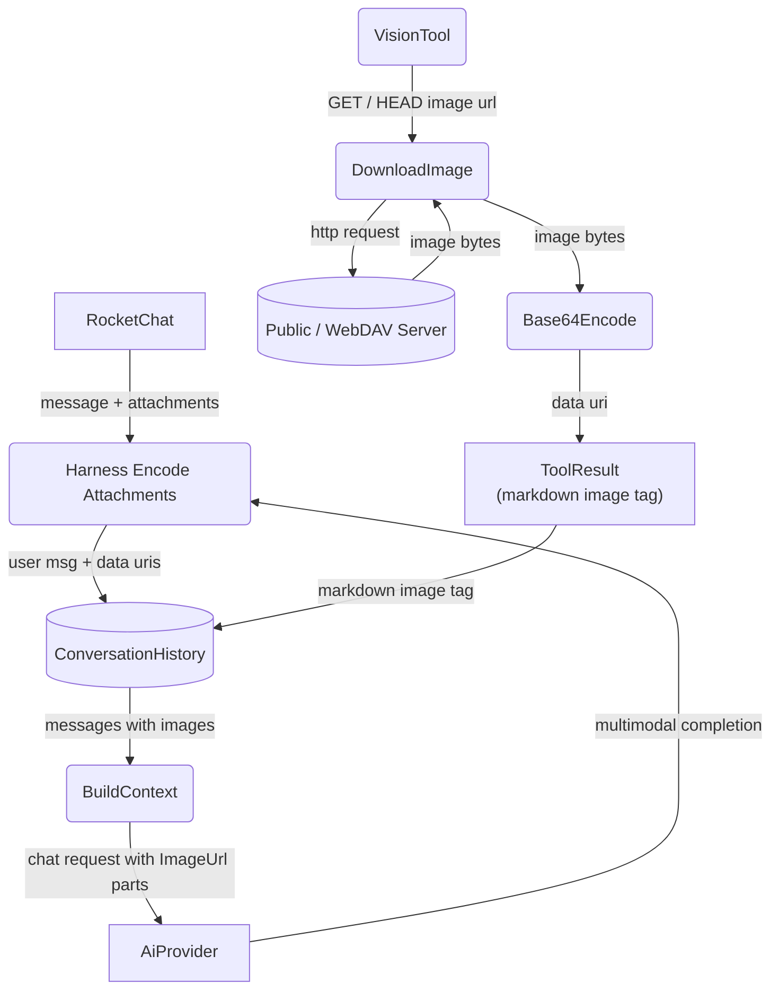
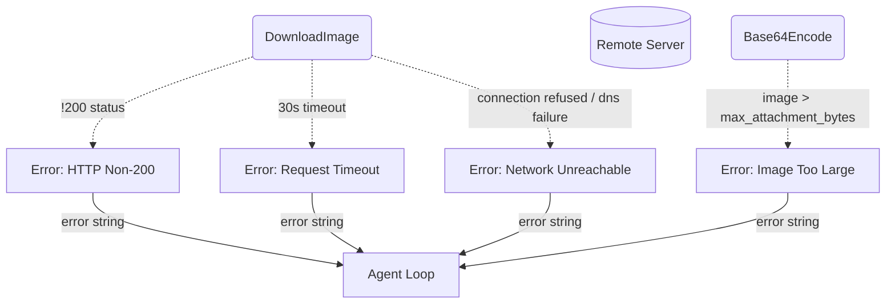
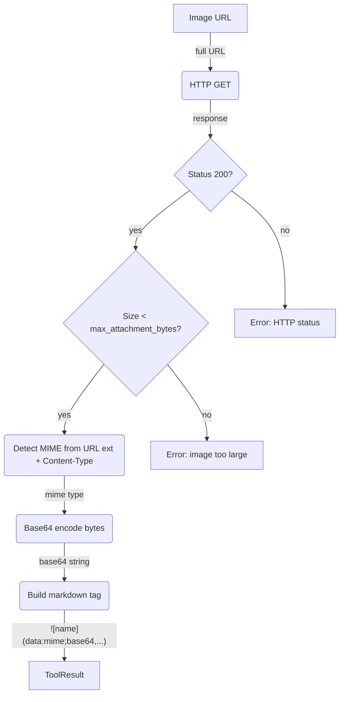
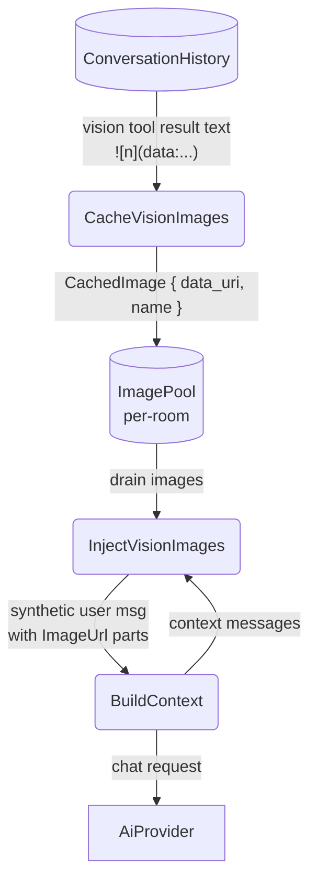

# Vision

## 1. Purpose

The agent harness natively "sees" images: when a user uploads an attachment to
RocketChat, the harness downloads it, encodes it as a base64 data URI, and embeds
it directly in the user's `ChatMessage` as `ContentPart::ImageUrl` parts — no
tool call needed.

The **vision tool** exists for the cases where the image is NOT already
attached to the incoming message:

- **Public URL**: fetch any image on the public web (HTTP/HTTPS URL)
- **WebDAV file**: fetch an image stored in the room's WebDAV directory

The vision tool downloads the image, base64-encodes it, and returns a **markdown
image tag** as a standard tool result: ``.
The LLM receives this as tool result text; it can embed the markdown tag in its
reply so RocketChat renders the image inline, or it can reference the base64
data URI for multimodal analysis by the AI provider.

> The vision tool does **not** perform OCR or image analysis — it is an image
> fetch-and-encode utility. Image analysis is done by the AI provider when the
> base64 data URI appears in chat context.
>
> **ContentPart injection**: The tool result text (``) is
> plain markdown — the LLM cannot see image pixels from it. The harness
> intercepts vision tool results, caches the decoded base64 data URIs in a
> per-room image pool, and injects them as `ContentPart::ImageUrl` parts
> in a synthetic user message before the next LLM call. This is the
> mechanism by which vision-tool-fetched images actually reach the
> multimodal model.

**Coworking with webdav tool**: the `webdav` tool's `read` action detects image
files by extension (`.png`, `.jpg`, etc.) and returns them as base64 markdown
tags — the same format as vision tool results. The harness intercepts both
`vision` AND `webdav` tool results for `ContentPart::ImageUrl` injection,
so images read from WebDAV storage pass transparently into the LLM context.
The `vision` tool handles public URLs; the `webdav` tool handles authenticated
WebDAV paths. The LLM chooses which to use based on the image's location.

- Upstream: [Agent Harness](../agent-harness.md) invokes the tool during the
  agent loop via `ToolRegistry::execute_by_name()`. The harness intercepts
  the result for injection into LLM context.
- Downstream: [AI Provider](../base/ai-provider.md) receives the tool result
  text and the injected `ContentPart::ImageUrl` for multimodal analysis.

## 2. Diagram

### 2a. Happy Flow (Main Success Path)

The agent harness natively sees user attachments (left path). The vision tool is
only invoked by the LLM for remote images — public URLs or WebDAV files (right
path).



### 2b. Error Handling & Fallbacks



Errors during auto-attachment download/encode are logged and the attachment is
skipped; the message still enters chat history with text-only content. Errors
from the vision tool are returned as tool result errors.
The size limit is configurable via `rocketchat.model.max_attachment_bytes`
(default 25 MB).

### 2c. Image Download & Encoding

Downloads the image bytes, verifies the MIME type and size limit (configurable via `max_attachment_bytes`, fallback default 20MB),
encodes as base64, and builds a markdown image tag. The URL path fragment is
used as the image alt text.



The markdown image tag format is ``.
The image name is extracted from the URL path (last segment, stripped of query
parameters). The result is appended to history as a standard
`ChatMessage::tool(call_id, content)`, then the harness intercepts it for
injection into the next LLM call (see §2d).

**Why base64 here but share links for image_gen**: the vision tool's base64 data
URIs flow only through the AI provider context and the harness's internal vision
image pool — they are never sent to RocketChat in the final reply. The LLM
receives them as `ContentPart::ImageUrl` parts (which AI providers handle
natively), and the harness collapses old vision data to `[image]` placeholders
in the conversation history. In contrast, `image_gen` results go into the
RocketChat reply text, where multi-megabyte base64 strings exceed
`Message_MaxAllowedSize` — hence the NextCloud share link approach.

### 2d. Harness Vision Injection

After the vision tool returns, the harness intercepts the result text, parses
the base64 data URIs from the markdown tags, caches them in a per-room image
pool, and injects them as `ContentPart::ImageUrl` parts in a synthetic user
message appended to the messages array before the next LLM call. The pool is
consumed (drained) on injection — images are ephemeral and only used for a
single LLM cycle.



**Labelling**: injected images are numbered `photo1.png`, `photo2.png`, etc.,
preserving the original file extension.

**Image pool structure** (`harness.rs`):
```
HashMap<room_id, Vec<CachedImage { data_uri, name }>>
```

## 3. Data Structures

#### `VisionParams`

| Field    | Type     | Notes                                                  |
| -------- | -------- | ------------------------------------------------------ |
| `url`    | `string` | URL of the image to download (public or WebDAV)        |
| `prompt` | `string` | Optional prompt for the LLM to use when analyzing       |

#### Tool Result (markdown string)

The vision tool returns a markdown image tag:

```

```

| Component         | Source                          | Example                    |
| ----------------- | ------------------------------- | -------------------------- |
| `{name}`          | URL path basename               | `photo.png`                |
| `{mime_type}`     | HTTP Content-Type or URL ext    | `image/png`                |
| `{encoded_bytes}` | base64-encoded image bytes      | `iVBORw0KGgo...`           |

#### MIME Detection

Detection uses the HTTP `Content-Type` header + URL file extension fallback:

| Extension          | MIME Type        |
| ------------------ | ---------------- |
| `.png`             | `image/png`      |
| `.jpg` / `.jpeg`   | `image/jpeg`     |
| `.gif`             | `image/gif`      |
| `.webp`            | `image/webp`     |
| `.svg`             | `image/svg+xml`  |
| *(other)*          | `image/png`      |

If the HTTP response includes a `Content-Type` header with a recognized image
MIME type, that takes precedence over extension-based detection.
