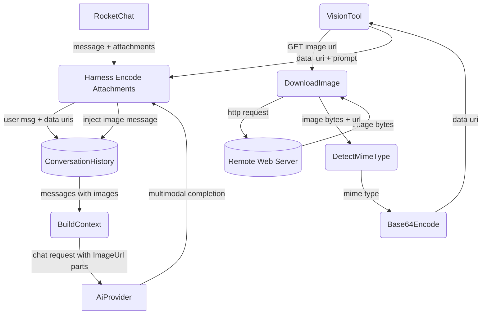
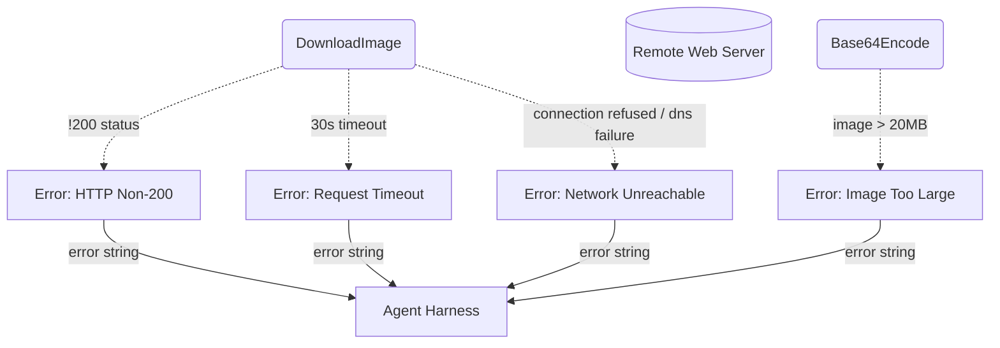
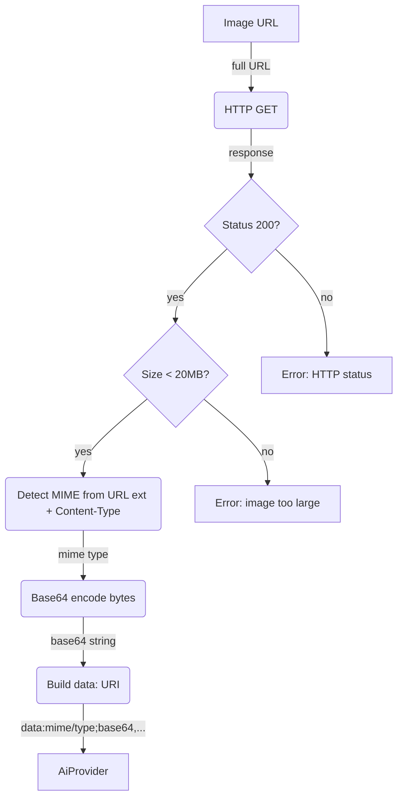
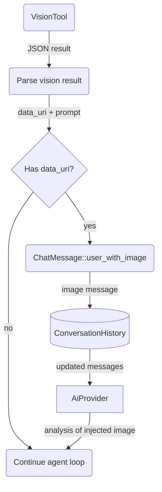

# Vision

## 1. Purpose

Describes how images enter, flow through, and are preserved in the agent's chat
context. Images reach the AI provider as `ContentPart::ImageUrl` data URIs via
three paths:

- **Auto-attachment** (harness-managed): user uploads image to RocketChat →
  harness downloads + encodes → embedded directly in the user's `ChatMessage` as
  `ContentPart::ImageUrl` parts — no tool call involved; the AI provider receives
  the images in the chat request messages
- **Vision tool** (LLM-invoked): LLM calls `vision(url, prompt)` → tool downloads
  + encodes from URL → harness extracts `data_uri` from result and injects an
  image `ChatMessage` back into history so the LLM "sees" the image on the next
  iteration
- **Chat history**: `build_context()` preserves `ContentPart::ImageUrl` parts on
  the most recent user message; earlier images are replaced with `[image]` text
  placeholders to save tokens

- Upstream: [Agent Harness](../agent-harness.md) auto-attaches images from
  incoming messages and manages chat context
- Downstream: [AI Provider](../base/ai-provider.md) receives `ChatRequest`
  messages with `ContentPart::ImageUrl` parts and returns multimodal completions

## 2. Diagram

### 2a. Happy Flow (Main Success Path)

Images enter the AI provider through two converging paths: auto-attachment
(harness encodes and embeds directly) and vision tool (LLM requests URL download,
harness injects result).



### 2b. Error Handling & Fallbacks



Errors during auto-attachment download/encode are logged and the attachment is
skipped; the message still enters chat history with text-only content. Errors from
the vision tool are appended as tool result errors.

### 2c. Image Encoding Deep Dive

Level 2 decomposition: downloads the image bytes, verifies the MIME type and size
limit (max 20MB), encodes as base64, and constructs a data URI. Common to both
auto-attachment and vision tool paths.



The data URI format is: `data:{mime_type};base64,{base64_encoded_bytes}`. The AI
provider wraps this in a `ContentPart::ImageUrl` with the data URI as the `url`
field. The provider's chat completion handler converts it to the provider-specific
format (OpenAI-compatible `image_url` type).

### 2d. Vision Tool Result Feedback

When the vision tool completes, its JSON result contains a `data_uri` field. The
harness extracts this and creates a `ChatMessage::user_with_image(prompt, data_uri)`,
appending it to chat history. The agent loop then continues (via `continue`) so the
LLM "sees" the image on the next iteration.



If the vision result lacks a `data_uri` field, the result is treated as a standard
tool response (no image injection). Other tools that return image data URIs (e.g.
`image_gen` could also follow this pattern — currently only `vision` injects).

### 2e. Chat History Image Preservation

When `build_context()` assembles messages for the AI provider, it preserves
`ContentPart::ImageUrl` data URIs only on the most recent user message. Earlier
user messages with images are rewritten: image parts become `[image]` text
placeholders, reducing token consumption while keeping the LLM aware that images
were present.

```mermaid
flowchart TD
    HIST[(ConversationHistory)]
    ITER(Iterate messages)
    FIND_LAST(Find last user msg index)
    CHECK{Is last user msg?}
    PRESERVE(Preserve Multipart content)
    STRIP(Strip images to [image] text)
    BUILD(Build messages vec)
    AI[AiProvider]

    HIST -->|"room history"| ITER
    ITER -->|"all messages"| FIND_LAST
    FIND_LAST -->|"last_user_idx"| ITER
    ITER -->|"each message"| CHECK
    CHECK -->|"yes"| PRESERVE
    CHECK -->|"no"| STRIP
    PRESERVE -->|"full message with ImageUrl parts"| BUILD
    STRIP -->|"text-only message"| BUILD
    BUILD -->|"ChatRequest.messages"| AI
```

This ensures the LLM can still "see" attached images from the current user turn
while avoiding unbounded data URI accumulation in the context window. The
`strip_images_from_message()` function in `memory.rs` collapses `Multipart`
content with images into a single-text `[image]` placeholder joined with
remaining text parts.

## 3. Data Structures

#### `VisionParams`

| Field    | Type     | Notes                                                  |
| -------- | -------- | ------------------------------------------------------ |
| `url`    | `string` | URL of the image to download (required)                |
| `prompt` | `string` | What to look for, ask, or analyze in the image         |

#### `VisionResult` (internal tool output)

| Field       | Type     | Notes                                       |
| ----------- | -------- | ------------------------------------------- |
| `data_uri`  | `string` | Base64-encoded data URI                     |
| `mime_type` | `string` | Detected MIME type (`image/png`, etc.)      |
| `size_bytes`| `u64`    | Image file size in bytes                    |
| `prompt`    | `string` | The prompt used for this analysis           |

The harness reads `data_uri` and `prompt` from this JSON to build an image
`ChatMessage` for injection into chat history (see section 2d).

#### Image Content Part

The vision tool and auto-attachment both build `ContentPart::ImageUrl` for the
AI provider:

| Field     | Type     | Notes                                            |
| --------- | -------- | ------------------------------------------------ |
| `url`     | `string` | `data:{mime};base64,{encoded}` data URI           |
| `detail`  | `Option<String>` | `"high"` for high-res analysis            |

This is passed to the AI provider as part of the chat request messages. The AI
provider converts it to the API-specific format (e.g. OpenAI-compatible
`{ "type": "image_url", "image_url": { "url": "...", "detail": "..." } }`).

#### MIME Detection

Detection uses the HTTP `Content-Type` header + URL file extension fallback:

| Extension       | MIME Type        |
| --------------- | ---------------- |
| `.png`          | `image/png`      |
| `.jpg` / `.jpeg`| `image/jpeg`     |
| `.gif`          | `image/gif`      |
| `.webp`         | `image/webp`     |
| `.svg`          | `image/svg+xml`  |
| *(other)*       | `image/png`      |

If the HTTP response includes a `Content-Type` header with a recognized image
MIME type, that takes precedence over extension-based detection.

#### `ChatMessage::user_with_images`

Not a Vision-specific type, but relevant: when the harness auto-attaches images
or injects a vision result, it uses `ChatMessage::user_with_images(text, data_uris)`
or `ChatMessage::user_with_image(text, data_uri)`. These produce `MessageContent::Multipart`
with a `ContentPart::Text` followed by one or more `ContentPart::ImageUrl` parts.
See `types.rs` for the full `ChatMessage` definition.
