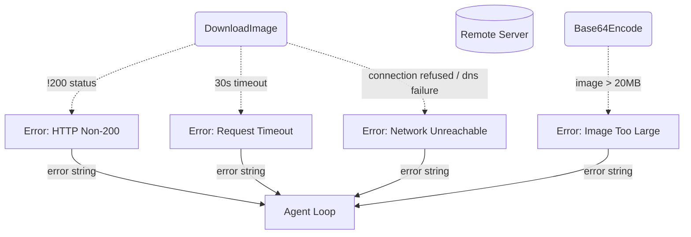
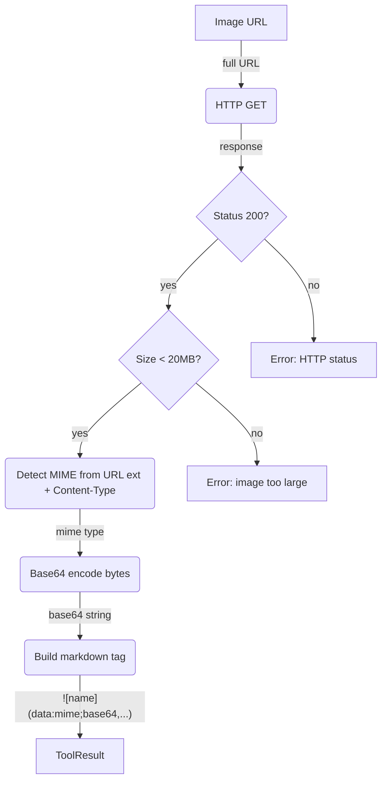

# Vision

## 1. Purpose

The agent harness natively "sees" images: when a user uploads an attachment to
RocketChat, the harness downloads it, encodes it as a base64 data URI, and embeds
it directly in the user's `ChatMessage` as `ContentPart::ImageUrl` parts — no
tool call needed.

The **vision tool** exists for the cases where the image is NOT already
attached to the incoming message:

- **Public URL**: fetch any image on the public web (HTTP/HTTPS URL)
- **WebDAV file**: fetch an image stored in the room's WebDAV directory

The vision tool downloads the image, base64-encodes it, and returns a **markdown
image tag** as a standard tool result: ``.
The LLM receives this as tool result text; it can embed the markdown tag in its
reply so RocketChat renders the image inline, or it can reference the base64
data URI for multimodal analysis by the AI provider.

> The vision tool does **not** perform OCR or image analysis — it is an image
> fetch-and-encode utility. Image analysis is done by the AI provider when the
> base64 data URI appears in chat context.

- Upstream: [Agent Harness](../agent-harness.md) invokes the tool during the
  agent loop via `ToolRegistry::execute_by_name()`. The result is appended as a
  standard `ChatMessage::tool` — no special injection.
- Downstream: [AI Provider](../base/ai-provider.md) receives the tool result
  text and may use the base64 data URI for multimodal analysis.

## 2. Diagram

### 2a. Happy Flow (Main Success Path)

The agent harness natively sees user attachments (left path). The vision tool is
only invoked by the LLM for remote images — public URLs or WebDAV files (right
path).

```mermaid
flowchart TD
    RC[RocketChat]
    HARNESS(Harness Encode Attachments)
    HIST[(ConversationHistory)]
    BUILD(BuildContext)
    AI[AiProvider]
    VISION(VisionTool)
    DL(DownloadImage)
    WEB[(Public / WebDAV Server)]
    ENCODE(Base64Encode)
    RESULT[ToolResult<br/>![name]&#40data:...&#41]

    RC -->|"message + attachments"| HARNESS
    HARNESS -->|"user msg + data uris"| HIST
    HIST -->|"messages with images"| BUILD
    BUILD -->|"chat request with ImageUrl parts"| AI
    AI -->|"multimodal completion"| HARNESS
    VISION -->|"GET / HEAD image url"| DL
    DL -->|"http request"| WEB
    WEB -->|"image bytes"| DL
    DL -->|"image bytes"| ENCODE
    ENCODE -->|"data uri"| RESULT
    RESULT -->|"markdown image tag"| HIST
```

### 2b. Error Handling & Fallbacks



Errors during auto-attachment download/encode are logged and the attachment is
skipped; the message still enters chat history with text-only content. Errors
from the vision tool are returned as tool result errors.

### 2c. Image Download & Encoding

Downloads the image bytes, verifies the MIME type and size limit (max 20MB),
encodes as base64, and builds a markdown image tag. The URL path fragment is
used as the image alt text.



The markdown image tag format is ``.
The image name is extracted from the URL path (last segment, stripped of query
parameters). This is a standard tool result — the harness appends it as
`ChatMessage::tool(call_id, content)` and the agent loop continues normally.

## 3. Data Structures

#### `VisionParams`

| Field    | Type     | Notes                                                  |
| -------- | -------- | ------------------------------------------------------ |
| `url`    | `string` | URL of the image to download (public or WebDAV)        |
| `prompt` | `string` | Optional prompt for the LLM to use when analyzing       |

#### Tool Result (markdown string)

The vision tool returns a markdown image tag:

```

```

| Component         | Source                          | Example                    |
| ----------------- | ------------------------------- | -------------------------- |
| `{name}`          | URL path basename               | `photo.png`                |
| `{mime_type}`     | HTTP Content-Type or URL ext    | `image/png`                |
| `{encoded_bytes}` | base64-encoded image bytes      | `iVBORw0KGgo...`           |

#### MIME Detection

Detection uses the HTTP `Content-Type` header + URL file extension fallback:

| Extension          | MIME Type        |
| ------------------ | ---------------- |
| `.png`             | `image/png`      |
| `.jpg` / `.jpeg`   | `image/jpeg`     |
| `.gif`             | `image/gif`      |
| `.webp`            | `image/webp`     |
| `.svg`             | `image/svg+xml`  |
| *(other)*          | `image/png`      |

If the HTTP response includes a `Content-Type` header with a recognized image
MIME type, that takes precedence over extension-based detection.
