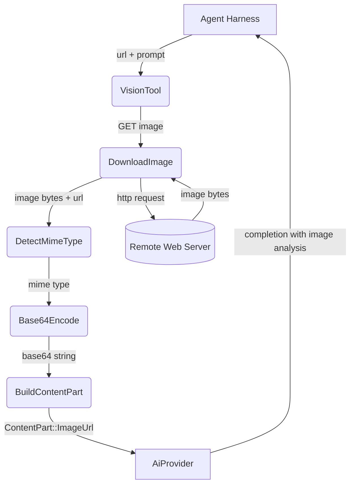
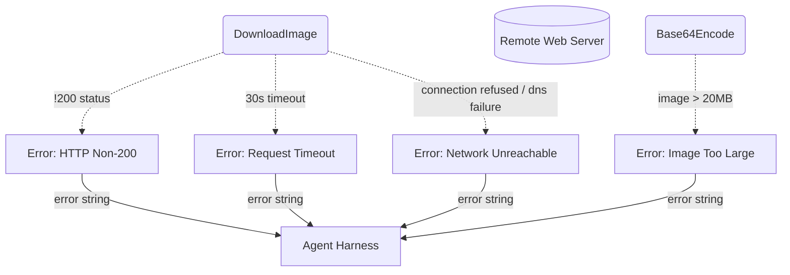
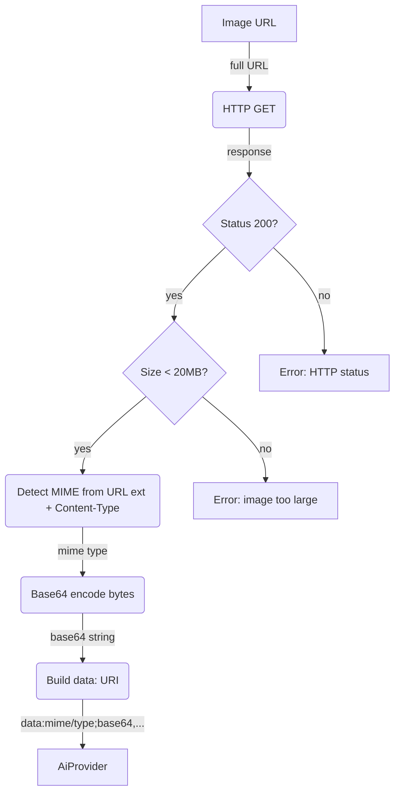

# Vision

## 1. Purpose

Downloads an image from a given URL, encodes it as base64, and sends it to the AI
provider as an image content part for true multimodal vision. The AI receives the
actual image data and can describe, analyze, or answer questions about the image.

The tool supports two modes:
- **URL mode**: downloads from any HTTP(S) URL (RocketChat file-uploads, WebDAV path, or external link)
- **Attachment pass-through**: when the harness detects image attachments in the
  incoming message, it auto-populates the URL from `attachments[0].title_link`
  (original file) and passes the user's prompt through

- Upstream: [Agent Harness](../agent-harness.md) invokes `VisionTool` with an
  image URL and optional prompt
- Downstream: [AI Provider](../base/ai-provider.md) receives the encoded image
  as a `ContentPart::ImageUrl` with the base64 data URI, returning a completion

## 2. Diagram

### 2a. Happy Flow (Main Success Path)

### 2b. Error Handling & Fallbacks

### 2c. Image Encoding Deep Dive

Level 2 decomposition: downloads the image bytes, verifies the MIME type and size
limit (max 20MB), encodes as base64, and constructs a data URI for the AI provider.

The data URI format is: `data:{mime_type};base64,{base64_encoded_bytes}`. The AI
provider wraps this in a `ContentPart::ImageUrl` with the data URI as the `url`
field. The provider's chat completion handler converts it to the provider-specific
format (OpenAI-compatible `image_url` type).

## 3. Data Structures

#### `VisionParams`

| Field    | Type     | Notes                                                  |
| -------- | -------- | ------------------------------------------------------ |
| `url`    | `string` | URL of the image to download (required)                |
| `prompt` | `string` | What to look for, ask, or analyze in the image         |

#### `VisionResult`

| Field       | Type     | Notes                                       |
| ----------- | -------- | ------------------------------------------- |
| `analysis`  | `string` | AI provider's text analysis of the image    |
| `mime_type` | `string` | Detected MIME type (`image/png`, etc.)      |
| `bytes`     | `u64`    | Image file size in bytes                    |
| `data_uri`  | `string` | Base64-encoded data URI (for debugging)     |

#### Image Content Part

The vision tool builds a `ContentPart::ImageUrl` for the AI provider:

| Field     | Type     | Notes                                            |
| --------- | -------- | ------------------------------------------------ |
| `url`     | `string` | `data:{mime};base64,{encoded}` data URI           |
| `detail`  | `Option<String>` | `"high"` for high-res analysis            |

This is passed to the AI provider as part of the chat request messages. The AI
provider converts it to the API-specific format (e.g. OpenAI-compatible
`{ "type": "image_url", "image_url": { "url": "...", "detail": "..." } }`).

#### MIME Detection

Detection uses the HTTP `Content-Type` header + URL file extension fallback:

| Extension       | MIME Type        |
| --------------- | ---------------- |
| `.png`          | `image/png`      |
| `.jpg` / `.jpeg`| `image/jpeg`     |
| `.gif`          | `image/gif`      |
| `.webp`         | `image/webp`     |
| `.svg`          | `image/svg+xml`  |
| *(other)*       | `image/png`      |

If the HTTP response includes a `Content-Type` header with a recognized image
MIME type, that takes precedence over extension-based detection.
