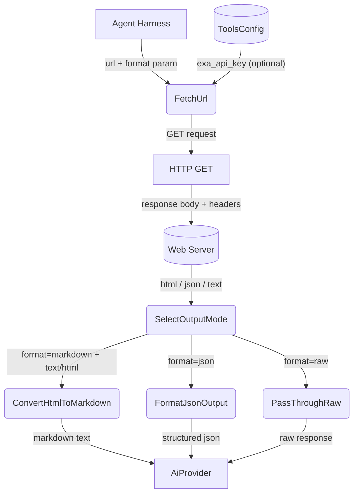
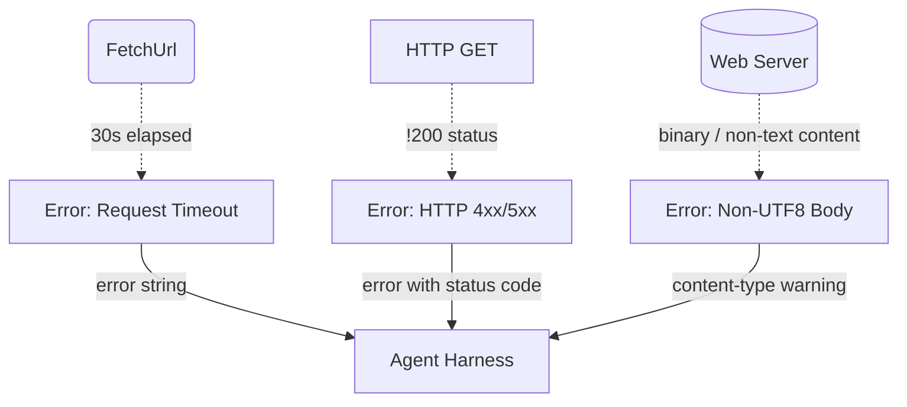
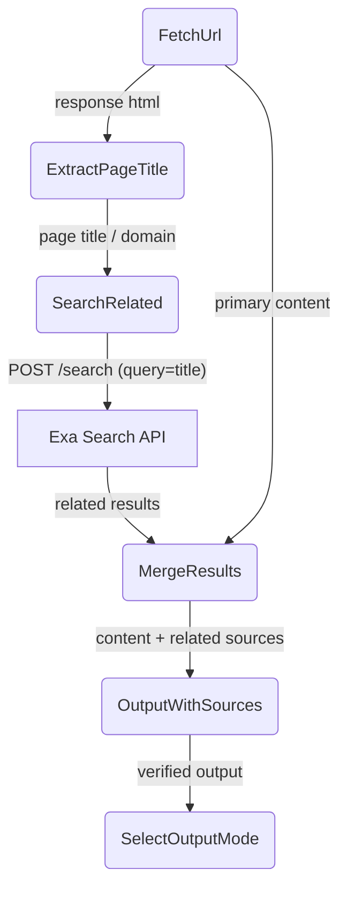

# Web Fetch

## 1. Purpose

Fetches content from arbitrary URLs with three output formats — `raw` (unmodified
response body), `markdown` (HTML-to-markdown conversion for AI consumption), and
`json` (structured metadata with content). Optionally cross-verifies fetched
content via a parallel Exa web search.

- Upstream: [Exa Search](exa-search.md) provides the verification search when
  `verify` is enabled and an Exa API key is configured
- Upstream: [Configuration Management](../base/config.md) supplies the
  `exa_api_key` for the optional verify flow
- Upstream: [Agent Harness](../agent-harness.md) invokes web_fetch as a tool
  during the agent loop, passing a URL and format selector
- Downstream: [AI Provider](../base/ai-provider.md) consumes the returned content
  (plain text, markdown, or structured JSON) as context for chat completions

## 2. Diagram

### 2a. Happy Flow (Main Success Path)

### 2b. Error Handling & Fallbacks

### 2c. Verify Deep Dive (Double-Check)

When `verify` is `true` and the tool holds a valid Exa API key, the fetched
page title is extracted and used as a query to the Exa search API. The resulting
related sources are bundled alongside the primary content, giving the AI provider
cross-referenced information for fact-checking.

## 3. Data Structures

### `FetchParams`

| Field    | Type     | Notes                                          |
| -------- | -------- | ---------------------------------------------- |
| `url`    | `String` | The URL to fetch (required)                    |
| `format` | `String` | Output format: `"json"`, `"markdown"`, or `"raw"` (default: `"raw"`) |
| `verify` | `bool`   | Trigger a parallel Exa search for cross-referencing (default: `false`) |

### `FetchJsonOutput` (format=`"json"`)

| Field             | Type              | Notes                                         |
| ----------------- | ----------------- | --------------------------------------------- |
| `url`             | `String`          | The requested URL                             |
| `status`          | `u16`             | HTTP status code                              |
| `content_type`    | `String`          | Content-Type header value                     |
| `content`         | `String`          | Response body (truncated to 10,000 chars)     |
| `verified`        | `bool`            | Whether cross-verification was performed      |
| `related_sources` | `Vec<SearchRef>`  | Results from the Exa verification search      |

### `SearchRef`

| Field    | Type     | Notes              |
| -------- | -------- | ------------------ |
| `title`  | `String` | Page title         |
| `url`    | `String` | Page URL           |
| `snippet`| `String` | Search snippet     |
