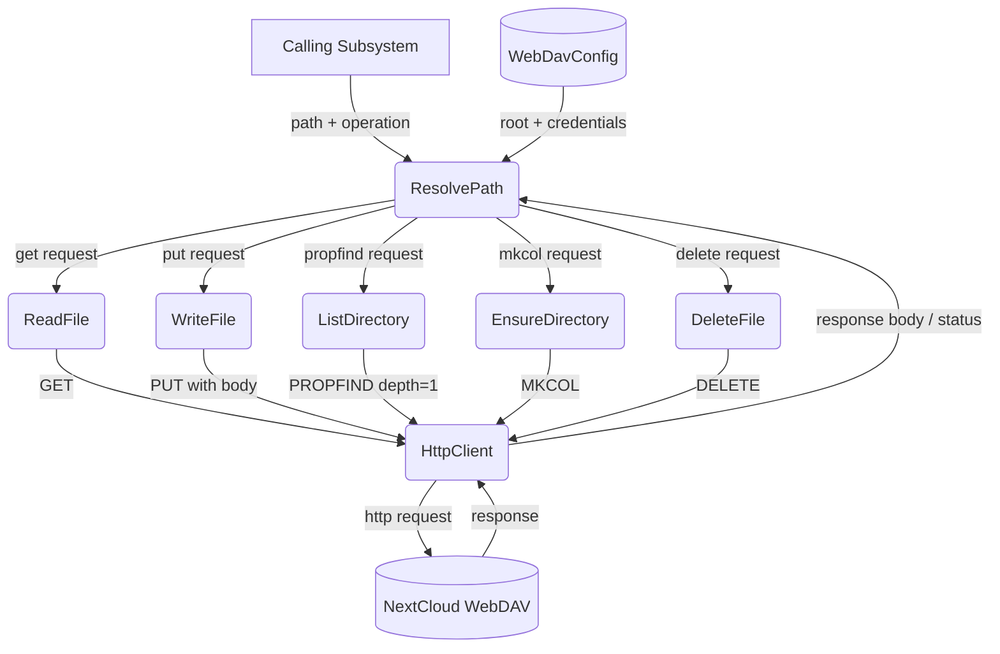
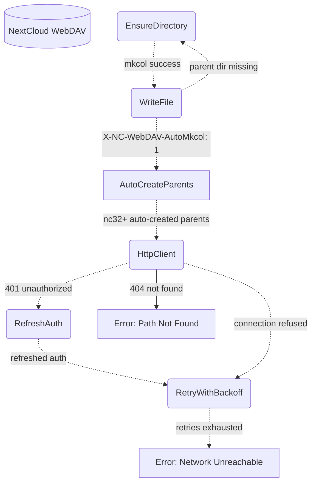
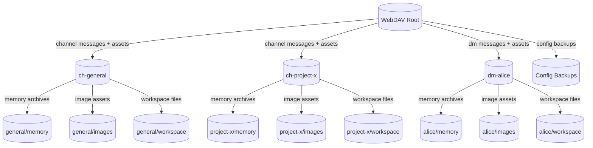

# WebDAV Storage

## 1. Purpose

Thin abstraction over HTTP-based WebDAV (NextCloud) providing typed
read/write/list/mkdir/delete operations. All bot state — configuration backups, memory
archives, and image assets — is stored remotely; the bot never writes to local
disk. Each room gets its own directory subtree.

The client targets NextCloud's WebDAV API at the path:
`{base_url}/remote.php/dav/files/{username}`. Authentication uses HTTP Basic Auth
with an app password (generated via NextCloud's personal security settings).

- Upstream: [Configuration Management](config.md) provides `WebDavConfig`
- Upstream: [Memory Management](memory.md) stores and retrieves `.md` archives
- Upstream: [Agent Loop](agent-harness.md) (vision tool) reads images from WebDAV

## 2. Diagram

### 2a. Happy Flow (Main Success Path)

### 2b. Error Handling & Fallbacks

### 2c. Directory Structure Deep Dive

## 3. Data Structures

#### `WebDavClient`

| Field       | Type              | Notes                                  |
| ----------- | ----------------- | -------------------------------------- |
| `base_url`  | `String`          | WebDAV endpoint                        |
| `root`      | `String`          | Base directory path                    |
| `auth`      | `BasicAuth`       | Username + app password                |
| `client`    | `reqwest::Client` | Shared HTTP client with connection pool|

#### `WebDavEntry`

| Field       | Type     | Notes                                      |
| ----------- | -------- | ------------------------------------------ |
| `name`      | `String` | File or directory name                     |
| `href`      | `String` | Full WebDAV href                           |
| `is_dir`    | `bool`   | True if collection (directory)             |
| `size`      | `u64`    | File size in bytes (0 for dirs)            |
| `modified`  | `String` | Last-modified timestamp                    |

#### `WebDavPath`

| Method                  | Returns    | Notes                                    |
| ----------------------- | ---------- | ---------------------------------------- |
| `room_dir(id)`          | `String`   | `/{root}/{room_id}/`                     |
| `memory_dir(id)`        | `String`   | `/{root}/{room_id}/memory/`              |
| `image_dir(id)`         | `String`   | `/{root}/{room_id}/images/`              |
| `workspace_dir(id)`     | `String`   | `/{root}/{room_id}/workspace/`           |
| `image_path(id, name)`  | `String`   | `/{root}/{room_id}/images/{name}`        |
| `archive_path(id, seq)` | `String`   | `/{root}/{room_id}/memory/{seq:06}_summary.md` |
| `room_path(id, file)`   | `String`   | `/{root}/{room_id}/{file_path}`          |
| `config_backup_path(f)` | `String`   | `/{root}/config/{filename}/`             |

## 4. NextCloud API Reference

| DFD Operation      | HTTP Method | NextCloud Endpoint                        | Notes                                |
| ------------------ | ----------- | ----------------------------------------- | ------------------------------------ |
| ReadFile           | `GET`       | `{base}/files/{user}/{path}`              | Returns raw file bytes               |
| WriteFile          | `PUT`       | `{base}/files/{user}/{path}`              | Overwrites existing files            |
| WriteFileAutoMkcol | `PUT`       | `{base}/files/{user}/{path}`              | Set `X-NC-WebDAV-AutoMkcol: 1` header |
| ListDirectory      | `PROPFIND`  | `{base}/files/{user}/{path}`              | `Depth: 1` for children              |
| EnsureDirectory    | `MKCOL`     | `{base}/files/{user}/{path}`              | Returns 405 if exists                |
| Delete             | `DELETE`    | `{base}/files/{user}/{path}`              | Recursive for folders                |
| Exists             | `PROPFIND`  | `{base}/files/{user}/{path}`              | `Depth: 0` — 207 = exists, 404 = no  |

The `X-NC-WebDAV-AutoMkcol` header (available since NextCloud 32) instructs the
server to automatically create any missing parent directories when uploading a
file, eliminating the need for explicit MKDIR fallback steps.
