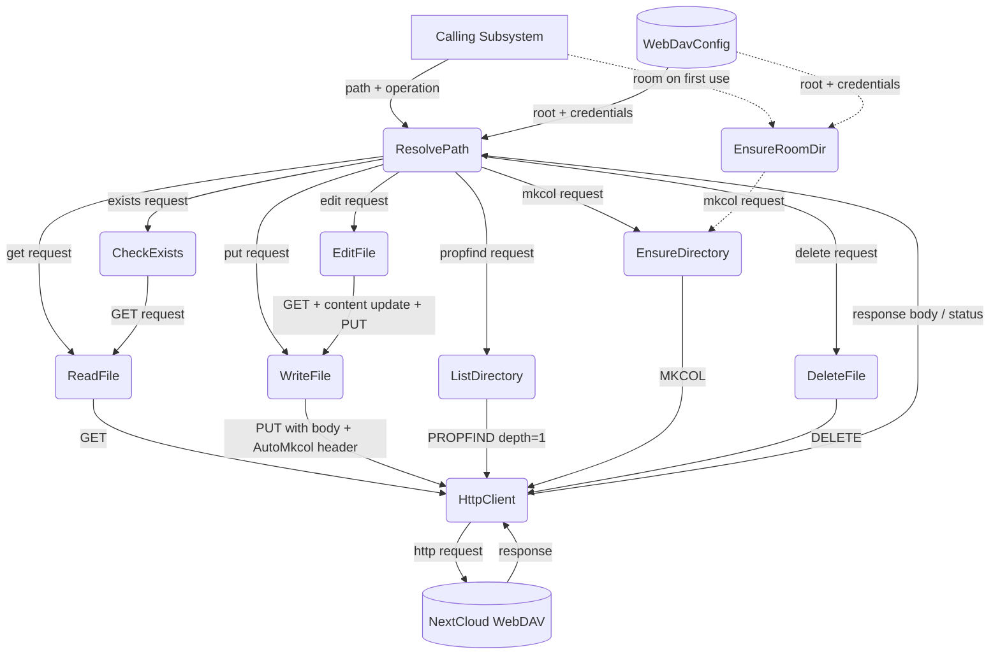
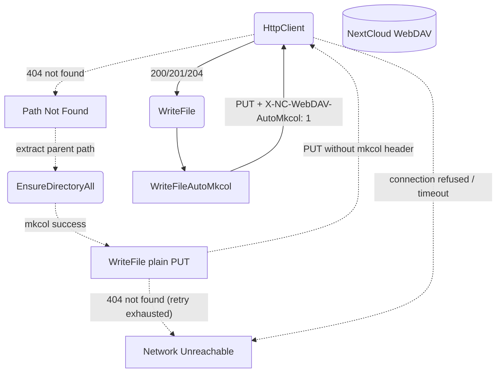
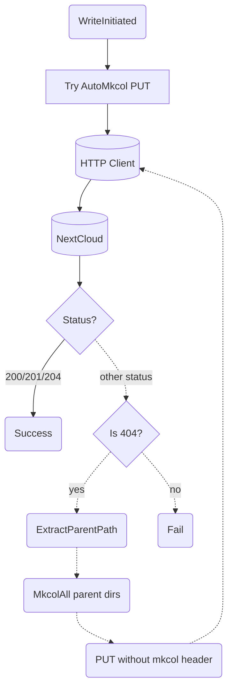
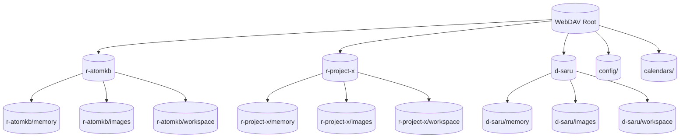

# WebDAV Directory

## 1. Purpose

Thin abstraction over HTTP-based WebDAV (NextCloud) providing typed file
read/write/list/mkdir/delete with per-room directory isolation. Each room gets
its own subtree created proactively on first use. Room names use type prefixes
(`r-` for channels, `d-` for DMs) to prevent collisions.

- Upstream: [Configuration Management](../base/config.md) provides `WebDavConfig`
- Downstream: [Agent Harness](../agent-harness.md) exposes `WebDavTool` to
  the AI agent
- Downstream: [Knowledge Management](../base/knowledge.md) persists `.md` files
- Downstream: [Memory Management](../base/memory.md) uses PUT/GET/PROPFIND
  operations for JSON archive persistence

## 2. Diagram

### 2a. Happy Flow (Main Success Path)

Note: `ensure_room_directory()` (client.rs:264) exists but is not currently called — directories are created implicitly by `write_file_with_fallback()` via AutoMkcol.

### 2b. Error Handling & Fallbacks

### 2c. Write-With-Fallback Deep Dive

### 2d. Room Directory Structure

Each room (channel or DM) has three subdirectories: `memory/`, `images/`, and
`workspace/`. A shared `config/` directory holds backups. The `calendars/`
directory stores CalDAV events (see [Calendar](calendar.md)).

## 3. Data Structures

#### `WebDavClient`

| Field        | Type              | Notes                                  |
| ------------ | ----------------- | -------------------------------------- |
| `base_url`   | `String`          | WebDAV endpoint including root         |
| `client`     | `reqwest::Client` | Shared HTTP client with connection pool|
| `auth_header`| `String`          | `Basic` base64-encoded credentials     |

#### `WebDavEntry`

| Field      | Type     | Notes                              |
| ---------- | -------- | ---------------------------------- |
| `name`     | `String` | File or directory name             |
| `href`     | `String` | Full WebDAV href                   |
| `is_dir`   | `bool`   | True if collection (directory)     |
| `size`     | `u64`    | File size in bytes (0 for dirs)    |
| `modified` | `String` | Last-modified timestamp            |

#### `WebDavPath`

All methods accept a `dir_key` — a flat type-prefixed directory name such
as `r-森林生態` or `d-saru`. The harness computes `webdav_dir` preferring
`room_fname` (the friendly display name) over `room_name` (the ASCII slug);
the raw RocketChat room UUID is never used as a path segment.

| Method                   | Returns  | Notes                                       |
| ------------------------ | -------- | ------------------------------------------- |
| `room_dir(key)`          | `String` | `/{root}/{key}/`                            |
| `room_path(key, file)`   | `String` | `/{root}/{key}/{file_path}`                 |
| `image_dir(key)`         | `String` | `/{root}/{key}/images/`                     |
| `workspace_dir(key)`     | `String` | `/{root}/{key}/workspace/`                  |
| `image_path(key, name)`  | `String` | `/{root}/{key}/images/{name}`               |
| `parent_path(path)`      | `String` | Strips last path segment                    |

## 4. NextCloud API Reference

Per [NextCloud WebDAV basic operations](https://docs.nextcloud.com/server/latest/developer_manual/client_apis/WebDAV/basic.html).

| DFD Operation           | HTTP Method | NextCloud Endpoint                        | Notes                                |
| ----------------------- | ----------- | ----------------------------------------- | ------------------------------------ |
| ReadFile                | `GET`       | `{base}/files/{user}/{path}`              | Returns raw file bytes               |
| WriteFile               | `PUT`       | `{base}/files/{user}/{path}`              | Overwrites existing files            |
| WriteFileAutoMkcol      | `PUT`       | `{base}/files/{user}/{path}`              | Set `X-NC-WebDAV-AutoMkcol: 1` header |
| WriteFileWithFallback   | `PUT`       | `{base}/files/{user}/{path}`              | Tries AutoMkcol; 404 → mkcol parents → retry PUT |
| ListDirectory           | `PROPFIND`  | `{base}/files/{user}/{path}`              | `Depth: 1` for children              |
| EnsureDirectory         | `MKCOL`     | `{base}/files/{user}/{path}`              | Returns 405 if exists                |
| EnsureDirectoryAll      | `MKCOL`     | `{base}/files/{user}/{path}`              | Iterative MKCOL per segment          |
| EnsureRoomDirectory     | `MKCOL`     | `{base}/files/{user}/{root}/{room}/`      | Creates room dir on first use        |
| Delete                  | `DELETE`    | `{base}/files/{user}/{path}`              | Recursive for folders                |
| Exists                  | `PROPFIND`  | `{base}/files/{user}/{path}`              | `Depth: 0` — 207 = exists, 404 = no  |
