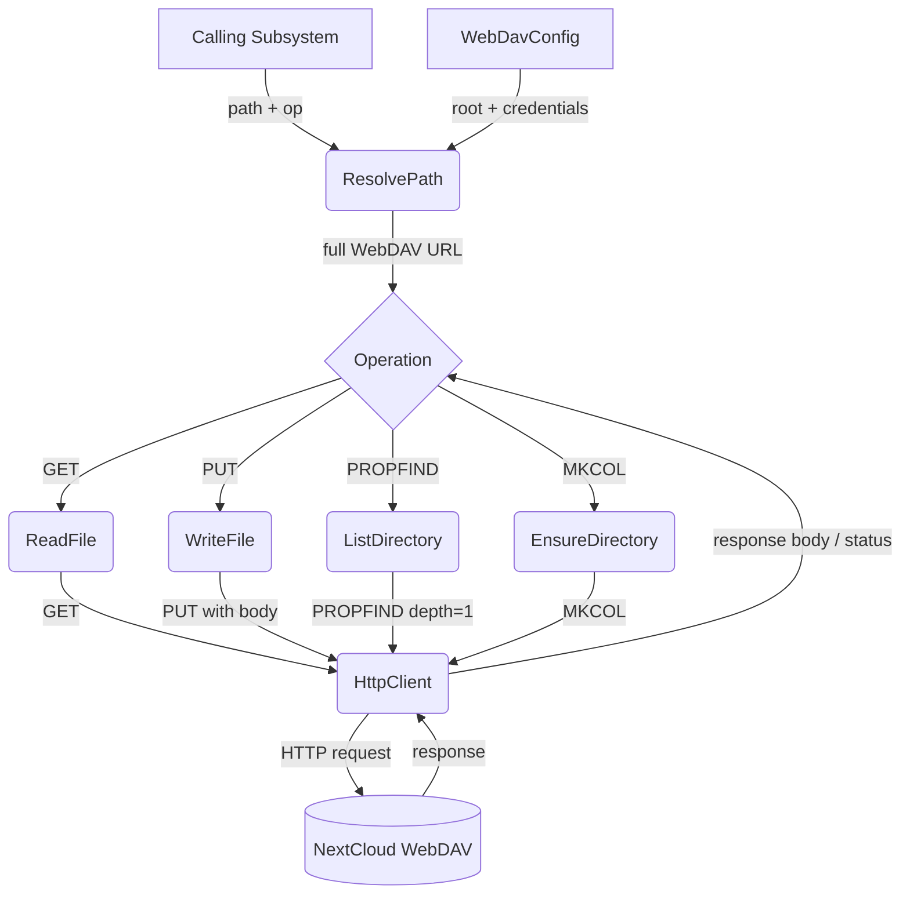
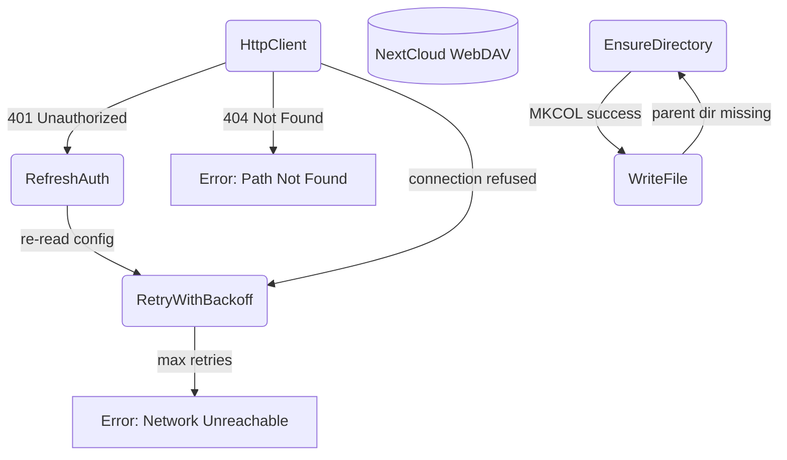
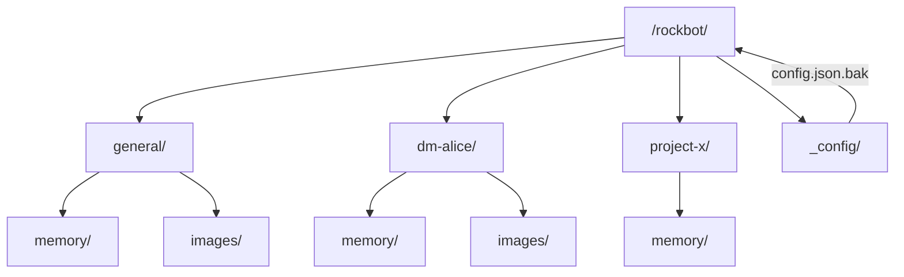

# WebDAV Storage

## 1. Purpose

Thin abstraction over HTTP-based WebDAV (NextCloud) providing typed
read/write/list/mkdir operations. All bot state — configuration backups, memory
archives, and image assets — is stored remotely; the bot never writes to local
disk. Each room gets its own directory subtree.

- Upstream: [Configuration Management](config.md) provides `WebDavConfig`
- Upstream: [Memory Management](memory.md) stores and retrieves `.md` archives
- Upstream: [Agent Tools](agent.md) (vision) reads images from WebDAV

## 2. Diagram

### 2a. Happy Flow (Main Success Path)

### 2b. Error Handling & Fallbacks

### 2c. Directory Structure Deep Dive

## 3. Data Structures

#### `WebDavClient`

| Field       | Type              | Notes                                  |
| ----------- | ----------------- | -------------------------------------- |
| `base_url`  | `String`          | WebDAV endpoint                        |
| `root`      | `String`          | Base directory path                    |
| `auth`      | `BasicAuth`       | Username + app password                |
| `client`    | `reqwest::Client` | Shared HTTP client with connection pool|

#### `WebDavEntry`

| Field       | Type     | Notes                                      |
| ----------- | -------- | ------------------------------------------ |
| `name`      | `String` | File or directory name                     |
| `href`      | `String` | Full WebDAV href                           |
| `is_dir`    | `bool`   | True if collection (directory)             |
| `size`      | `u64`    | File size in bytes (0 for dirs)            |
| `modified`  | `String` | Last-modified timestamp                    |

#### `WebDavPath`

| Method           | Returns    | Notes                                    |
| ---------------- | ---------- | ---------------------------------------- |
| `room_dir(id)`   | `String`   | `/{root}/{room_id}/`                     |
| `memory_dir(id)` | `String`   | `/{root}/{room_id}/memory/`              |
| `image_path(id, name)` | `String` | `/{root}/{room_id}/images/{name}`  |
| `archive_path(id, seq)` | `String` | `/{root}/{room_id}/memory/{seq}_summary.md` |
