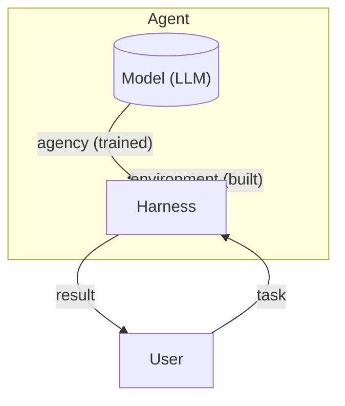
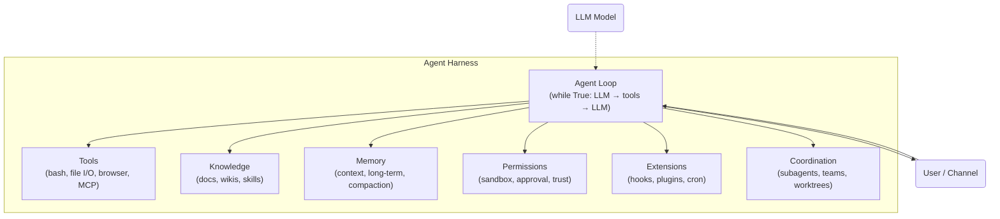
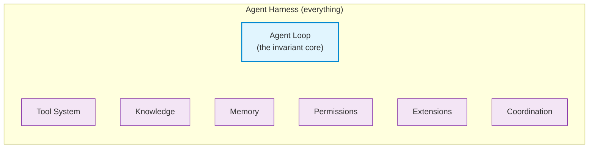
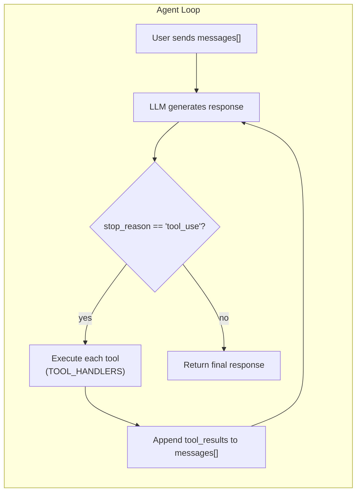

# Agent Harness

## Origin

The term **harness** is borrowed from **test harness** — a well-known software testing concept (Wikipedia: "a collection of stubs and drivers configured to assist with the testing of an application or component"). In the AI agent space, it was repurposed to describe the infrastructure layer that supports an LLM.

## Visual Overview





## The Core Formula

```
Agent = Model + Harness

  Model:  The LLM — provides agency (perception, reasoning, action).
          Agency is trained (via RLHF, RL, fine-tuning), not coded.

  Harness: The operational environment — everything around the model
           that lets it perceive, act, and stay safe.
```

Key insight: **Agency comes from the model. The harness gives agency a place to land.** You cannot engineer agency by stacking procedural glue code around an LLM — that produces brittle pipelines, not agents. The harness is not "the agent"; it is the vehicle the model drives.

## What a Harness Contains

```
Harness = Tools + Knowledge + Context + Permissions + Extensions + Coordination

  Tools:         bash, file I/O, browser, database, API calls, MCP servers
  Knowledge:     docs, wikis, codebases, style guides — loaded on demand
  Context:       message loop, memory, compaction, task persistence
  Permissions:   sandbox, approval workflows, trust boundaries
  Extensions:    hooks, skills, plugin system
  Coordination:  subagents, mailboxes, team protocols, worktree isolation
```

Each of these concerns is a **harness mechanism** — a piece of infrastructure that layers around the core agent loop without modifying it.

## Key Distinction: Harness ≠ Agent Loop



The agent loop is a **subset** of the harness, not the same thing:

```
Agent Harness = Agent Loop + Tools + Knowledge + Permissions + Memory
                + Subagents + Compaction + Hooks + MCP + ...
```

| Concept | Scope | Example |
|---------|-------|---------|
| **Agent Loop** | Just the `while True: LLM → tools → LLM → ...` cycle | 15 lines of code shown below |
| **Agent Harness** | Everything that wraps, extends, and supports the loop | Tools, permissions, memory, teams, MCP, scheduling, error recovery, etc. |

The loop alone is a bare REPL. The harness turns it into a product.

## The Agent Loop (Harness Core)

The central loop that every harness implements:



```python
def agent_loop(messages):
    while True:
        response = client.messages.create(
            model=MODEL, system=SYSTEM,
            messages=messages, tools=TOOLS,
        )
        messages.append({"role": "assistant", "content": response.content})

        if response.stop_reason != "tool_use":
            return

        results = []
        for block in response.content:
            if block.type == "tool_use":
                output = TOOL_HANDLERS[block.name](**block.input)
                results.append({
                    "type": "tool_result",
                    "tool_use_id": block.id,
                    "content": output,
                })
        messages.append({"role": "user", "content": results})
```

The loop itself never changes. Every new capability — subagents, memory, error recovery, MCP plugins — is added by wrapping or extending this loop, never by rewriting it.

## Concrete Examples

### 1. Claude Code (Anthropic)

The most polished production agent harness. Its architecture:

```
Claude Code = agent loop
            + tools (bash, read, write, edit, glob, grep, browser...)
            + on-demand skill loading
            + context compaction (snip, micro, auto)
            + subagent spawning (fresh context per subtask)
            + task system with dependency graphs
            + async mailbox team coordination
            + worktree-isolated parallel execution
            + permission governance (approval flows)
            + hooks extension system
            + memory persistence
            + MCP server integration
```

### 2. CowAgent (45k ⭐)

Describes itself as an "Agent Harness" with:

```
CowAgent = Channels (Web, WeChat, Telegram, Slack...)
         + Agent Core (planning, reasoning, tool use)
         + Memory (context → daily → long-term, Deep Dream distillation)
         + Knowledge (auto-curated Markdown wiki, graph view)
         + Skills (one-click install from marketplace, conversational authoring)
         + Tools (file I/O, terminal, browser, scheduler, MCP)
         + Models (Claude, GPT, Gemini, DeepSeek, Qwen...)
```

### 3. Harness Engineering Tutorial (65k ⭐)

The [learn-claude-code](https://github.com/shareAI-lab/learn-claude-code) repository teaches harness building from 0 to 1 across 20 progressive lessons:

| Lesson | Mechanism | Motto |
|--------|-----------|-------|
| s01 | Agent Loop | "One loop & Bash is all you need" |
| s02 | Tool Use | "Adding a tool means adding one handler" |
| s03 | Permission System | "Set boundaries first, then grant freedom" |
| s04 | Hooks | "Hook around the loop, never rewrite the loop" |
| s05 | TodoWrite | "An agent without a plan drifts" |
| s06 | Subagent | "Big tasks split small, each subtask gets clean context" |
| s07 | Skill Loading | "Load knowledge on demand, not upfront" |
| s08 | Context Compact | "Context always fills up — have a way to make room" |
| s09 | Memory | "Remember what matters, forget what doesn't" |
| s10 | System Prompt | "Prompts are assembled at runtime, not hardcoded" |
| s11 | Error Recovery | "Errors aren't the end, they're the start of a retry" |
| s12 | Task System | "Big goals break into small tasks, ordered, persisted" |
| s13 | Background Tasks | "Slow ops go background, agent keeps thinking" |
| s14 | Cron Scheduler | "Fire on schedule, no human kick needed" |
| s15 | Agent Teams | "Too big for one agent — delegate to teammates" |
| s16 | Team Protocols | "Teammates need shared communication rules" |
| s17 | Autonomous Agents | "Teammates check the board, claim work themselves" |
| s18 | Worktree Isolation | "Each works in its own directory, no interference" |
| s19 | MCP Plugin | "Not enough capability? Plug in more via MCP" |
| s20 | Comprehensive Agent | "Many mechanisms, one loop" |

## Harness Engineering Mindset

### What harness engineers actually do:

1. **Implement tools** — Give the agent hands. File read/write, shell, API calls, browser. Each tool is atomic, composable, clearly described.
2. **Curate knowledge** — Give the agent domain expertise. Product docs, ADRs, style guides. Load on demand, not upfront.
3. **Manage context** — Give the agent clean memory. Subagents isolate noise, compaction prevents history drowning the present, tasks persist goals across conversations.
4. **Control permissions** — Give the agent boundaries. Sandbox file access, require approval for destructive ops, enforce trust boundaries.
5. **Collect trajectory data** — Every action sequence the agent executes is training signal for the next generation of models.

### What it is NOT:

- NOT a no-code "AI agent" drag-and-drop builder
- NOT a prompt-chain orchestration library with if-else branches
- NOT a node graph of hardcoded routing logic
- NOT a Rube Goldberg machine with an LLM wedged in

These are **procedural pipelines with an LLM in the middle** — they do not constitute an agent harness. They try to code agency instead of letting the model supply it.

## Related Projects

| Project | Stars | Description |
|---------|-------|-------------|
| shareAI-lab/learn-claude-code | 65k+ | Harness engineering tutorial from 0 to 1 |
| zhayujie/CowAgent | 45k+ | Production agent harness with channels, memory, skills |
| openclaw/openclaw | — | Always-on agent harness with heartbeat, cron, IM |
| shareAI-lab/Kode-Agent | — | Open-source coding agent CLI |

## References

- [learn-claude-code](https://github.com/shareAI-lab/learn-claude-code) — "Agency comes from the model. An Agent Product = Model + Harness."
- [CowAgent](https://github.com/zhayujie/CowAgent) — "Open-source super AI assistant & Agent Harness"
- [Wikipedia: Test Harness](https://en.wikipedia.org/wiki/Test_harness) — Original concept the term is borrowed from
- [Claude Code](https://docs.anthropic.com/en/docs/claude-code/overview) — Production agent harness by Anthropic
