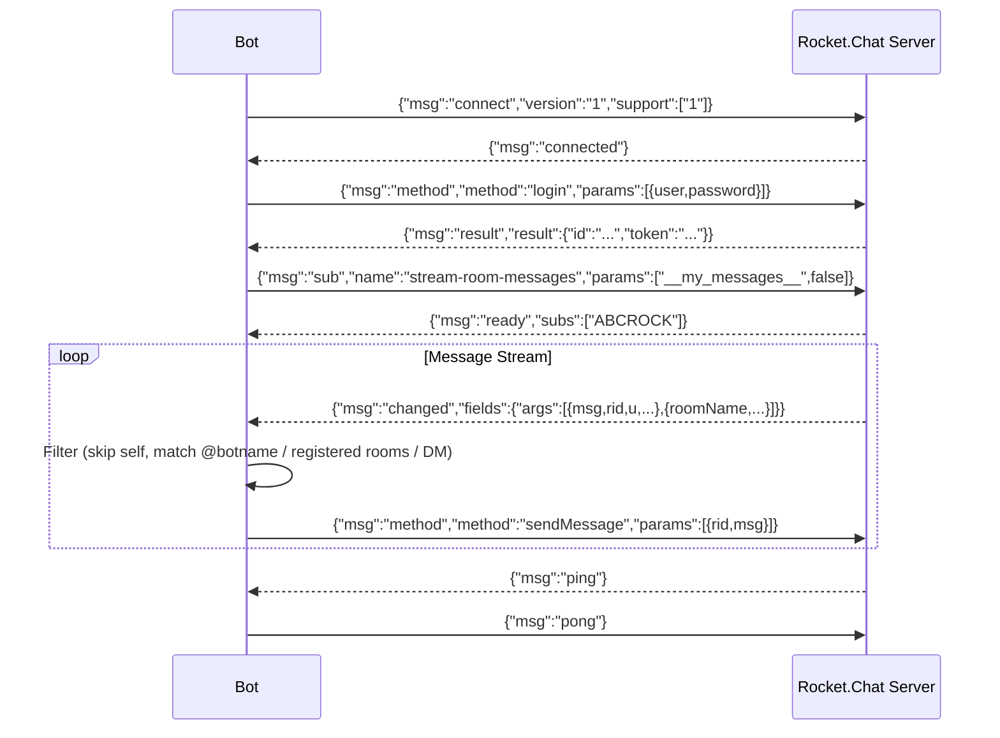
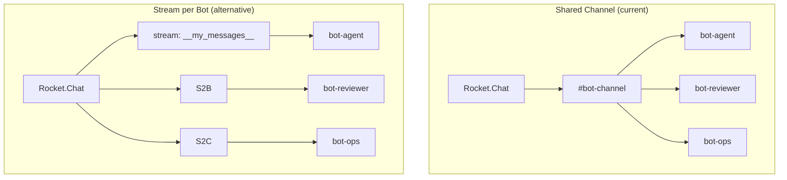
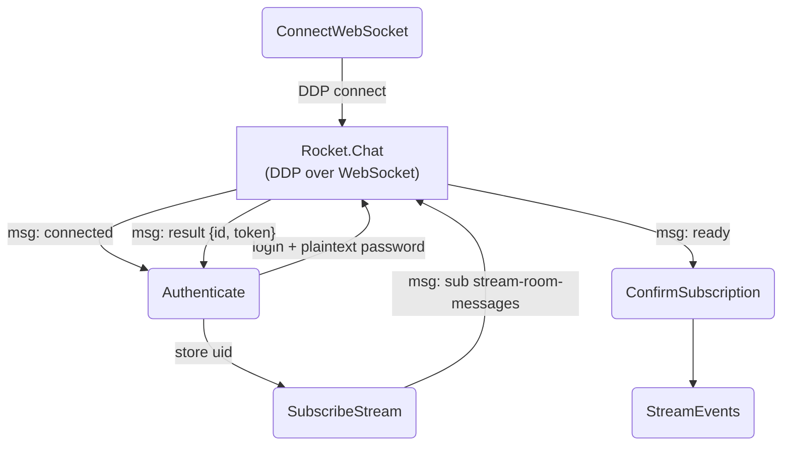
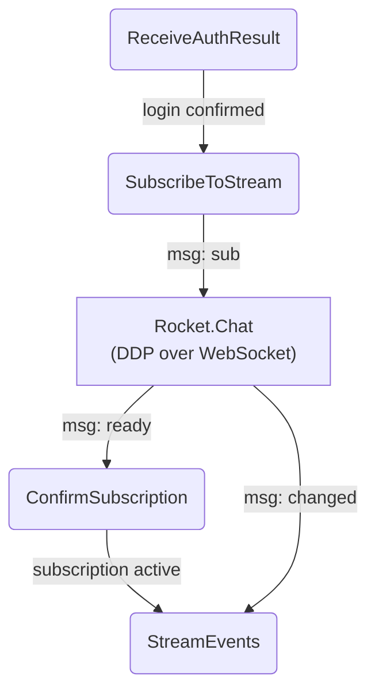

# RocketChat Client

## Origin

The bot communicates with Rocket.Chat over the **DDP (Distributed Data Protocol)** — a
Meteor protocol carried over a single WebSocket connection at
`wss://<server>/websocket`. The Python implementation (`bot/RocketChatBot.py`)
speaks this protocol directly: it opens a WebSocket, sends a DDP `connect`
handshake, authenticates via the `login` method, subscribes to
`stream-room-messages` scoped to `__my_messages__`, and then reacts to
`changed` events as incoming messages.

The official Rocket.Chat docs now mark the raw DDP/bots approach as
**deprecated** (2025), recommending [`@rocket.chat/ddp-client`](https://www.npmjs.com/package/@rocket.chat/ddp-client)
and the [Apps-Engine](https://developer.rocket.chat/docs/rocketchat-apps-engine)
instead. This client predates those recommendations and remains operational
against the legacy realtime API.

## Protocol Overview

The client implements a subset of DDP over WebSocket. The full handshake and
message lifecycle:



## DDP Message Types

The dispatch table (`cbdist`) routes every incoming server frame by its
`msg` field:

| `msg`       | Handler           | Behavior |
|-------------|-------------------|----------|
| `connected` | `_cb_connected`   | Sends `login` method with username and plaintext password (line 84); the [official spec](https://web.archive.org/web/20220728050012/https://developer.rocket.chat/reference/api/realtime-api/method-calls/login) requires SHA-256 digest — our client relies on the server accepting plaintext |
| `result`    | `_rt_dispatch`    | Extracts `id` (stored as `self.uid`) and `token`; triggers `_gologin()` to subscribe |
| `ready`     | *(not handled)*   | Server confirms subscription is active (`"subs":["ABCROCK"]`); ignored silently |
| `nosub`     | *(not handled)*   | Server reports subscription loss; passes through uncaught |
| `changed`   | `_cb_changed`     | Parses message payload and runs the four-stage filter |
| `ping`      | `_cb_ping`        | Replies with `{"msg":"pong"}`; no proactive pings sent |

The `ready` and `nosub` messages are standard DDP lifecycle events that the
current implementation does not handle — subscription confirmation and
subscription loss are not detected.

## Channel Subscription & Stream Classes

Rocket.Chat supports two subscription modes. The current implementation is
a **Shared Channel Approach** — multiple bots share the same pre-created
bot channel. The Alternative Approach is a simpler model where each bot
subscribes to its own stream.



## Architecture

### Connectivity & Protocol (Layer 1)

| Mechanism    | Implementation |
|--------------|----------------|
| Transport    | `websockets` library over `wss://`; single persistent connection |
| Handshake    | DDP `{"msg":"connect","version":"1","support":["1"]}`; server responds `{"msg":"connected"}` |
| Auth         | `{"msg":"method","method":"login"}` with username and plaintext password (`self._password`); the official API spec requires `{"password":{"digest":"<sha256>","algorithm":"sha-256"}}` — this client does **not** hash the password |
| Keepalive    | Reactive only: responds to server `ping` with `pong`; no proactive heartbeat or watchdog timer |
| Subscription | `{"msg":"sub","name":"stream-room-messages","params":["__my_messages__",false]}` — the `false` flag selects DDP delta mode (only `changed` events, no `added` for existing messages) |
| Send         | `{"msg":"method","method":"sendMessage","params":[{rid, msg}]}`; optional `tmid` for threading is available in the DDP API but not exposed by `sendMsg()` |
| Typing       | `{"msg":"method","method":"stream-notify-room","params":[rid+"/typing", username, typing]}` |

### Authentication Flow



The login payload (`_cb_connected` at `RocketChatBot.py:75`):

```json
{
    "msg": "method",
    "method": "login",
    "id": "42",
    "params": [{
        "user": { "username": "rockbot" },
        "password": "plaintext-password"
    }]
}
```

> The [official realtime API login spec](https://web.archive.org/web/20220728050012/https://developer.rocket.chat/reference/api/realtime-api/method-calls/login)
> requires the password to be sent as `{"password":{"digest":"<sha256>","algorithm":"sha-256"}}`.
> Our client passes it as a plain string and relies on the server accepting
> plaintext credentials (many self-hosted instances do).

The server responds with an auth result containing the user id, token, and
optional `tokenExpires` date (not consumed by this client):

```json
{
    "msg": "result",
    "id": "42",
    "result": {
        "id": "user-id",
        "token": "auth-token",
        "tokenExpires": { "$date": 1480377601 }
    }
}
```

### Subscription Flow



Subscription payload:

```json
{
    "msg": "sub",
    "id": "ABCROCK",
    "name": "stream-room-messages",
    "params": ["__my_messages__", false]
}
```

`"__my_messages__"` scopes to the authenticated user's message stream.
The trailing `false` is the DDP backward-compatibility flag: `false` = only
`"changed"` events (deltas); `true` would also emit `"added"` events for
every existing message. Bots only need new messages, so `false` is correct.

### Message Processing (Layer 2)

The `_cb_changed` callback implements a four-stage decision chain:

| Stage | Condition | Action |
|-------|-----------|--------|
| 1 | `sender_id == bot_uid` | Silently drop (skip self) |
| 2 | `msg.starts_with("@botname")` AND `room_name != ""` | Forward as @mention in channel; strips `@botname` prefix from text |
| 3 | `room_name` in registered rooms dict | Forward to room-specific callback |
| 4 | `room_name == ""` (DM) | Forward as direct message; `@botname` prefix **not** stripped |

All other cases are silently dropped.

### Parsing

Messages arrive as nested DDP `changed` events:

```json
{
    "msg": "changed",
    "fields": {
        "args": [
            { "msg": "hello", "rid": "room-id", "u": { "_id": "...", "username": "..." } },
            { "roomName": "general" }
        ]
    }
}
```

The bot extracts `msg_txt`, `room_id`, `sender_id`, `sender_name`, and
`room_name` using ad-hoc dict accessors (`_parse_msg_txt`, `_parse_room_id`,
etc.) with a `@defJson` decorator providing a fallback default on `KeyError`.

### Reply Delivery

| Method | Parameters | Description |
|--------|------------|-------------|
| `sendMsg(rid, msg)` | `rid`, `msg` | Plain text reply via DDP `sendMessage` method |
| `notifyTyping(rid, typing)` | `rid`+"/typing", `username`, `bool` | Typing indicator via `stream-notify-room` |
| `bot.reply(msg)` | `msg` | Convenience wrapper around `sendMsg` |
| `bot.replyQ(msg)` | `msg` | Code-block formatted reply |
| `bot.typing(state)` | `bool` | Convenience wrapper around `notifyTyping` |

### Error Recovery

The implementation has minimal internal error recovery. Any WebSocket
exception propagates uncaught and terminates the process. External
restart is provided by the shell wrapper (`manual_start.sh`) with a
retry counter. There is no proactive connection watchdog, no ping
interval monitoring, and no automatic reconnection or exponential
backoff within the Python process itself.

## Environment Config

```json
{
    "botname": "rockbot",
    "password": "...",
    "server": "chat.example.com"
}
```

The `config.json` file is loaded into a `SimpleNamespace` and passed to
`RocketChatBot(user, password, server, debug=false)`.

## References

- [Rocket.Chat DDP Client SDK](https://www.npmjs.com/package/@rocket.chat/ddp-client) — Official modern SDK
- [Rocket.Chat Realtime API (archived 2022)](https://web.archive.org/web/20220728050012/https://developer.rocket.chat/reference/api/realtime-api) — Legacy DDP method calls and subscriptions
- [Rocket.Chat Apps-Engine](https://developer.rocket.chat/docs/rocketchat-apps-engine) — Recommended replacement for bots
- [Meteor DDP Specification](https://github.com/meteor/meteor/blob/devel/packages/ddp/DDP.md) — Protocol specification
