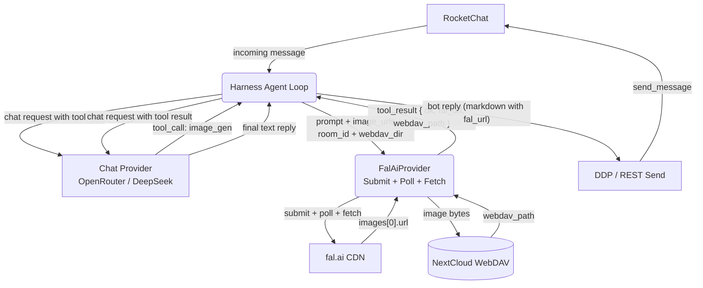
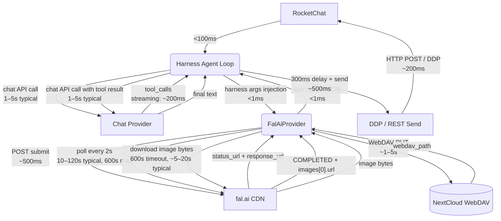
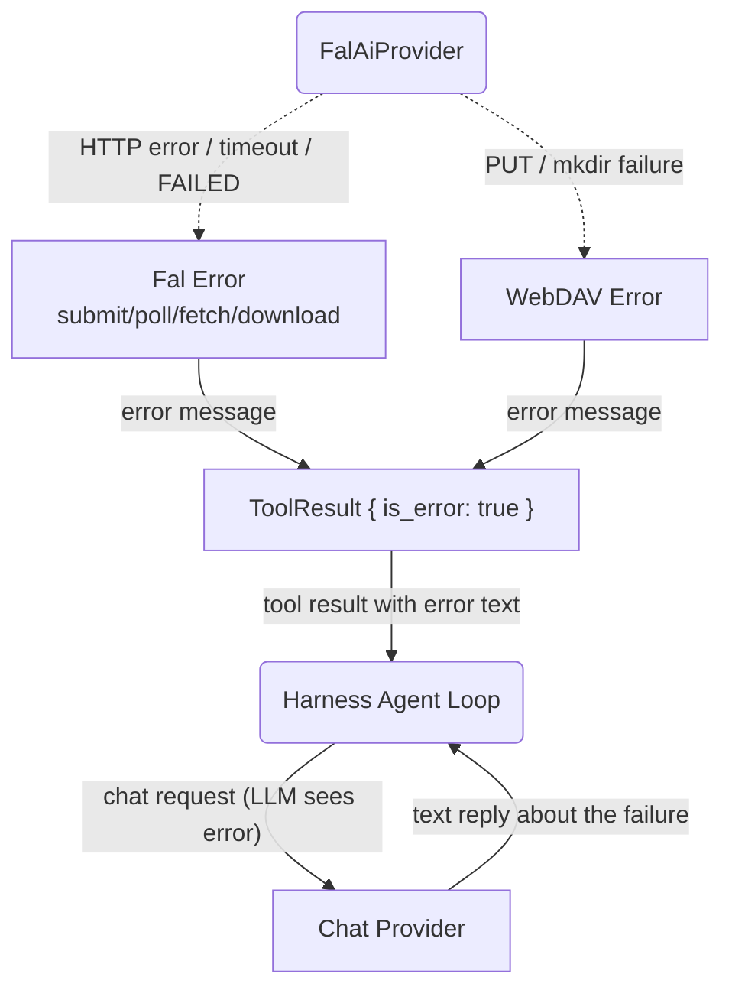

# Image Generation — Full Round-Trip

## 1. Purpose

Tracks the complete data flow from an inbound RocketChat message requesting image
generation to the final bot reply, covering the LLM decision loop, fal.ai
generation (submit/poll/download), WebDAV storage, and the response sent back to
RocketChat. This is a cross-cutting flow — not a single component DFD.

- Upstream: [Agent Loop](../_dfds/agent-loop.md) delivers the `IncomingMessage`
  and sends the `BotReply`
- Downstream: [Agent Harness](../_dfds/agent-harness.md) executes the
  LLM ↔ tools loop
- Downstream: [Image Gen Tool](../_dfds/tools/image-gen.md) handles
  fal.ai submit/poll/fetch + WebDAV upload
- Downstream: [AI Provider](../_dfds/base/ai-provider.md) —
  `FalAiProvider` for generation, chat provider for the LLM loop
- Companion: [_docs/image-data-flow.md](./image-data-flow.md) —
  prose summary of image data movement across layers

## 2. Diagram

### 2a. Happy Flow — Full Round-Trip (Level 1)

### 2b. Timing Breakdown

Each edge is annotated with its primary bottleneck. Arrows are colour-coded by
latency class (green = sub-second, yellow = seconds, red = 10s–minutes).

### 2c. Error Handling — Tool Returns Error

## 3. Key Latency Points

| Phase            | Source File:Line                   | Typical    | Worst Case   |
| ---------------- | ---------------------------------- | ---------- | ------------ |
| Chat API call #1 | `harness.rs:257`                   | 1–5 s      | 30 s         |
| fal.ai submit    | `provider/fal.rs:168`              | <1 s       | 5 s          |
| fal.ai poll      | `provider/fal.rs:216` — 300×2s     | 10–120 s   | **600 s**    |
| Image download   | `tools/image_gen.rs:85` — 600s     | 5–20 s     | **600 s**    |
| WebDAV upload    | `tools/image_gen.rs:111`           | 1–5 s      | 15 s         |
| Chat API call #2 | `harness.rs:257` (loop iteration)  | 1–5 s      | 30 s         |
| Send reply       | `main.rs:408` (REST) / `:423` (DDP)| ~300 ms    | 5 s          |
| **Total**        |                                    | **20–160 s**| **~21 min**  |

The two 600-second timeouts (`fal.rs:217` poll + `image_gen.rs:89` download) are
independent and stack — worst-case is ~21 minutes before the bot gives up on the
tool call alone. The second LLM call adds additional latency after the tool
completes.

To observe real timings, restart with `RUST_LOG=debug` — timing logs include
`elapsed_ms` for fal.ai polling, image download, WebDAV upload, each tool
execution, each LLM call, and the overall `process_message` duration.
