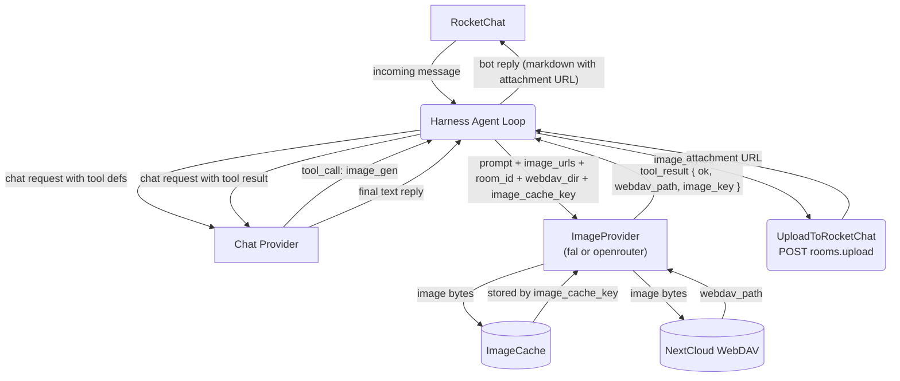
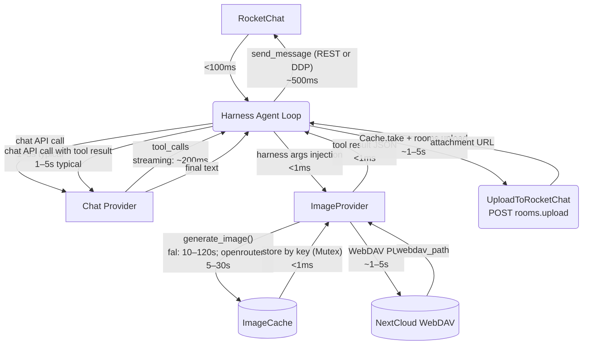
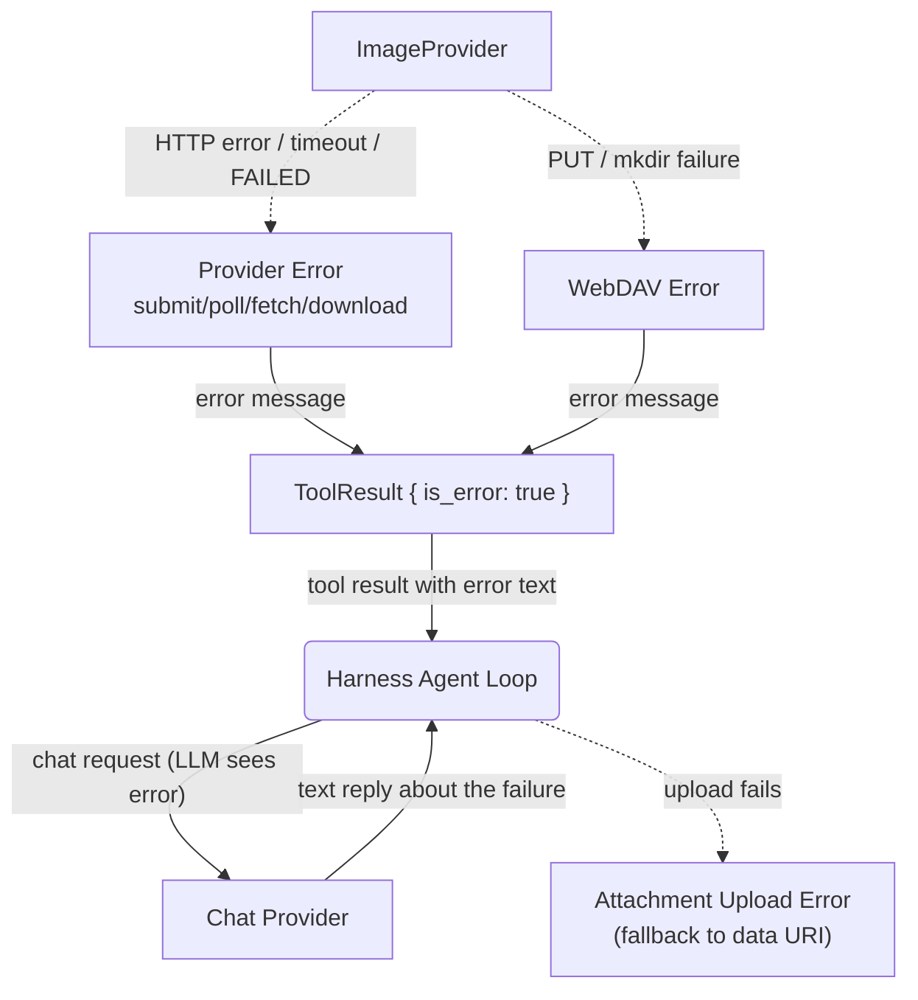

# Image Generation — Full Round-Trip

## 1. Purpose

Tracks the complete data flow from an inbound RocketChat message requesting image
generation to the final bot reply, covering the LLM decision loop, provider
generation (fal.ai submit/poll/download or OpenRouter synchronous POST), WebDAV
storage, RocketChat attachment upload, and the reply sent back.

- Upstream: [Agent Loop](../_dfds/agent-loop.md) delivers the `IncomingMessage`
  and sends the `BotReply`
- Downstream: [Agent Harness](../_dfds/agent-harness.md) executes the
  LLM ↔ tools loop
- Downstream: [Image Gen Tool](../_dfds/tools/image-gen.md) handles
  provider generation + WebDAV upload + ImageCache storage
- Downstream: [AI Provider](../_dfds/base/ai-provider.md) —
  `FalAiProvider` / `OpenRouterImageProvider` for generation, chat provider for LLM
- Companion: [_docs/image-data-flow.md](./image-data-flow.md) —
  prose summary of image data movement across layers

## 2. Diagram

### 2a. Happy Flow — Full Round-Trip (Level 1)

### 2b. Timing Breakdown

Each edge is annotated with its primary bottleneck. Arrows are colour-coded by
latency class (green = sub-second, yellow = seconds, red = 10s–minutes).

### 2c. Error Handling — Tool Returns Error

## 3. Key Latency Points

| Phase                   | Source File:Line                         | Typical      | Worst Case   |
| ----------------------- | ---------------------------------------- | ------------ | ------------ |
| Chat API call #1        | `harness.rs:257`                         | 1–5 s        | 30 s         |
| fal.ai generate         | `provider/fal.rs:168` (submit + poll + download) | 10–120 s  | **600 s**    |
| OpenRouter generate     | `provider/openrouter.rs:779`             | 5–30 s       | 60 s         |
| WebDAV upload           | `tools/image_gen.rs:111`                 | 1–5 s        | 15 s         |
| ImageCache store        | `image_cache.rs:20`                      | <1 ms        | <1 ms        |
| Chat API call #2        | `harness.rs:257` (loop iteration)        | 1–5 s        | 30 s         |
| RocketChat file upload  | `rest.rs:293` — POST rooms.upload        | 1–5 s        | 15 s         |
| Send reply              | `main.rs:408` (REST) / `:423` (DDP)      | ~300 ms      | 5 s          |
| **Total**               |                                          | **20–160 s** | **~21 min**  |

The two 600-second timeouts (`fal.rs:217` poll + `image_gen.rs:89` download) are
independent and stack — worst-case is ~21 minutes for a fal.ai generation before
the bot gives up. OpenRouter is faster (single synchronous POST, 5–30s typical).

After the LLM produces the final text, the harness uploads the image bytes to
RocketChat as a file attachment (1–5s typical). This replaces the old approach
of embedding multi-megabyte base64 data URIs in the message text, which exceeded
RocketChat's `Message_MaxAllowedSize` and caused HTTP 400 errors.

To observe real timings, restart with `RUST_LOG=debug` — timing logs include
`elapsed_ms` for provider generation, WebDAV upload, each tool execution,
each LLM call, and the overall `process_message` duration.
