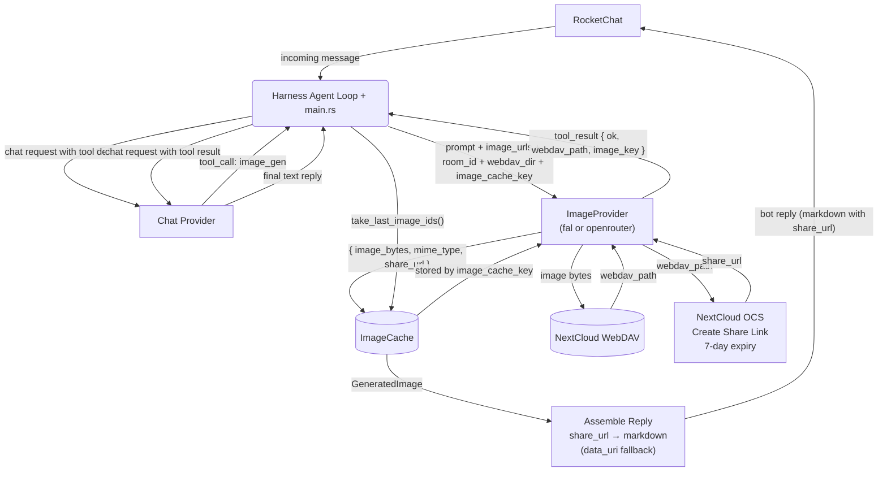
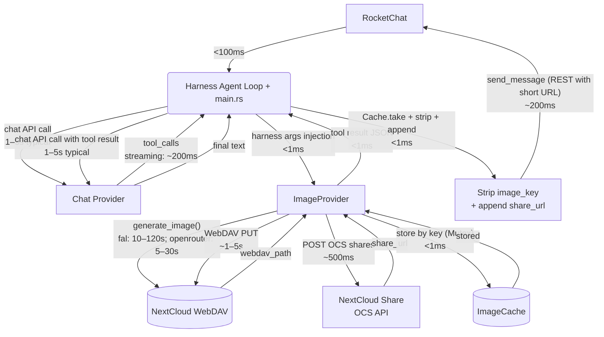
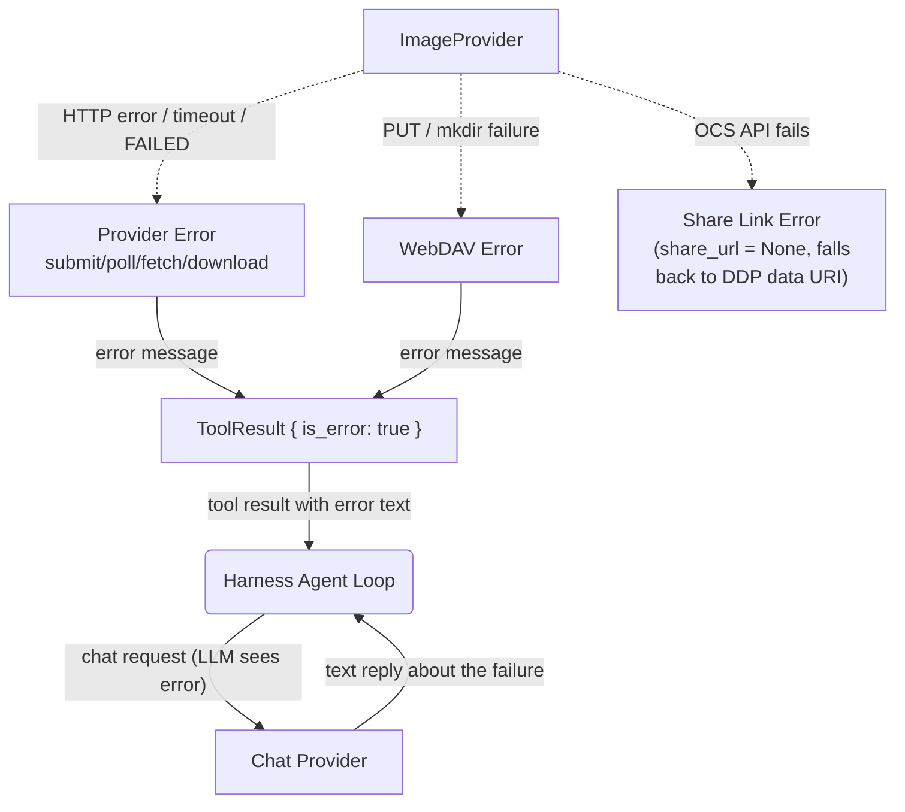

# Image Generation — Full Round-Trip

## 1. Purpose

Tracks the complete data flow from an inbound RocketChat message requesting image
generation to the final bot reply, covering the LLM decision loop, provider
generation (fal.ai submit/poll/download or OpenRouter synchronous POST), WebDAV
storage, NextCloud share link creation, and the reply sent back to RocketChat.

- Upstream: [Agent Loop](../_dfds/agent-loop.md) delivers the `IncomingMessage`
  and sends the `BotReply`
- Downstream: [Agent Harness](../_dfds/agent-harness.md) executes the
  LLM ↔ tools loop
- Downstream: [Image Gen Tool](../_dfds/tools/image-gen.md) handles
  provider generation + WebDAV upload + NextCloud share link + ImageCache storage
- Downstream: [AI Provider](../_dfds/base/ai-provider.md) —
  `FalAiProvider` / `OpenRouterImageProvider` for generation, chat provider for LLM
- Companion: [_docs/image-data-flow.md](./image-data-flow.md) —
  prose summary of image data movement across layers

## 2. Diagram

### 2a. Happy Flow — Full Round-Trip (Level 1)

**Note**: the NextCloud share link is created during image_gen tool execution
(right after WebDAV upload), not as a separate post-processing step. The agent
loop simply reads `share_url` from `ImageCache` and appends it as markdown.

### 2b. Timing Breakdown

Each edge is annotated with its primary bottleneck. Arrows are colour-coded by
latency class (green = sub-second, yellow = seconds, red = 10s–minutes).

### 2c. Error Handling

**Share link error**: if NextCloud's OCS API fails, `share_url` is set to
`None`. The agent loop then falls back to building a DDP `sendMessage` with a
`data:` URI in the `attachments` field. This is a worst-case path — the reply
still gets delivered, but with a larger payload via DDP.

## 3. Key Latency Points

| Phase                     | Source File:Line                               | Typical      | Worst Case   |
| ------------------------- | ---------------------------------------------- | ------------ | ------------ |
| Chat API call #1          | `harness.rs:257`                               | 1–5 s        | 30 s         |
| fal.ai generate           | `provider/fal.rs:168` (submit + poll + download)| 10–120 s    | **600 s**    |
| OpenRouter generate       | `provider/openrouter.rs:779`                   | 5–30 s       | 60 s         |
| WebDAV PUT                | `tools/image_gen.rs:248`                       | 1–5 s        | 15 s         |
| NextCloud share link      | `webdav/client.rs:76` — POST OCS shares        | ~500 ms      | 5 s          |
| ImageCache store          | `image_cache.rs:20`                            | <1 ms        | <1 ms        |
| Chat API call #2          | `harness.rs:257` (loop iteration)              | 1–5 s        | 30 s         |
| Reply assembly + send     | `main.rs:437–470`                              | <1 ms + ~200ms| 5 s         |
| **Total**                 |                                                | **20–160 s** | **~21 min**  |

## 4. Why NextCloud Share Links

| Approach | Message Size | Works on RC v8.4 | Fate |
|----------|-------------|-------------------|------|
| Base64 in `msg` text | Multi-MB | REST fails (400), DDP works but huge | ✗ Replaced |
| `rooms.upload` REST | Small msg + file upload | Returns 404 (endpoint removed) | ✗ Replaced |
| DDP `attachments` field | Small msg + attachment data | Match failed [400] | ✗ Replaced |
| **NextCloud share URL** | ~40 chars | REST ✅ DDP ✅ | **Current** |

The NextCloud share link is created during `image_gen` tool execution via
`WebDavClient::create_nextcloud_share_link()` — a POST to the OCS sharing API
(`/ocs/v2.php/apps/files_sharing/api/v1/shares`) with `shareType=3` (public
link), `permissions=1` (read-only), and `expireDate={today+7d}`. The result is a
short URL like `https://nc.tokyofy.top/s/abc123` that RocketChat renders as an
inline image preview from standard markdown ``.

The image already lives on NextCloud (uploaded during tool execution), so no
additional upload step is needed. The share link is generated in the same
async call chain, adding only ~500ms overhead. Share links expire after 7 days —
longer than typical chat message relevance.

To observe real timings, restart with `RUST_LOG=debug` — timing logs include
`elapsed_ms` for provider generation, WebDAV upload, share link creation, each
tool execution, each LLM call, and the overall `process_message` duration.
