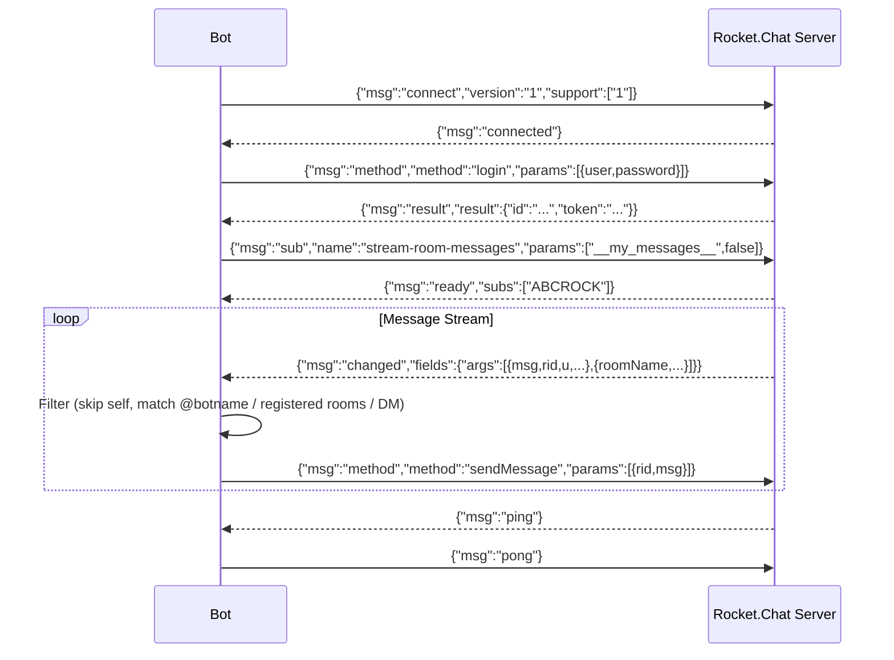
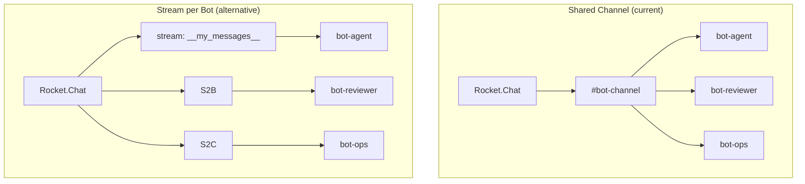

# RocketChat Client

## Origin

The bot communicates with Rocket.Chat over the **DDP (Distributed Data Protocol)** — a
Meteor protocol carried over a single WebSocket connection at
`wss://<server>/websocket`. The Python implementation (`bot/RocketChatBot.py`)
speaks this protocol directly: it opens a WebSocket, sends a DDP `connect`
handshake, authenticates via the `login` method, subscribes to
`stream-room-messages` scoped to `__my_messages__`, and then reacts to
`changed` events as incoming messages.

The official Rocket.Chat docs now mark the raw DDP/bots approach as
**deprecated** (2025), recommending [`@rocket.chat/ddp-client`](https://www.npmjs.com/package/@rocket.chat/ddp-client)
and the [Apps-Engine](https://developer.rocket.chat/docs/rocketchat-apps-engine)
instead. This client predates those recommendations and remains operational
against the legacy realtime API.

## Protocol Overview



## Channel Subscription & Stream Classes

Rocket.Chat supports two subscription modes. The current implementation is
a **Shared Channel Approach** — multiple bots share the same pre-created
bot channel. The Alternative Approach is a simpler model where each bot
subscribes to its own stream.



## Architecture

### Connectivity & Protocol (Layer 1)

| Mechanism | Implementation | Notes |
|-----------|---------------|-------|
| Transport | `websockets` library (`wss://`) | Single persistent connection |
| Handshake | `{"msg":"connect","version":"1"}` | DDP connect; server responds `{"msg":"connected"}` |
| Auth | `{"msg":"method","method":"login"}` | **Sends password in plain text** (see fixes below) |
| Keepalive | Reactive pong only | No proactive ping; no heartbeat monitoring |
| Subscription | `stream-room-messages` / `__my_messages__` | Receives all messages visible to the bot user |
| Send | `{"msg":"method","method":"sendMessage"}` | Sends text; no threading support |

### Message Processing (Layer 2)

The `_cb_changed` callback implements a four-stage decision chain:

| Stage | Condition | Action |
|-------|-----------|--------|
| 1 | `sender_id == bot_uid` | Silently drop (skip self) |
| 2 | `msg.starts_with("@botname")` AND `room_name != ""` | Forward as @mention in channel |
| 3 | `room_name` in registered rooms dict | Forward to room-specific callback |
| 4 | `room_name == ""` (DM) | Forward as direct message |

All other cases are silently dropped.

### Parsing

Messages arrive as nested DDP `changed` events:

```json
{
  "msg": "changed",
  "fields": {
    "args": [
      { "msg": "hello", "rid": "room-id", "u": { "_id": "...", "username": "..." } },
      { "roomName": "general" }
    ]
  }
}
```

The bot extracts `msg_txt`, `room_id`, `sender_id`, `sender_name`, and
`room_name` using ad-hoc dict accessors (`_parse_msg_txt`, `_parse_room_id`,
etc.) with a `@defJson` decorator providing a fallback default on KeyError.

### Reply Delivery

| Method | Parameters | Description |
|--------|------------|-------------|
| `sendMsg(rid, msg)` | `rid`, `msg` | Plain text reply |
| `notifyTyping(rid, typing)` | `rid`+"/typing", `username`, `bool` | Typing indicator |
| `bot.reply(msg)` | `msg` | Convenience wrapper around `sendMsg` |
| `bot.replyQ(msg)` | `msg` | Code-block formatted reply |
| `bot.typing(state)` | `bool` | Convenience wrapper around `notifyTyping` |

## Environment Config

```json
{
  "botname": "rockbot",
  "password": "...",
  "server": "chat.example.com"
}
```

The `config.json` file is loaded into a `SimpleNamespace` and passed to
`RocketChatBot(user, password, server, debug=false)`.

## Known Issues & Required Fixes

### 1. Password sent in plain text (CRITICAL)

**What**: `RocketChatBot.py:84` sends `"password": self._password` as a plain
string. The Rocket.Chat DDP login API requires the password to be SHA-256
hashed:

```json
{
  "user": { "username": "rockbot" },
  "password": {
    "digest": "2cf24dba5fb0a30e26e83b2ac5b9e29e1b161e5c1fa7425e73043362938b9824",
    "algorithm": "sha-256"
  }
}
```

**Fix**: Hash the password with `hashlib.sha256(password.encode()).hexdigest()`
before sending, and restructure the login params to include `"digest"` and
`"algorithm"` keys. Without this fix, the client only works against
non-standard servers that accept plaintext credentials.

*Location*: `bot/RocketChatBot.py:79-87`

### 2. No `ready`/`nosub` subscription handshake

**What**: The server sends `{"msg":"ready","subs":["ABCROCK"]}` to confirm a
subscription is active, and `{"msg":"nosub"}` on unsubscribe. The current
dispatch table has no handler for either message, meaning the bot never
confirms its subscription actually succeeded.

**Fix**: Add `"ready"` and `"nosub"` to the `cbdist` dispatch table. Log the
confirmation. On `"nosub"`, attempt re-subscription.

*Location*: `bot/RocketChatBot.py:30-34`

### 3. No proactive ping / reconnection logic

**What**: The bot only responds to server-initiated pings. If the server
stops sending pings (or the connection drops silently), the bot hangs forever.
When a WebSocket error does occur, it propagates uncaught and kills the
process. The shell wrapper (`manual_start.sh`) provides only external restart.

**Fix**: Add a proactive ping every 30s and a connection watchdog. If no
frame is received within 60s, close and reconnect. Catch `WebSocketException`
and retry with exponential backoff instead of relying solely on the shell
wrapper.

*Location*: `bot/RocketChatBot.py:40-54, 220-227`

### 4. Thread support missing

**What**: `sendMsg()` has no threading capability. The Rocket.Chat
`sendMessage` method supports `tmid` (thread message ID) for replying in
threads. DMs and channel replies always go to the main timeline.

**Fix**: Add an optional `tmid` parameter to `sendMsg()` and `bot.reply()`.
Pass it through as `{"tmid": thread_id}` in the payload.

*Location*: `bot/RocketChatBot.py:185-192`, `bot/bot.py:15-16`

### 5. Mentions not stripped in DMs

**What**: Section 3 of the DFD notes that mentions are stripped via
`.replace()` for @channel messages but "**not stripped for DMs**". The
current code at `RocketChatBot.py:132` strips `@botname` from the message
text before forwarding in-channal @mentions. DM messages are passed with the
raw text (line 141). This is intentional — DMs don't start with `@botname` —
but means any incidental `@botname` in a DM body is not cleaned.

**Fix**: Optionally strip `@botname` from DM text too, or document this as
intended behavior.

*Location*: `bot/RocketChatBot.py:132, 141`

### 6. `__my_messages__` second param semantics

**What**: The DFD (section 2e) says `false` "disables the `args` shorthand
(ensuring full message payloads are delivered)." In reality, this boolean
controls DDP backward compatibility: `true` = receive `add` events for new
items; `false` = only receive `changed` events (deltas). The current value
(`false`) is correct, but the explanation is wrong.

**Fix**: Update the DFD documentation in `_dfds/rocketchat.md`, section 2e.

### 7. Protocol is DDP, not custom WebSocket

**What**: The DFD uses "RocketChat WebSocket" as a black-box component. The
actual communication runs DDP (Distributed Data Protocol), a Meteor protocol
with specific message types (`connect`, `ping`, `pong`, `method`, `sub`,
`unsub`, `ready`, `nosub`, `result`, `changed`, `added`, `removed`). Naming
the protocol correctly aids debugging and integration with other DDP clients.

**Fix**: Reference DDP in the documentation. Consider using the official
`@rocket.chat/ddp-client` SDK for a TypeScript/Node.js rewrite.

### 8. Typing notification misconfigured

**What**: `notifyTyping()` at line 180 sends `stream-notify-room` with params
`[rid + "/typing", self._username, typing]`. The first param should be the
room ID; appending `"/typing"` is a server-side convention that may or may
not work depending on the Rocket.Chat version.

**Fix**: Verify against the target Rocket.Chat server version. The documented
approach is `stream-notify-room` with `[roomId + "/typing", username, bool]`.

*Location*: `bot/RocketChatBot.py:176-183`

## Implementation Checklist

- [ ] Fix password hashing (SHA-256 digest + algorithm)
- [ ] Add `ready`/`nosub` handlers to dispatch table
- [ ] Add proactive ping + reconnection with backoff
- [ ] Add optional `tmid` thread support to `sendMsg()` and `bot.reply()`
- [ ] Strip `@botname` from DM text (or document as intentional)
- [ ] Correct DFD `__my_messages__` param explanation
- [ ] Rename protocol references from "WebSocket" to "DDP over WebSocket"
- [ ] Verify typing notification param format against server version

## References

- [Rocket.Chat DDP Client SDK](https://www.npmjs.com/package/@rocket.chat/ddp-client) — Official modern SDK
- [Rocket.Chat Realtime API (archived 2022)](https://web.archive.org/web/20220728050012/https://developer.rocket.chat/reference/api/realtime-api) — Legacy DDP method calls and subscriptions
- [Rocket.Chat Apps-Engine](https://developer.rocket.chat/docs/rocketchat-apps-engine) — Recommended replacement for bots
- [Meteor DDP Specification](https://github.com/meteor/meteor/blob/devel/packages/ddp/DDP.md) — Protocol specification
